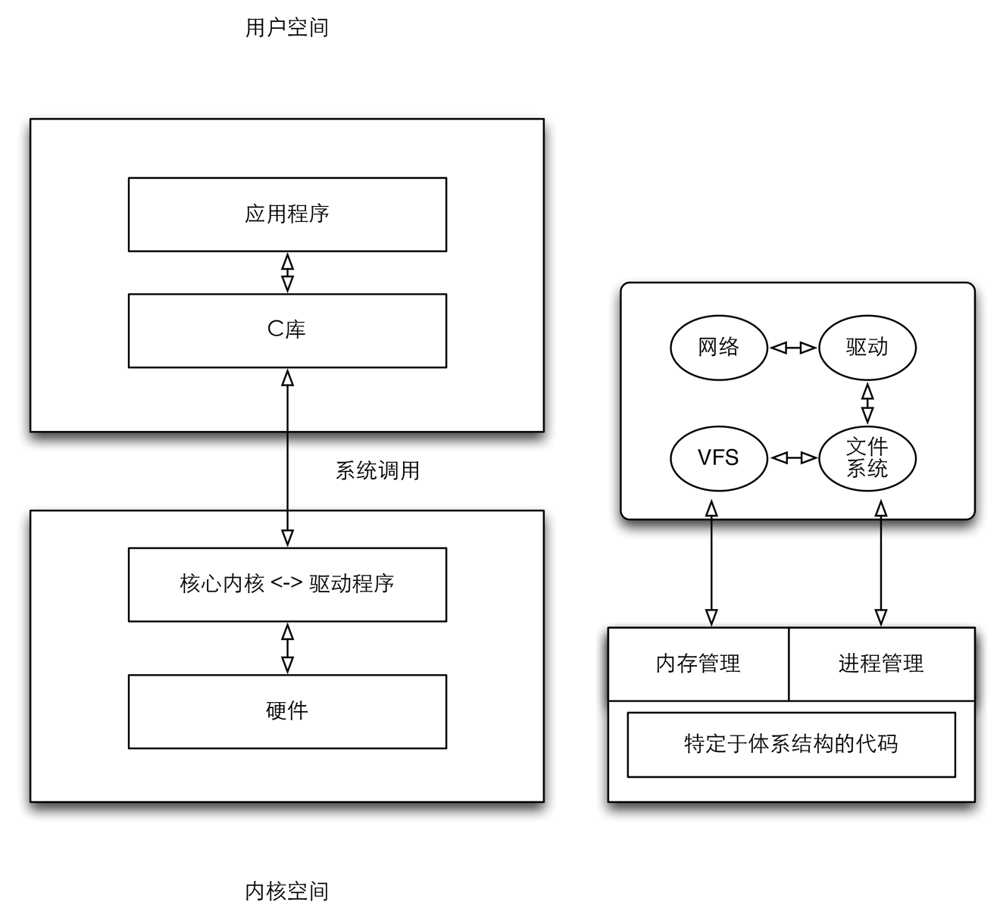

尽管Linux是整体式的宏内核，但其具有相当良好的结构，尽管如此，Linux内核各个组成部分之间的彼此交互是不可避免的。各部分会共享数据结构，而且与严格隔离的系统相比，各部分（因为性能原因）协同工作时需要更多的函数。

下面是一个粗略的草图，概述了组成完成Linux系统的各个层次，以及内核所包含的一些重要子系统。

内核大体的体系结构

### 进程/切换/调度 ###

传统上，UNIX操作系统下运行的应用程序、服务器以及其他程序都称为进程。每个进程都在CPU的虚拟内存中分配地址空间。各个进程的地址空间是完全独立的，因此进程并不会意识倒彼此的存在。对它们自己来说，它也会认为自己是系统中唯一的进程，如果进程想要彼此通信，就需要特定的内核机制。

Linux是多任务系统，虽然只是看上去并发的执行若干进程，但其实系统中同时真正在运行的进程数目不超过CPU的数目，因此内核会按照短的时间间隔在不同的进程之间切换，由于时间太快，用户是注意不到的，所以产生了并发的假象。

1. 内核借助于CPU的帮助，负责进程切换的技术细节。给每个进程一种错觉，造成CPU总是可用的。
2. 内核还必须确定如何在现存进程之间共享CPU时间，重要的获得的CPU时间多一些，次要的得到的少一点，确定哪个进程运行多长时间称为调度。

### UNIX进程 ###

Linux对进程采用了一种层次系统，每个进程都依赖于一个父进程。内核启动init程序作为第一个进程，这个进程负责进一步的系统初始化操作。

树型结构的扩展方式与新进程的创建方式密切相关，UNIX操作系统中创建进程有两种方式，一种是fork，一种是exec。

1. fork可以创建当前进程的一个副本，父进程和子进程只有PID（进程ID）不同。从使用角度来说，父进程内存的内存将被复制，Linux使用了copy on write[^copyonwrite]来提高性能。
2. exec将一个新程序加载到当前进程的内存中并执行，旧程序的内存页将刷出，内容被替换为新数据，并执行新程序。

[^copyonwrite]: 主要的原理是将内存复制操作延迟倒父进程或子进程向内存页面写入数据之前，在只读访问的情况下，主进程和子进程可以共享同一份内存块。

#### 线程 ####

当然系统除了进程以外，还提供了线程，有时也被成为轻量级进程。Linux使用clone方法创建线程。工作方式类似于fork，但启用了精确的检查，以确认哪些资源是和父进程共享，哪些资源为线程自己创建。在一定程度上，允许线程和进程之间的连续转换。

#### 命名空间 ####

命名空间则是将不同的进程进行分组，将它们隔离起来。在每个组里，进程同样有一个类似init的进程，每个组的资源对外是隔离的，这样的技术使得很多虚拟化技术得以发展，因为计算机上只需要有一个内核管理所有容器。[^problem]

[^problem]: 传统意义上来说，每个用户相当于拥有一台计算机，也就是说有一个CPU、内存等资源。当多个用户需要不同环境的时候，通常需要使用多台计算机来解决。Linux内核加上命名空间的概念之后，只需要一台计算机就能够隔离出不同的资源，进行虚拟化。