红黑树是内核里面最常用的数据结构，红黑树本身也是一个非常复杂的数据结构。我自己为了详细的理解红黑树的流程和原理弄了好几天，果然已经老了，再加上智商有限，真是。。不管怎样，无论是看wikipedia还是看其他人写的教程，我觉得都不是很好懂。当然，红黑树本身就不是太好懂，自己不画是很难理解的。

但是在网上不太好找红黑树的代码，即便红黑树的原理讲的再清楚，也只是『假装』自己理解了。怎么说，就是不太理解吧，因为写起来也不好写，一下子内存越界了什么的情况很多。如果对红黑树不感兴趣，只需要直到这是一个能够自平衡的树，概念依旧不想了解的话，只要知道红黑树的插入、删除和搜索的算法复杂度都是O(log n)，是相当快的。如果你有需求是大量的插入删除还要保证有序的话，那可以使用红黑树。

代码可以直接看这里[GIST](https://gist.github.com/GuoJing/11205438)。

如果你有点兴趣，就往下看，我们这里简单规定：

1. *n*是新结点。
2. *r*是根结点。
3. *x*某个结点。
4. *p*是某个结点的父结点（x->parent）。
5. *g*是某个结点的祖父结点（x->parent->parent）。
6. *s*是某个结点的兄弟结点（x->parent->left或right）。
7. *u*是某个节点的叔叔节点（g->left或right）。

其中s和u两个节点具体是left或者right可以根据实际情况来判断。比如当前节点为右孩子，那么兄弟节点肯定就是父节点的左孩子。那么叔叔节点也同理了。

### 二叉查找树 ###

红黑树继承二叉查找树的性质，这里简单的说一下二叉查找树的性质，具体解释看[Wikipedia](http://zh.wikipedia.org/zh/二元搜尋樹)，需要详细的理解二叉查找树。

这里就非常非常简单的讲解一下二叉查找树的一点点简单的概念，不涉及深度优化什么的。

插入

简单的来说用图示来解释，插入过程如下：

1. 如果是空树，则直接作为根（*root*）结点。
2. 如果不是空树，则从根搜寻，如果值小于当前结点（*x*），但是当前结点有左孩子，则继续找当前结点的左孩子（*x=x->left*）。直到当前结点没有左孩子（*x->left==NULL*），新结点（*r*）作为当前结点的左孩子。
3. 如果不是空树，则从根搜寻，如果值大于当前结点（*x*），但是当前结点有右孩子，则继续找当前结点的右孩子（*x=x->left*）。直到当前结点没有右孩子（*x->left==NULL*），新结点（*r*）作为当前结点的右孩子。

具体步骤如下所示：

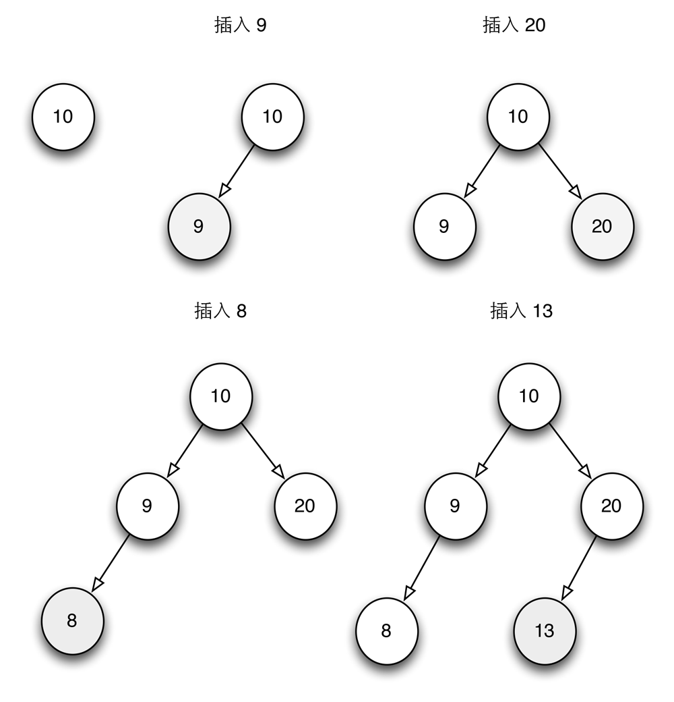

分解成下面步骤：

1. 根节点为空，插入10。
2. 插入9，比10小，并且10没有左孩子，则9为10的左孩子。
3. 插入20，比10大，并且10没有右孩子，则20为10的右孩子。
4. 插入8，比10小，10右左孩子，继续查找10的左孩子9，9没有左孩子，则8作为9的左孩子。
5. 插入13，比10大，10有右孩子，找到20，比20小，并且20没有左孩子，则13成为20的左孩子。

代码如下：


int put(struct node *root, const int value){
    struct node *p = root;
    struct node *c = (node*)malloc(sizeof(node));
    c->left = NULL;
    c->right = NULL;
    c->parent = NULL;
    c->value = value;

    while(p){
        if(value==p->value) break;
        if(value<p->value){
            if(!p->left){
                p->left = c;
                c->parent = p;
                break;
            }
            p = p->left;
        } else if(value>p->value){
            if(!p->right){
                p->right = c;
                c->parent = p;
                break;
            }
            p = p->right;
        }
    }

    return 1;
}


删除

删除二叉查找树的一个结点方法如下：

1. 如果删除的节点没有左右孩子，则直接删除。
2. 如果要删除一个节点，则查找右子树中的最小值或者左子树中的最大值，与要删除的节点交换。

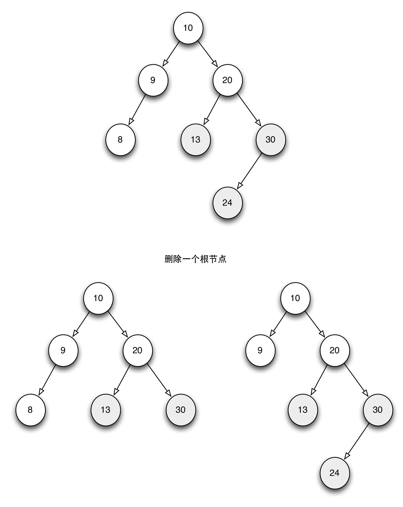
删除一个根节点24或者根节点8

----

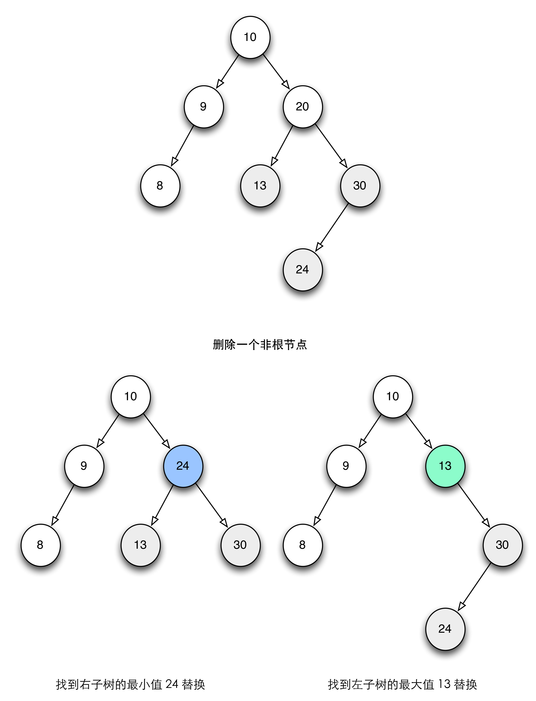
删除一个有子树的节点20，交换后依旧能保持搜索树的性质

上面的图中，无论是右子树的最小值还是左子树的最大值都可以。如果没有右子树或者左子树，则用右子树和左子树的根替换即可。图中删除节点20的右子树为以30为根节点的子树。左子树为以13为根节点的子树。所以右子树的最小值为24，替换20，再删除20。左子树的最大值为13，则替换20。

任意一种方法都可以。

代码如下：


struct node *find_trans(struct node *root){
    /*
    如果要删除一个结点，则查找
    右子树中的最小值
    或者
    左子树中的最大值
    与要删除的结点交换
     */
    struct node *p = root;
    if(p->left){
        p = p->left;
        while(p->right){
            p = p->right;
        }
    } else {
        p = p->right;
        while(p->left){
            p = p->left;
        }
    }
    return p;
}


删除代码如下：


int del(struct node *root, const int value){
    struct node *p = root;
    while(p){
        if(value==p->value){
            printf("hit and removed %d\n", p->value);
            /* remove */
            if(!p->left&&!p->right){
                /* nil child */
                if(p->value>p->parent->value){
                    /*at right*/
                    p->parent->right = NULL;
                } else {
                    p->parent->left = NULL;
                }
            } else {
                node *tmp = find_trans(p);
                if(p->value>p->parent->value){
                    /*at right*/
                    p->parent->right = tmp;
                } else {
                    p->parent->left = tmp;
                }
                tmp->parent = p->parent;
            }
            p->value = NULL;
            p->left=NULL;
            p->right=NULL;
            p->parent=NULL;
            free(p);
            return 1;
        }
        if(value<p->value){
            p = p->left;
        } else if(value>p->value){
            p = p->right;
        }
    }
    return 0;
}


具体的代码在这个[GIST](https://gist.github.com/GuoJing/11136864)中。这是一个非常非常简单的搜索树，并没有做什么优化，也有可能有的地方有bug，但这里只是为了方便理解。

### 红黑树 ###

红黑树是建立在二叉搜索树之上的一种树，这个树必须依赖一下几种性质，一旦任意一个性质被破坏了，就不是红黑树了。[Wikipedia页面在此](http://zh.wikipedia.org/wiki/红黑树)。

1. 节点是红色或黑色。
2. 根是黑色。
3. 所有nil节点都是黑色，也可以说nil节点都为黑色的NULL节点。
4. 每个红色节点的两个子节点都是黑色。(从每个叶子到根的所有路径上不能有两个连续的红色节点)
5. 从任一节点到其每个叶子的所有简单路径都包含相同数目的黑色节点。

这里主要说一下这其中的性质里容易混淆的。

其中性质3可以这么看，叶子节点就是二叉树里最下面的节点的一个空节点，可以被称为NIL节点。如下图。

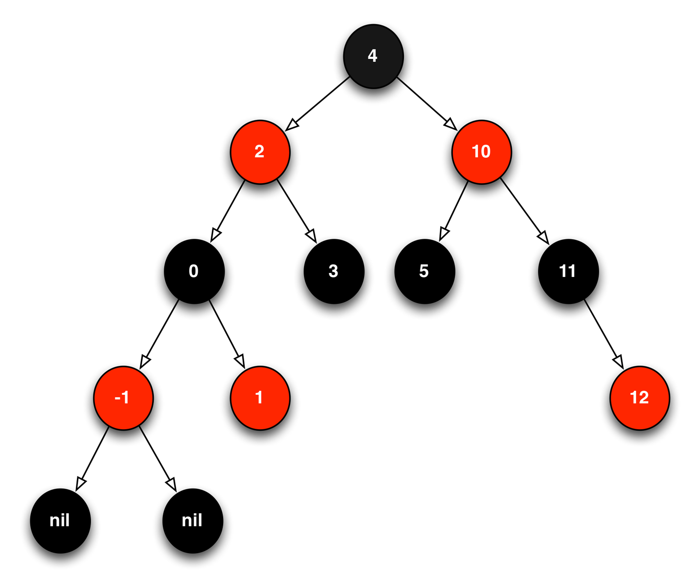

这里的-1这个节点的两个nil节点都是黑色，也就是说倒数一层的节点是红色的。但其实没有关系，有没有这个nil节点都没有关系，为了简单，后面的图我就不画这些nil节点了。可以默认认为，每个新的节点都有两个nil节点，这两个nil节点其实都是NULL节点。这里必须理解。

再强调一下，如果认为最后一层节点没有nil节点，而左右都是NULL的话，那么最后一层必须是红色。如果认为最后一层节点都有默认的nil节点，即左子树和右子树都有一个nil节点，值可能也是NULL，那么nil节点必须是黑色的，『最后一层』节点为红色。

其中性质5也要提一下，从上图来看，从根节点到最下层的节点的任意路径的黑色节点数都相同。例如上图中的，4->2->0->-1就有两个黑节点，同理4->2->3、4->10->5和4->10->11->12。

我们定义节点如下：


int BLACK = 0;
int RED = 1;

struct node {
    struct node *left;
    struct node *right;
    struct node *parent;
    int value;
    int color; //0 is black, 1 is red
};

struct rbtree {
    struct node *root;
};


### 旋转节点 ###

在红黑树中另一个非常重要的概念就是节点的旋转，有左旋和右旋。每一次左旋和右旋之后都会生成新的子树，图如下。

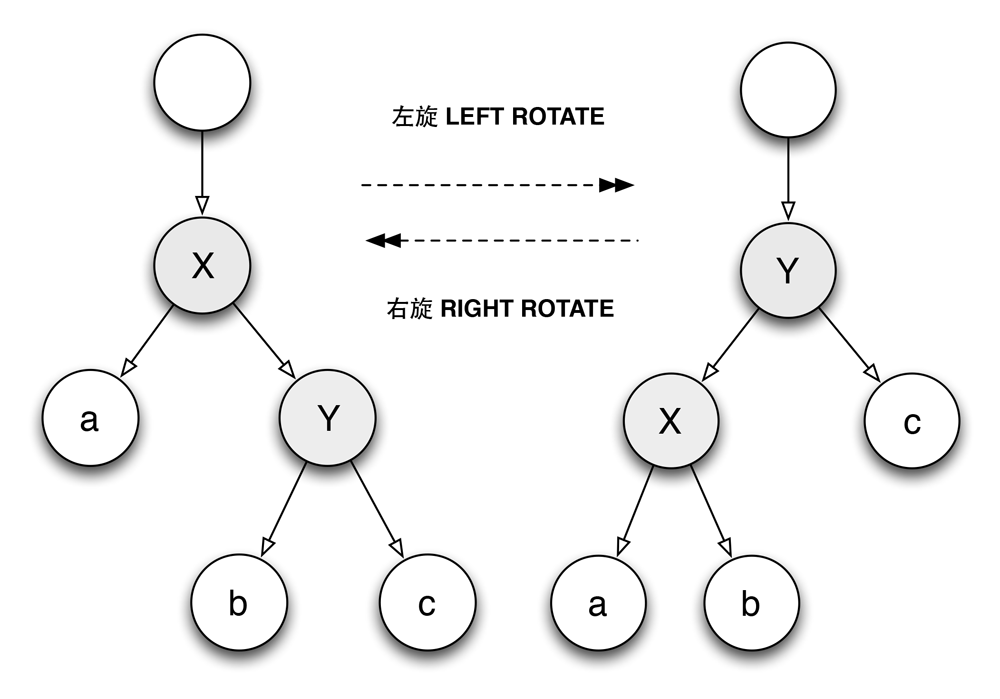

需要注意一点的是，上面示意图里的旋转节点里面的X和Y都有子节点，但如果X，Y没有子节点的话，可以想象成nil，也就是NULL。虽然a、b、c都可能为NULL，但不代表只是交换了X和Y的值。必须是旋转了。只是Y的左孩子NULL变成了X的右孩子NULL。

其中代码如下：


void replace_node(struct rbtree *t, struct node *o,
    struct node *n) {
    if (o->parent == NULL) {
        t->root = n;
    } else {
        if (o == o->parent->left)
            o->parent->left = n;
        else
            o->parent->right = n;
    }
    if (n != NULL) {
        n->parent = o->parent;
    }
}

void rotate_left(struct rbtree *t, struct node *n) {
    // 左旋
    struct node *r = n->right;
    replace_node(t, n, r);
    n->right = r->left;
    if (r->left != NULL) {
        r->left->parent = n;
    }
    r->left = n;
    n->parent = r;
}

void rotate_right(struct rbtree *t, struct node *n) {
    // 右旋
    struct node *l = n->left;
    replace_node(t, n, l);
    n->left = l->right;
    if (l->right != NULL) {
        l->right->parent = n;
    }
    l->right = n;
    n->parent = l;
}


### 插入 ###

红黑树的插入和删除都比较复杂，但插入相比删除来说已经算是简单的了。所有插入的新节点的颜色都为**黑色**插入可以包含5个情形，我们可以简单的使用*insert_case_n*。这几个case的定义如下。

如果在平衡过程中根节点变为红色，则可以直接把根节点变为黑色。


static void insert_case1(struct rbtree *t, struct node *n);
static void insert_case2(struct rbtree *t, struct node *n);
static void insert_case3(struct rbtree *t, struct node *n);
static void insert_case4(struct rbtree *t, struct node *n);
static void insert_case5(struct rbtree *t, struct node *n);


情况1：

新节点位于树的根上，这种情况下，比较简单，就一个节点，直接变为黑色即可。如下图。

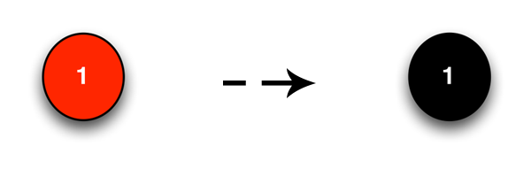
1节点作为根节点则直接变为黑色

代码如下：


void insert_case1(struct rbtree *t, struct node *n) {
    if (n->parent == NULL)
        n->color = BLACK;
    else
        insert_case2(t, n);
}


情况2：

如果新节点的根节点颜色是黑色，则就没有违反任何性质，因为新节点是红色的，在任何一个简单路径都没有增加黑色节点的个数。如下图。

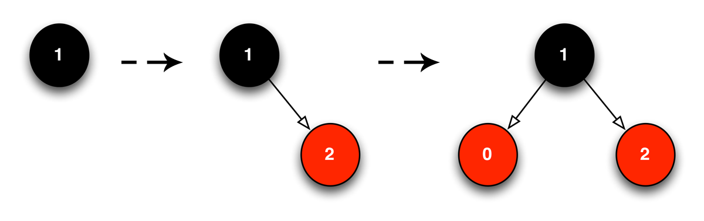
无论是增加一个2节点还是0节点，都没有违反任何性质

上图的0节点只是举例，我们还是按照插入2节点来说。

代码如下：


void insert_case2(struct rbtree *t, struct node *n) {
    if (node_color(n->parent) == BLACK)
        return; /* Tree is still valid */
    else
        insert_case3(t, n);
}


情况3：

如果新节点的父节点是红色，如上图中如果要插入一个3，那么3的父节点2节点也是红色，就违反了红黑树的性质，必须重新绘制。那么分这几种情况。

**如果父节点P和叔叔节点U都是红色**

如果父节点P和叔叔节点U都是红色节点，那么就：

1. 祖父节点变为红色。
2. 把父节点变为黑色。
3. 把叔叔节点变为黑色。

如下图：

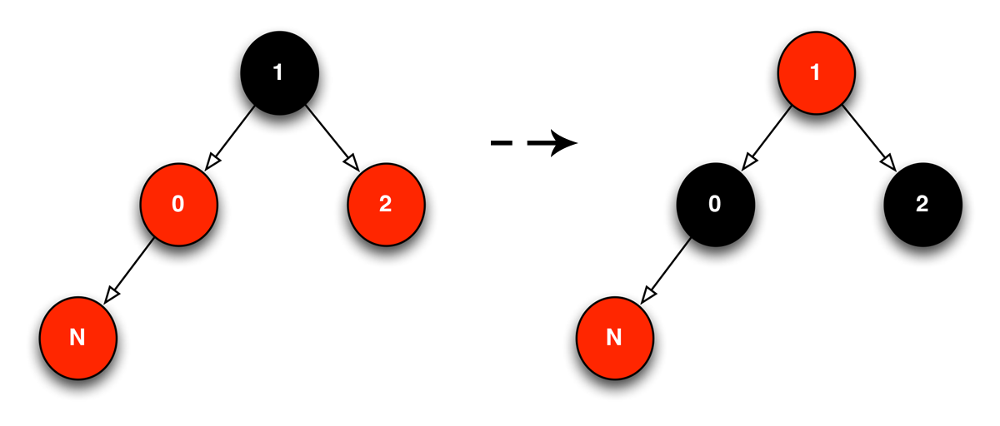
改变节点颜色

这个时候祖父节点G就是红色了。一般来说，祖父节G点是黑色，那么祖父节点G的父节点G->parent必须是红色节点，就又遇到这种情况。这个时候把指针指向祖父节点，然后再执行情况3。如果不满足这个条件了，就执行情况4。

如果按照上图的情况，1节点是根节点，则直接将1节点涂为黑色即可。

代码如下：


void insert_case3(struct rbtree *t, struct node *n) {
    if (node_color(uncle(n)) == RED) {
        n->parent->color = BLACK;
        uncle(n)->color = BLACK;
        grandparent(n)->color = RED;
        insert_case1(t, grandparent(n));
    } else {
        insert_case4(t, n);
    }
}


情况4：

**父节点P是红色但叔叔节点U是黑色或者没有**

如果父节点P是红色但是叔叔节点U是黑色或者没有，新节点是父节点的一种不同顺序的节点。比如父节点P是右孩子，但新节点N是左孩子；比如父节点是左孩子，但新节点是右孩子。那么：

*（对，我知道很烦，但确实很麻烦）*

1. 新节点N是父节点P的右孩子，而P是其父节点的左孩子，那么左旋P。
2. 新结点N是父节点P的左孩子，而P是其父节点的右孩子，那么右旋P。

如下图：

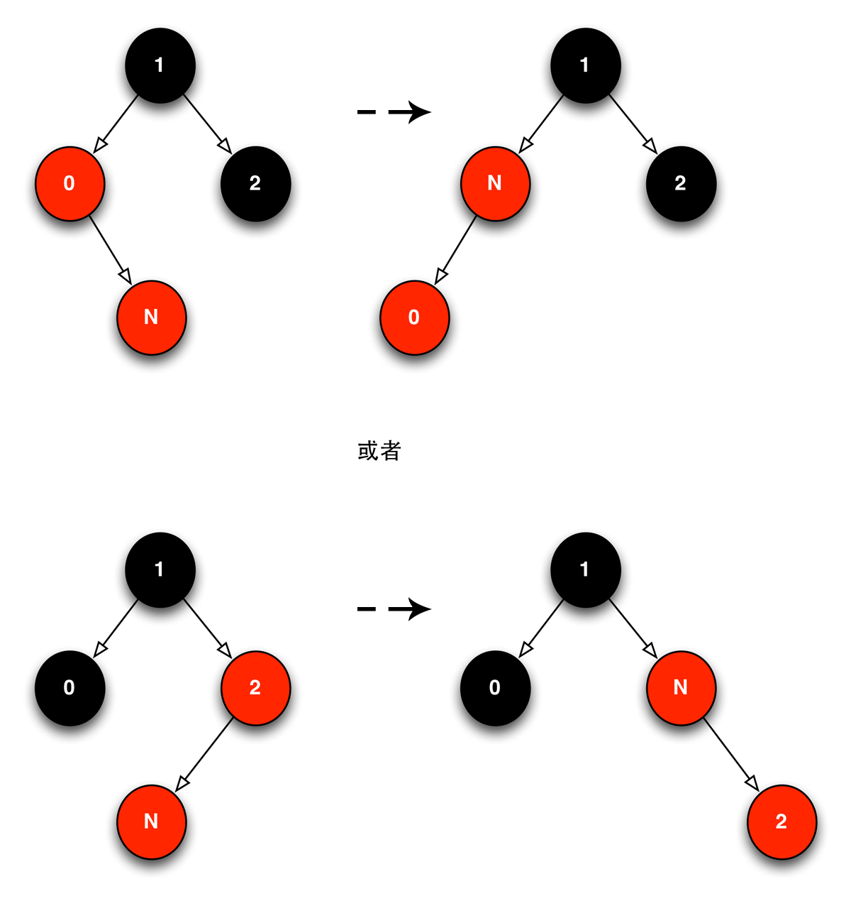
注意里面不只是把节点的值和颜色改了，是左旋和右旋

其中上面一部分是新结点N是父节点P的左孩子，而P是其父节点的右孩子的情况，下面一部分是新节点N是父节点P的右孩子，而P是其父节点的左孩子的情况。

代码如下：


void insert_case4(struct rbtree *t, struct node *n) {
    if (n == n->parent->right && n->parent == grandparent(n)->left) {
        rotate_left(t, n->parent);
        n = n->left;
    } else if (n == n->parent->left && n->parent == grandparent(n)->right) {
        rotate_right(t, n->parent);
        n = n->right;
    }
    insert_case5(t, n);
}


情况5：

**父节点P是红色但叔叔节点U是黑色或者没有**

如果不是上面的不同顺序节点，而是相同顺序节点的话，就是情况5。也就是说，父节点P是右孩子，新节点N也是父节点的右孩子；父节点P是左孩子，新节点P也是父节点的左孩子，那就符合这种情况。那么：

1. 新节点N和父节点P都是左子节点，那么右旋祖父节点。
2. 新节点N和父节点P都是右子节点，那么左旋祖父节点。

在旋转完毕后，切换父节点和祖父节点的颜色。

如下图：

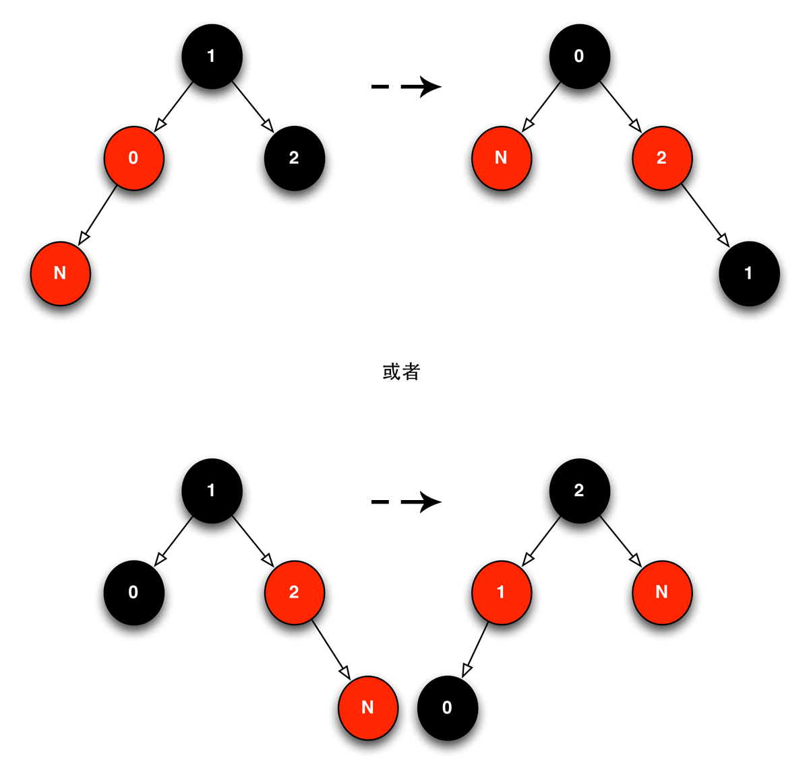
注意里面不只是把节点的值和颜色改了，是左旋和右旋

代码如下：


void insert_case5(struct rbtree *t, struct node *n) {
    n->parent->color = BLACK;
    grandparent(n)->color = RED;
    if (n == n->parent->left && n->parent == grandparent(n)->left) {
        rotate_right(t, grandparent(n));
    } else {
        rotate_left(t, grandparent(n));
    }
}


*注意里面不只是把节点的值和颜色改了，是左旋和右旋*，这个必须强调，如果不理解可以去Wikipedia看带nil节点的图。

在处理完整个情况之后，我们的插入节点的代码如下：


void insert_node(struct rbtree *t, int value){
    struct node *n =new_node(value, RED, NULL, NULL);
    if (t->root == NULL) {
        t->root = n;
    } else {
        struct node *r = t->root;
        while (1) {
            if (value == r->value) {
                //value is root value
                return;
            } else if(value > r->value){
                if (r->right == NULL) {
                    r->right = n;
                    break;
                } else {
                    r = r->right;
                }
            } else if(value < r->value){
                if (n->left == NULL) {
                    if (r->left == NULL) {
                        r->left = n;
                        break;
                    } else {
                        r = r->left;
                    }
                }
            }
        }
        n->parent = r;
    }
    insert_case1(t, n);
}


### 插入步骤 ###

现在我们可以模拟插入步骤，一步一步的看是如何插入的：


int main(){
    struct rbtree *t = create();
    insert_node(t, 1);
    insert_node(t, 2);
    insert_node(t, 3);
    insert_node(t, 4);
    insert_node(t, 5);
    print(t);
    return 0;
}


下图描绘了插入1、2、3、4、5整个红黑树的过程。

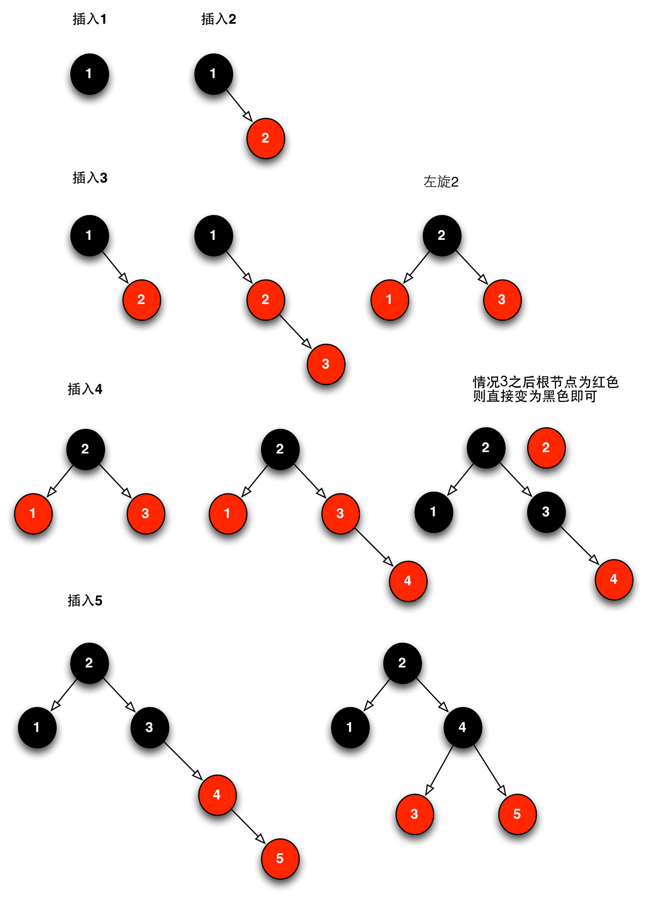
来加上插入12、11的过程。
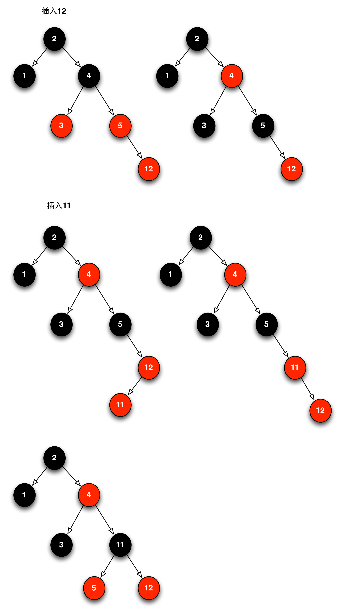

基本上整个插入过程就是这样的了，相比删除还是比较简单的。

### 删除 ###

红黑树的删除是最为复杂的，但无论怎样我们已经看过了插入，插入虽然已经很困难，但按照插入的逻辑来走，应该是可以理解的。删除也有好几个情形，比插入多一个，一共6个情形。其实插入和删除本质上来说没有那么多情况，只是分的比较细而已，就拿插入来说，可以说总共就三种，只是最后的一种还衍生出多的两种。

删除定义如下：


static void delete_case1(struct rbtree *t, struct node *n);
static void delete_case2(struct rbtree *t, struct node *n);
static void delete_case3(struct rbtree *t, struct node *n);
static void delete_case4(struct rbtree *t, struct node *n);
static void delete_case5(struct rbtree *t, struct node *n);
static void delete_case6(struct rbtree *t, struct node *n);


上面的函数我们会一个一个的讲解，除此之外还有一个非常重要的函数*replace_node*，用来替换节点，代码如下。


void replace_node(struct rbtree *t, struct node *o, struct node *n) {
    if (o->parent == NULL) {
        t->root = n;
    } else {
        if (o == o->parent->left)
            o->parent->left = n;
        else
            o->parent->right = n;
    }
    if (n != NULL) {
        n->parent = o->parent;
    }
}


情况1：

如果要删除的节点是一个根节点，什么也不做的返回，否则执行删除的情况2。


void delete_case1(struct rbtree *t, struct node *n) {
    if (n->parent == NULL)
        return;
    else
        delete_case2(t, n);
}


情况2：

**兄弟节点S的颜色为红色**

如果兄弟节点S的颜色为红色，那么把父节点P的颜色变为红色，把兄弟节点S的颜色变为黑色。如果要删除的节点是左孩子，那么左旋要删除节点的父节点P。如果要删除的节点是右孩子，那么右旋要删除节点的父节点P。

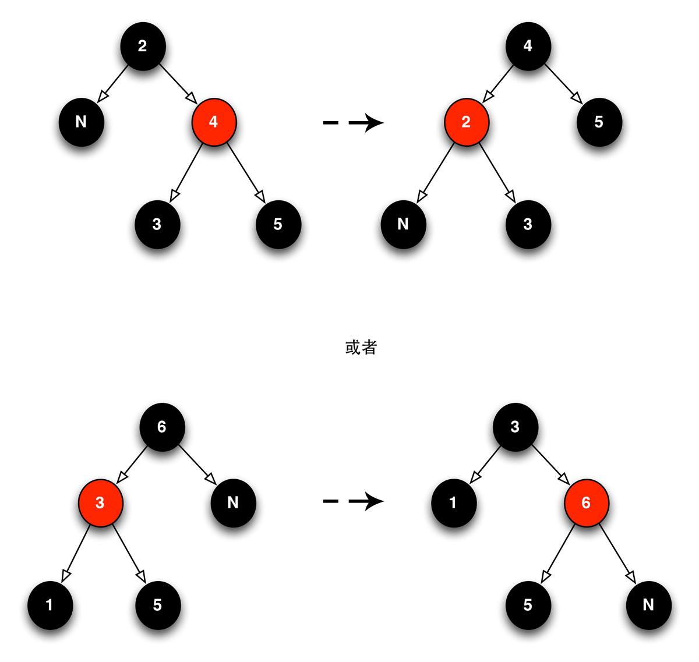

如图所示，但执行了这一步之后还没有完，和插入不一样，删除还必须进入后续情况处理。

代码如下：


void delete_case2(struct rbtree *t, struct node *n) {
    if (node_color(sibling(n)) == RED) {
        n->parent->color = RED;
        sibling(n)->color = BLACK;
        if (n == n->parent->left)
            rotate_left(t, n->parent);
        else
            rotate_right(t, n->parent);
    }
    delete_case3(t, n);
}


情况3：

**N的父节点P、叔叔节点S和S的儿子节点都是黑色**

这种情况下，只需要把叔叔节点的颜色变为红色，然后将指针指向父节点P，并进入第一种删除情况。因为叔叔节点变为红色之后，通过他的路径都少了一个黑色节点。

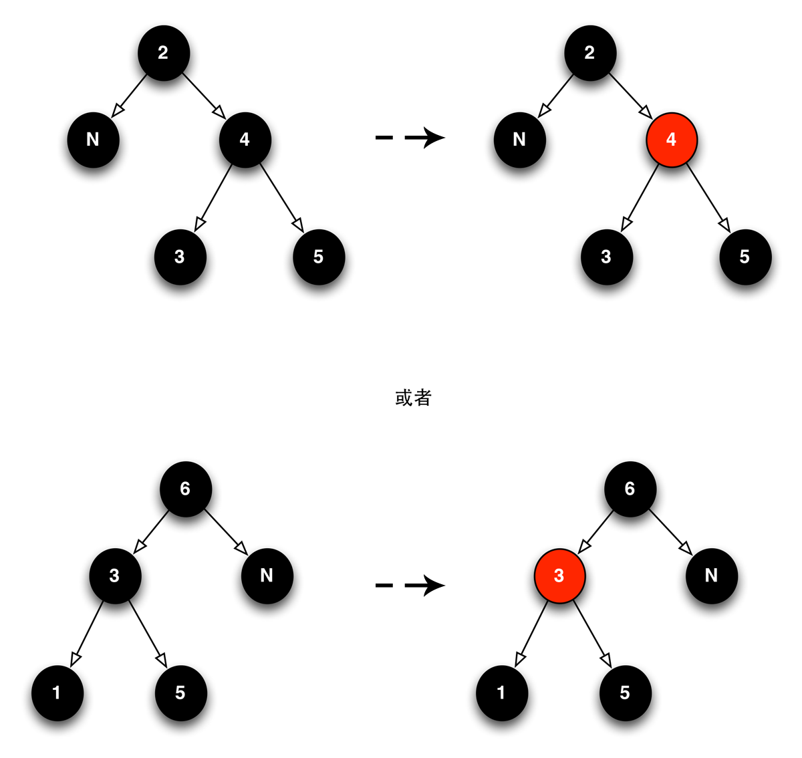

代码如下：


void delete_case3(struct rbtree *t, struct node *n) {
    if (node_color(n->parent) == BLACK &&
        node_color(sibling(n)) == BLACK &&
        node_color(sibling(n)->left) == BLACK &&
        node_color(sibling(n)->right) == BLACK)
    {
        sibling(n)->color = RED;
        delete_case1(t, n->parent);
    }
    else
        delete_case4(t, n);
}


如果不满足上面的情况，则进入情况4（*对，其实我写的也很累了*）。

情况4：

**叔叔节点S和S的儿子都是黑色，但是父节点P是红色**

这种情况下，我们简单的交换删除节点的父节点P和兄弟节点S的颜色。

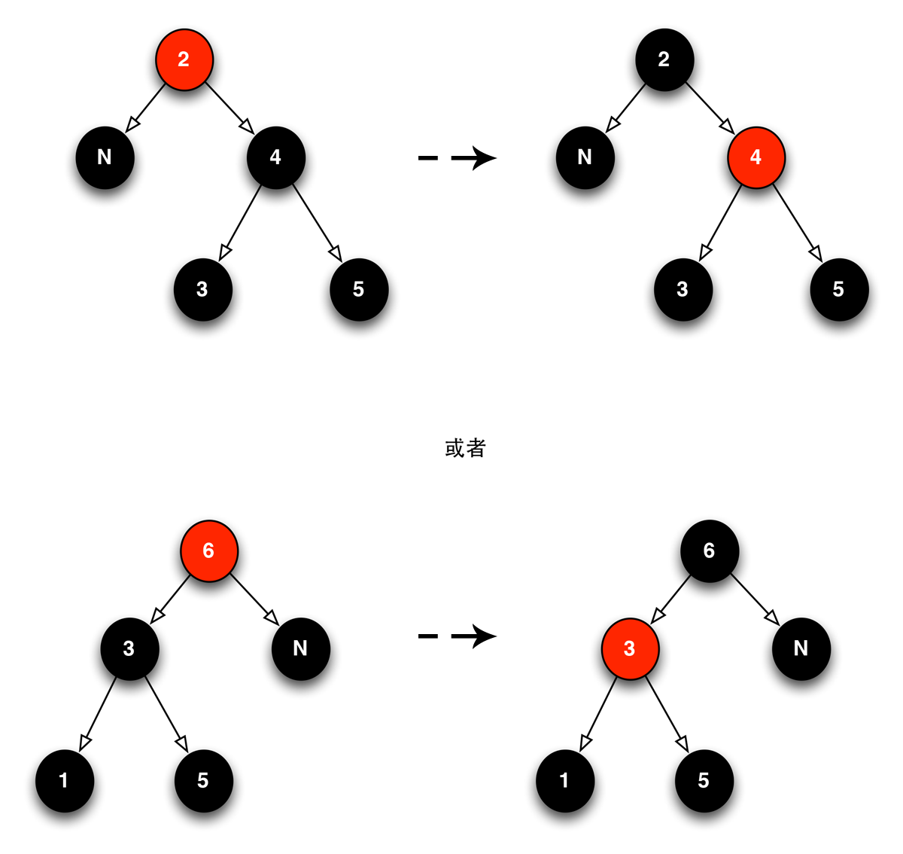

代码如下：


void delete_case4(struct rbtree *t, struct node *n) {
    if (node_color(n->parent) == RED &&
        node_color(sibling(n)) == BLACK &&
        node_color(sibling(n)->left) == BLACK &&
        node_color(sibling(n)->right) == BLACK)
    {
        sibling(n)->color = RED;
        n->parent->color = BLACK;
    }
    else
        delete_case5(t, n);
}


如果不符合上面情况，则进入情况5。

情况5：

**如果叔叔节点S是黑色，叔叔节点S的右儿子是黑色，而删除节点N是它父亲节点P的左孩子，则在叔叔节点S上做右旋。反之如果叔叔节点S是黑色，叔叔节点S的左儿子是黑色，而删除节点N是它父亲节点P的右孩子，则在叔叔节点S上做左旋。**

如果删除的节点N是左孩子，把叔叔节点的颜色变为红色，叔叔节点的左孩子颜色变为黑色。反之亦然。

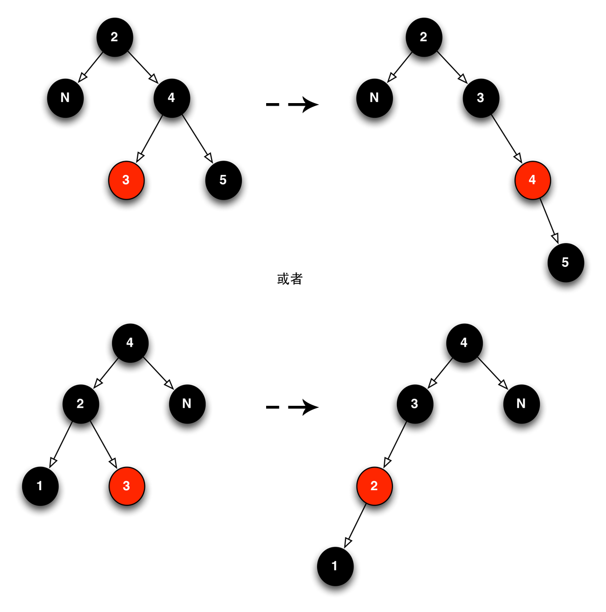

代码如下：


void delete_case5(struct rbtree *t, struct node *n) {
    if (n == n->parent->left &&
        node_color(sibling(n)) == BLACK &&
        node_color(sibling(n)->left) == RED &&
        node_color(sibling(n)->right) == BLACK)
    {
        sibling(n)->color = RED;
        sibling(n)->left->color = BLACK;
        rotate_right(t, sibling(n));
    }
    else if (n == n->parent->right &&
             node_color(sibling(n)) == BLACK &&
             node_color(sibling(n)->right) == RED &&
             node_color(sibling(n)->left) == BLACK)
    {
        sibling(n)->color = RED;
        sibling(n)->right->color = BLACK;
        rotate_left(t, sibling(n));
    }
    delete_case6(t, n);
}


如果不符合上面的情况则直接进入情况6，最后的一种情况。

情况6：

**如果叔叔节点S是黑色，叔叔节点S的右儿子是红色，而删除节点N是父节点P的左孩子，则在父节点P做左旋。反之如果叔叔节点S是黑色，叔叔节点S的左儿子是红色，而删除节点N是父节点P的右孩子，则在父节点P做右旋。**

如果删除的节点N是左孩子，则把叔叔节点的右孩子变为黑色再旋转父节点，反之亦然。

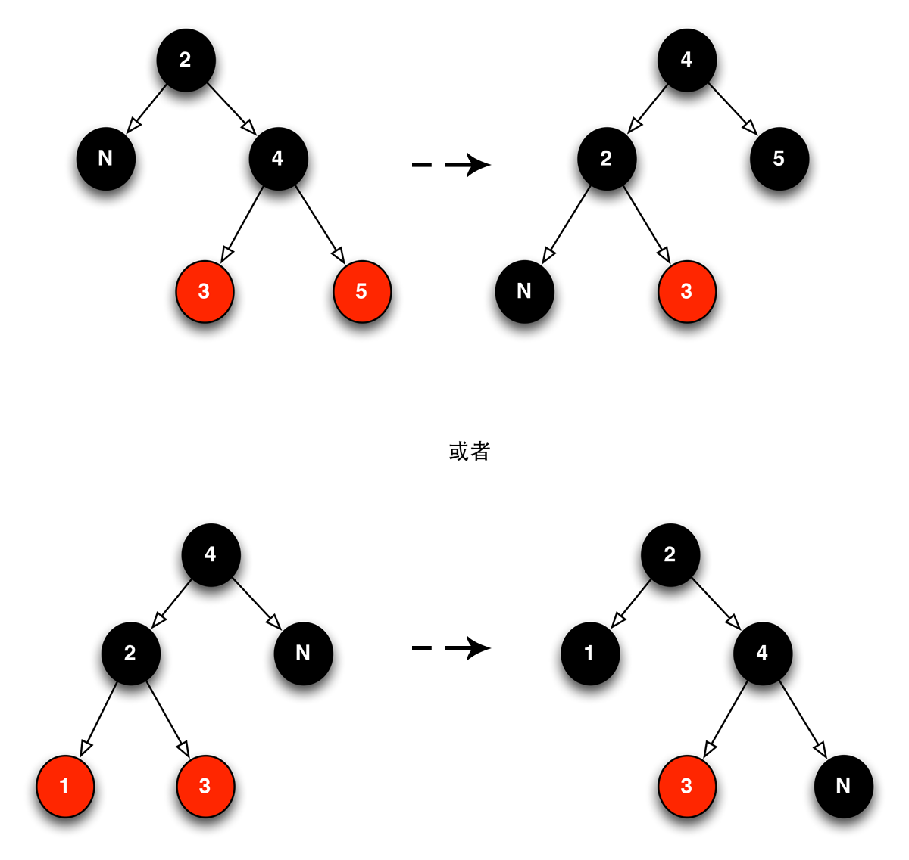

代码如下：


void delete_case6(struct rbtree *t, struct node *n) {
    sibling(n)->color = node_color(n->parent);
    n->parent->color = BLACK;
    if (n == n->parent->left) {
        sibling(n)->right->color = BLACK;
        rotate_left(t, n->parent);
    }
    else
    {
        sibling(n)->left->color = BLACK;
        rotate_right(t, n->parent);
    }
}


这样我们几种删除的情况就完成了。完成后删除代码如下：


void delete_node(struct rbtree *t, int value){
    struct node *child;
    struct node *n = search(t, value);
    if (n == NULL) {
        return;
    }
    if (n->left != NULL && n->right !=NULL ){
        struct node *pred = maximum_node(n->left);
        n->value = pred->value;
        n = pred;
    }

    child = n->right == NULL ? n->left : n->right;
    if (node_color(n) == BLACK) {
        n->color = node_color(child);
        delete_case1(t, n);
    }
    replace_node(t, n, child);
    if (n->parent == NULL && child != NULL) {
        child->color = BLACK;
    }
    free(n);
}


删除过程如下：

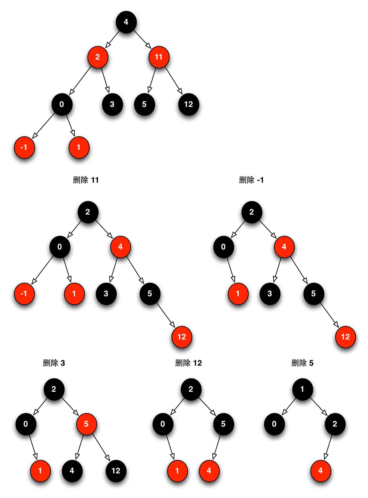

基本上我们红黑树就讲解完了，如果有任何不理解的地方，请给我发邮件，也欢迎提PR修正里面的错误内容。

完整代码可以看这个[GIST](https://gist.github.com/GuoJing/11205438)方便理解。
