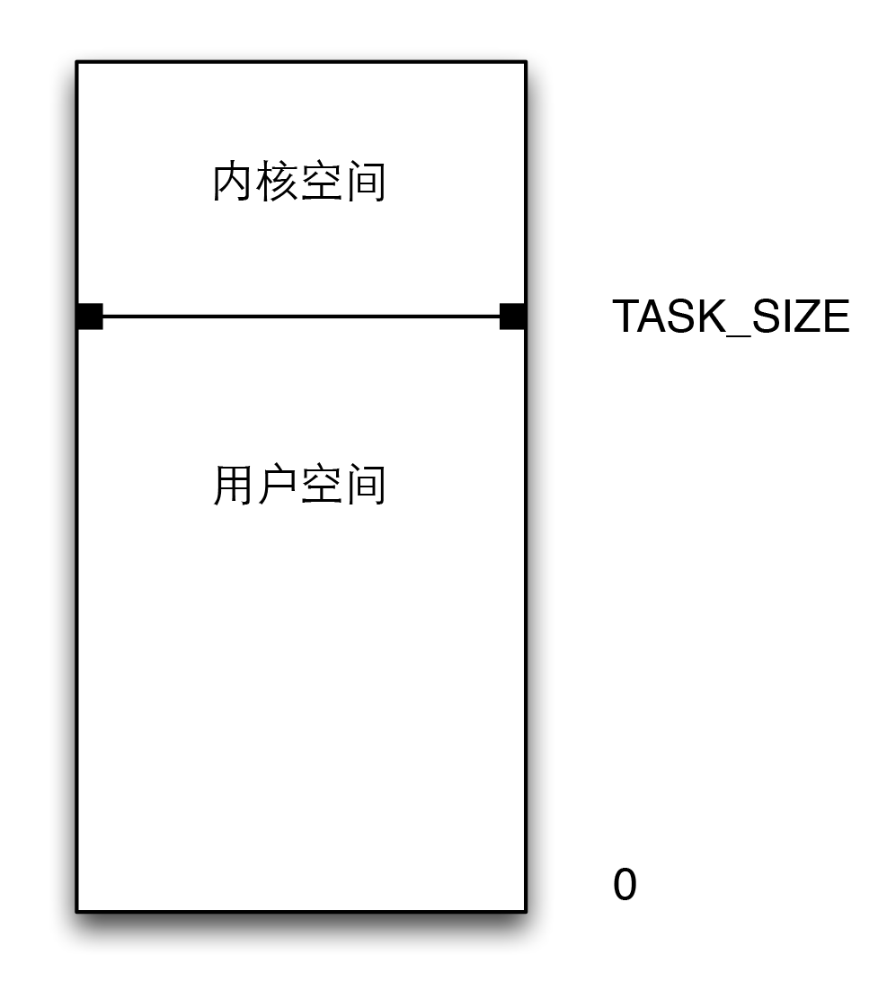

由于内存区域是通过指针寻址，因此CPU的字长，如32位，64位决定了所能管理的地址的空间的最大长度。对64位的处理器而言，可以管理2^64B的长度。

地址空间的最大长度和实际可用的物理内存数量无关，因此被称为**虚拟地址**空间。从系统中每个进程的角度来看，地址空间中只有自己一个进程，因为无法感知其他进程的存在，况且，应用程序也不需要关注其他应用程序的存在，就好像计算机中只有一个进程一样。

Linux将虚拟地址空间划分为两个部分，分别称为**内核空间**和**用户空间**。

进程地址空间

系统中每个用户进程都有自身的虚拟地址范围，从0到TASK\_SIZE。其中内核空间保留给内核专用，用户的进程不能访问。TASK\_SIZE是一个特定于计算机体系结构的常数。比如在某些系统中，地址空间在3x2^30处划分，因此每个进程的虚拟地址空间是3x2^30长。假设虚拟地址空间的总长度4x2^30，那么留给内核的就是1x2^30[^1]。不同的计算机，体系结构的划分也不尽相同。

这种划分与可用内存的数量无关。由于地址空间虚拟化的结果，每个用户进程都认为自己有3x2^30长的地址空间，各个系统进程的用户空间是完全彼此分离的。

[^1]: 虚拟地址空间的顶部和内核空间总是同样的，无论当前执行的是哪个进程。

64位计算机的情况更加复杂，因为它们在实际管理自身巨大的虚拟地址空间时，更倾向于使用小于64的位数[^2]。因此，地址空间中实际可寻址的部分小于理论长度。但无论怎样，该值仍大于计算机上实际可能的内存数量，是完全够用的。这种做法的一个优点是，与寻址完整的虚拟地址空间相比，管理有效地址空间所需的位数较少，因此CPU可以节省一些工作量[^3]。

[^2]: 如42位或47位。

[^3]: 但这样，虚拟地址空间会包含一些不可寻址的洞。