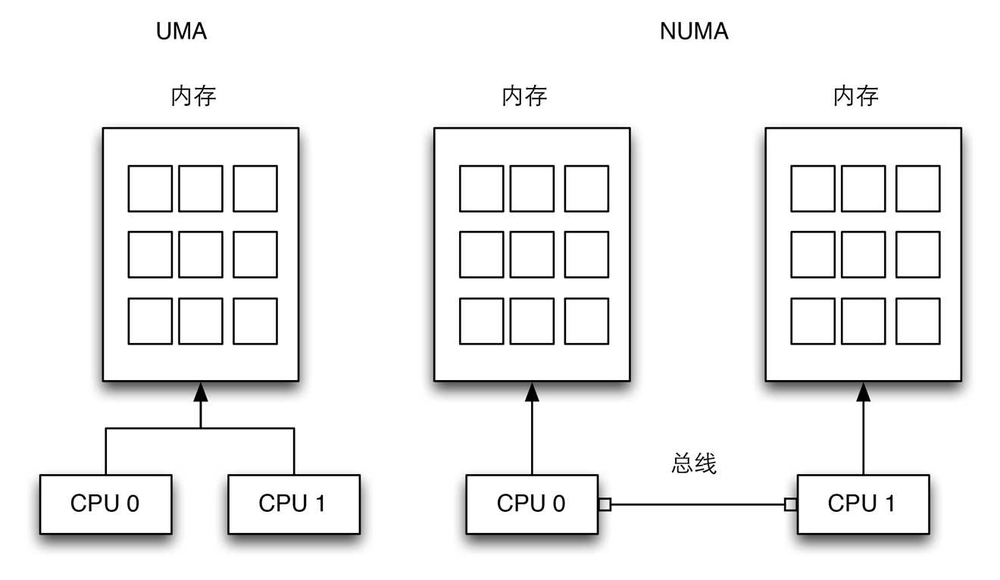
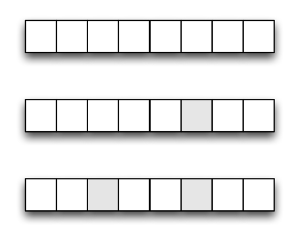

内存管理是Linux内核中最复杂的事情，其实Linux内核主要工作是内存管理，当然还有进程调度等，这篇只是基础，后面会根据进程调度，内存管理分章节来显示笔记[^1]。这里只是说说内存管理里的一些很基础的问题。

### 虚拟内存 ###

所有的新的Linux系统都提供了一种有用的抽象，叫做虚拟内存（*virtual memory*）。虚拟内存作为一种逻辑层，处于应用程序的内存请求与硬件管理单元（*Memory Management Unit*，MMU）之间，虚拟内存有很多用途和优点：

1. 若干进程可以并发地执行。
2. 应用程序所需内存大于物理内存的时候也可以运行[^2]。
3. 程序只有部分代码装入内存时进程可以执行它。
4. 允许每个进程访问可用物理内存的子集。
5. 进程可以共享函数库或程序的一个单独内存映象。
6. 程序是可重定位的，可以把程序放在物理内存的任何地方。
7. 程序员可以编写机器无关代码，无需关系物理内存的组织结构。

[^1]: 有时候我还要自己理解了才能写笔记。

[^2]: 如Firefox呵呵。

虚拟内存子系统的主要成分是虚拟地址空间的概念，进程所用的一组内存地址不同于物理内存地址，当进程使用一个虚拟地址时，内核和MMU协同定位其在物理内存中的实际位置。

现在的CPU包含了能自动把虚拟地址转换成物理地址的硬件电路。为了大刀这个目标，把可用RAM划分成长度为4KB或8KB的页框，并且引入一组页表来指定虚拟地址与物理地址之间的对应关系。这些电路让内存分配变得简单。

### UMA和NUMA ###

UMA和NUMA体系结构

有两种类型的计算机，分别以不同的方法管理物理内存。

（1）：UMA计算机（*一致内存访问，uniform memory access*）将可用内存以连续方式组织起来，系统中的每个处理器访问各个内存都是同样的块。

（2）：NUMA计算机（*非一致内存访问，non uniform memory access*）总是多处理器计算机。系统的各个CPU都有本地内存，可支持特别快的访问，各个处理器之间通过总线连接起来。

### 随机访问存储器 RAM ###

RAM基本上被划分为两部分，其中若干兆节用于存放内核映象，主要是内核代码和内核静态数据结构。其余部分通常由虚拟内存来处理，可能用于：

1. 满足内核对缓冲区、描述符及其他动态内核数据结构的请求。
2. 满足进程对一般内存区的请求及对文件内存映射的请求。
3. 借助于告诉缓存从磁盘及其他缓冲设备获得较好的性能。

虚拟内存另一个必须要解决的问题是内存碎片。理想情况下，只有页框太少，新请求的内存才能返回失败。但是有很多情况内存会产生碎片，虽然系统里有了较多的空闲内存，但可能没有连续的地址空间，则也没有足够可用的内存，不能作为一个连续的大块来使用，那么内存请求也会失败。

内存碎片

如上图的第一行，有8字节的内存，当申请4字节时，可以申请成功。假设产生了一个内存碎片，继续申请，如第二步，还是可以有4字节的内存空间。如果产生了第三步那样的内存碎片，则申请4字节的内存空间会失败，因为没有连续的内存空间。

内存碎片也是内核管理中另一个很重要的议题。

### 内核内存分配器 ###

内核内存分配器（*Kernel Memory Allocator*，KMA）是一个子系统，尝试满足系统中所有部分对内存的请求，可以看作是一个内存操作的更高抽象。KMA需要有以下特点：

1. 性能，速度要快。
2. 必须把内存的浪费减少到最少。
3. 必须努力减轻内存碎片问题。
4. 必须能与其他内存管理子系统合作。

基于不同的算法和技术，提出了几种KMA，最重要的是伙伴系统和Slab分配算法。

### 进程虚拟地址空间处理 ###

进程的虚拟地址空间包括了进程可以引用的所有虚拟内存地址。当进程通过exec调用开始某个程序执行时，内核分配给进程的虚拟地址空间由以下内存区组成：

1. 程序的可执行代码。
2. 程序的初始化数据。
3. 程序的为初始化数据。
4. 初始程序栈。
5. 所需共享库的可执行代码和数据。
6. 堆。

现在所有inx系统都采用了请求调页（*demand paging*）的内存分配策略。有了请求调页，进程可以在它的页还没有内存时就开始执行[^3]。另外还有写时复制（*copy on write*）策略。

[^3]: 当进程访问一个不存在的页时，MMU产生一个异常，异常处理程序找到受影响的内存区，分配一个空闲的页，并用适当的数据初始化。

### 高速缓存 ###

物理内存的一大优势就是用作磁盘和其他设备的高速缓存，这是因为硬盘非常慢，磁盘的访问需要数毫秒，和RAM访问相比，太慢了。所有inx系统的策略都是，尽可能的推迟写磁盘时间。因此，从磁盘读入的内存的数据即使任何进程都不再使用，也继续保存在RAM中。

这一策略的另一个好处是，例如在多个进程修改同一个文件时，可以不需要重复的低效的I/O操作，另一方面，也实现了并行化。
