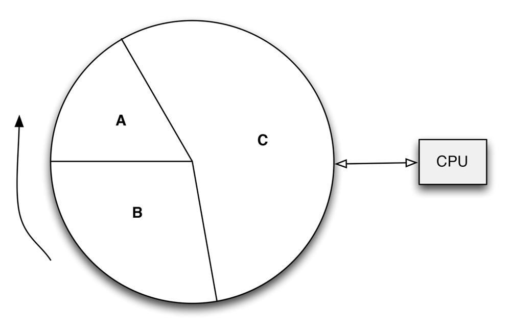

并非所有的进程都具有相同的重要性，除了一般所熟悉的进程优先级之外，进程还有不同的关键度类别，以满足不同的需求，如果比较粗糙的划分的话，进程可以分为*实时进程*和*非实时进程*。

### 硬实时进程 ###

硬实时进程有严格的时间限制，必须尽快的处理发送，即必须保证在一定的时间内完成。例如飞机处于着陆状态，而飞行员想要拉起机头，但是计算机要几秒才能响应，这什么用也没有，因为这样飞机只可能坠毁。硬实时进程的关键特征是，它必须在可保证的时间范围内得到处理。这并不意味着所要求的时间范围特别短，而是系统必须保证绝不会超过某一时间范围，即使在不大可能或者条件不利的情况下也是如此。

主流内核的Linux不支持硬实时进程，但有一些修改版本如RTLinux、Xenomai、RATI提供了该特征。在这些修改后的方案中，Linux内核作为独立的『进程』运行来处理次重要的软件，而实时的工作则在内核外部完成。只有当没有实时的关键操作执行时，内核才会运行。

### 软实时进程 ###

软实时进程是硬实时进程的一种弱化形式。尽管仍然需要快速的响应和完成，但稍微晚一点不会有什么问题，例如对CD的写入操作。CD写入进程接收的数据必须保持某一速率，因为数据是以连续流的形式写入介质。如果系统负荷过高，则可能导致数据写入中断，导致CD不可用。但相比之下，这并不会有什么大问题[^1]。

[^1]: 当然实时进程需要的CPU时间应该能得到保证，并不会被其他进程中断。

### 普通进程 ###

大多数进程都是没有特定约束的普通进程，但仍然可以根据重要性来分配优先级。例如冗长的编译或计算工作只需要低优先级，比如中断一两秒不会有什么问题。而对于用户界面而言，却需要高优先级。因为前者用户可能不会注意到什么，后者用户能很明显的感知，因此可能会很愤怒。

进程的运行按时间片调度，分配给进程的时间份额与其相对重要性相当。如果进程优先级高，则可能获取较多的CPU时间，反之则获取较少的CPU时间。可以模拟成下图：

进程调度

系统中的时间流动对应圆盘的转动，CPU则类似于扫描器，最后的效果是，尽管所有的进程都有机会运行，但重要的进程会比次要的得到更多的CPU时间。这种方案称之为抢占式多任务处理（*preemptive multitasking*），各个进程都分配到一定的时间段上执行。所有的CPU寄存器的内容和页表，在转换时都会保存起来。

这种简化的模型没有考虑的几个问题，例如，进程在某些时间可能因为无事可做而无法立即执行。为使CPU时间的利益回报尽可能最大化，这样的进程坚决不能执行。在上图中看不出来，因为其中假定所有的进程都是可以立即执行的。另外一个忽略的事实是Linux支持不同的调度类别[^2]，调度时也必须考虑到这一点。此外在有重要的进程变为就绪状态可以运行时，有一种选项是抢占当前进程，图中也没有反映出这一点。

[^2]: 进程之间完全公平的调度和实时调度。