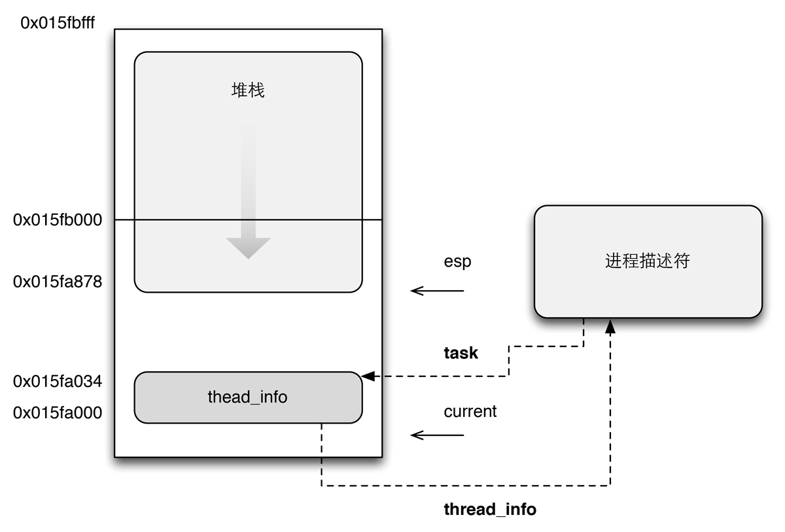

能被独立调度的每个执行上下文都必须有自己的进程描述符，因此，使用共享内核大部分数据结构的轻量级进程也有自己的task_struct结构。

进程和进程描述符之间有非常严格的一一对应关系，这使得用32位进程描述符地址标[^1]识进程成为一种方便的方式。进程描述符指针指向这些地址，内核对进程的大部分引用是通过进程描述符指针进行的。

[^1]: 尽管从技术上说，这32位仅仅是一个逻辑地址的偏移量部分，但它们与线性地址相一致。

另一方面，类Unix操作系统允许用户使用一个叫进程标识符（*process ID*）的数来标识进程，PID存放在进程描述符pid字段中。PID被顺序变好，新创建的进程的PID通常是前一个进程的PID+1，PID并非无限向上增长。PID有一个最大值上限，当超过了这个上限后，PID就开始循环使用已闲置的小PID号。在默认情况下，最大的PID号是32767[^2]。

[^2]: PID_MAX_DEFAULT-1。

系统管理员可以通过往`/proc/sys/kernel/pid_max`这个特殊文件写入一个更小的值来减小PID上限。64位系统PID最大值可以扩展到4194303。

### 进程PID ###

每个进程除了PID这个特征值以外，还有其他的ID，有以下几种可能类型。

1. 处于某个线程组中的所有进程都统一的线程组ID（*TGID*），如果进程没有使用线程，则PID==TGID。
2. 独立进程可以合并成进程组，使用setpgrp系统调用即可。
3. 几个进程组可以合并成一个会话，会话中所有进程都有同样的会话ID，保存在task_struct的session成员中。

### 命名空间 ###

命名空间[^namespace]增加了PID管理的复杂性，PID命名空间按照层次组织。在建立一个新的命名空间时，该命名空间中所有PID对父命名空间都是可见的，但子命名空间无法看到父命名空间的信息。但这意味着某些进程有多个PID，凡可以看到该进程的命名空间，都会为其分配一个PID，这必须反映在数据结构中。所以有了全局ID和局部ID。

[^namespace]: 可以看[《进程类型和命名空间》](/linux-kernel-architecture/2014/04/02/process-type-and-namespace/)。

1. 全局ID时在内核本身和初始命名空间中唯一的ID号，init属于初始命名空间。对每个ID类型，都有一个给定的全局ID。
2. 局部ID属于某个特定的命名空间，不具备全局有效性，只在命名空间内部有效。

#### \<sched.h\> ####


struct task_struct {
    pid_t pid;
    pid_t tgid;
};


### 管理PID ###

一个小型的子系统称之为PID分配器用于加速ID的分配，此外内核需要提供辅助函数实现查找task\_struct的功能，以及将ID的内核标识形式和用户空间转换。其数据结构大致如下：

#### \<pid_namespace.h\> ####


struct pid_namespace {
    struct task_struct *child_reaper;
    int level;
    struct pid_namespace *parent;
};


于是：

1. 每个PID命名空间都具有一个进程，发挥相当于全局init进程的作用。
2. parent时指向父命名空间的指针，level标识当前命名空间在命名空间层次结构中的深度。

由于循环使用PID编号，内核必须通过管理一个叫pidmap\_array位图来表示当前已分配的PID号和闲置的PID号。因为一个页框包含32768个位，所以在32位体系结构中pidmap\_array位图粗放在一个单独的页。在64位体系结构中，当内核分配了超过当前位图大小的PID号时，需要位PID位图增加更多的页，系统会一直保存这些页不被释放。

Linux把不同的PID与系统中每个进程或轻量级进程相关联，这种方式提供最大的灵活性，因为系统中每个执行上下文都可以被唯一的识别。另一方面，Unix程序员希望同一组中的线程有共同的PID，这样就可以把信号发送给指定的PID的一组线程，这个信号会作用于该组中的所有线程。遵照这样的设计，Linux引入线程组，一个线程组中的所有线程使用和该线程组的领头线程（*thread group leader*）相同的PID，也就是该组中第一个轻量级进程的PID，它被放入进程描述符tgid字段中。getpid()系统调用会返回当前进程的tgid值而不是pid的值。

因此，一个多线程应用的所有线程共享相同的PID。

### 进程描述符处理 ###

进程是动态实体，其生命周期范围从几毫秒到几个月。因此，内核必须能够处理很多进程，并把进程描述符存放在动态内存中。Linux都把两个不同的数据结构紧凑地存放在一个单独为进程分配的存储区域内，一个是与进程描述符相关的小数据结构thread_info，叫做线程描述符。另一个是内核态的进程堆栈。

进程堆栈大小通常为8192个字节。考虑到效率的因素，内核让这8K空间占据连续的两个页框并让第一个页框的起始地址是2^13的倍数。当几乎没有可用的动态内存空间时，就会很难找到这两个连续页框，因为空闲空间可能存在大量碎片。因此，在80x86体系结构中，在编译时可以设置，以使内核堆栈和线程描述符跨越一个单独的页框。

进程堆栈

esp寄存器是CPU栈指针，用来存放栈顶单元的地址。在80x86系统中，栈起始于末端，并朝这个内存区开始的方向增长。从用户态刚切换到内核态以后，进程的内核栈总是空的。因此esp寄存器指向这个栈的顶端。一旦数据写入堆栈，esp的值就递减，因为thread_info结构是52个字节长，因此内核栈能扩展到8140个字节。

current是当前进程指针。

下面C语言大概描述了线程描述符和内核栈：


union thread_union {
    struct thread_info thread_info;
    unsigned long stack[2048];
};


### 标识当前进程 ###

thread\_info结构与内核态堆栈之间的紧密结合提供的主要好处是内核很容易从esp寄存器的值获得当前在CPU上正在运行的进程thread\_info结构地址。如果thread\_info的结构长度是8K，则内核屏蔽掉esp的低13位有效位就可以获得thread\_info结构的基地址；如果thread\_info结构长度是4K，内核只需要屏蔽esp的低12位有效位。

进程最常用的是进程描述符的地址而不是thread_info结构的地址。为了获得当前在CPU上运行的描述符指针，内核调用current[^3]宏获取。current宏进程作为进程描述符字段的前缀出现在内核代码中，例如`current->pid`返回在CPU上正在执行的进程PID。

[^3]: current_thread_info()->task。
