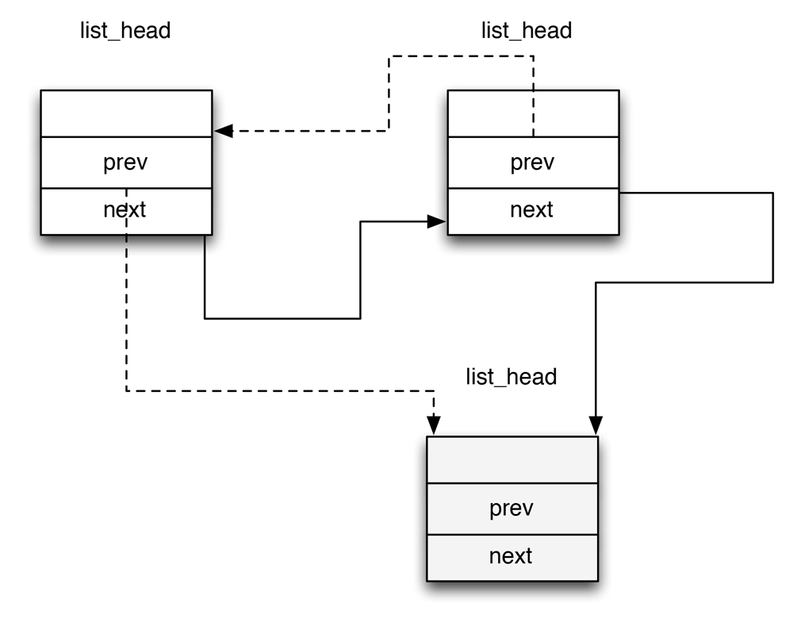

进程链表是一种双向链表数据结构（*list_head*），简单的说一下双向链表。每一个双向链表，都有一组操作，插入和删除一个元素，扫描链表等等。双向链表和链表相同，但双向链表除了有指向下一个元素的指针，还有指向上一个元素的指针，所以被称为双向连表。

进程链表

Linux内核提供了*list_head*数据结构，字段*next*和*prev*分表标识链表向后和向前的指针元素。list\_head字段的指针中存的是另一个list\_head字段的地址。新链表使用宏LIST\_HEAD(list_name)创建。

### 进程链表 ###

进程链表是一个双向链表，进程链表把所有进程的描述符链接起来。每个*task_struct*
结构都包含一个*list_head*类型的*tasks*字段，这个类型的*orev*和*next*字段分别指向前面和后面的*task_struct*元素。

进程链表的表头是*init_task*描述符，就是0进程（*process 0*）或*swapper*进程的进程描述符。*init_task*的*tasks.prev*字段指向链表中最后插入的进程描述符的*tasks*字段。SET\_LINKS和REMOVE\_LINKS宏分别用于从进程链表中插入和删除一个进程描述符。另外*for_each_process*宏用来扫描整个进程链表。

### TASK_RUNNING状态的进程链表 ###

当内核寻找一个在CPU上运行的进程，必须值考虑可运行的进程。早先的Linux把所有可运行的进程都放在一个叫做运行队列（*runqueue*）的链表中，由于维持连表中的进程优先级排序开销过大，因此早起的调度程序不得不为了某些特殊的功能扫描整个链表。在Linux 2.6实现的运行队列则有所不同。其目的是让调度程序能在固定的时间内选出『最佳』可运行进程，与队列中可运行的进程数无关。

**提高调度程序运行速度的诀窍是建立多个可运行进程链表，每种进程优先级对应一个不同的链表**。

每个*task_struct*描述符包含一个*list_head*类型的字段*run_list*。如果进程的优先级等于k[^1]，*run_list*字段把该进程加入优先权为k的可允许进程连表中。在多CPU系统中，每个CPU都有自己的运行队列，这是一个通过使数据结构更复杂来改善性能的典型例子。

[^1]: 其取值范围从0到139。

进程描述符的*prio*字段存放进程的动态优先级，而*array*字段是一个指针，指向当前运行队列的*prio_array_t*的数据结构。