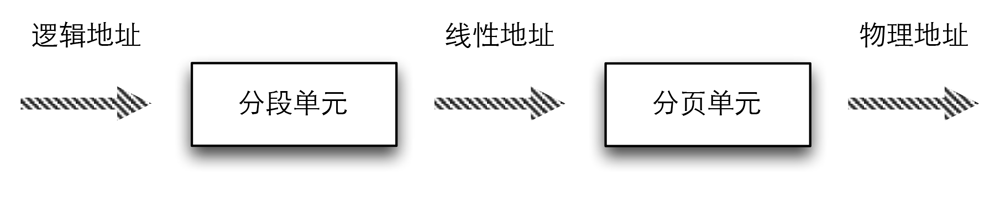

现代的操作系统自身不必完全了解物理内存；如今的微处理器包含的硬件线路使得内存管理既高效又健壮，所以编程错误就不会对该程序之外的内存产生非法访问。

陈许愿偶尔会引用内存地址（*memory address*）作为访问单元内容的一种方式，但是，当使用80x86微处理器时，必须区分三种不同的地址：

### 逻辑地址（*logical address*） ###

包含在机器语言指令中用来规定一个操作数或一条指令的地址。这种寻址方式在80x86著名的分段结构中表现的尤为具体，它促使MS-DOS或Windows程序员把程序分成若干段。每个逻辑地址都由一个段（*segment*）和偏移量（*offset*或*displacement*）组成，偏移量指明了从段开始的地方到实际地址之间的举例。

### 线性地址（*linear address*） ###

线性地址也成虚拟地址（*virtual address*）。线性地址是一个32位无符号整数，可以用来表示高达4GB的地址，也就是，高达4294967296个内存单元。线性地址通常用十六进制数字表示，值的范围从0x00000000到0xffffffff。

### 物理地址（*physical address*）###

用于内存芯片级内存单元寻址。它们与从微处理器的地址引脚发送到内存总线上的电信号相对应。物理地址由32位或36位无符号整数表示。

### 内存控制单元 ###

内存控制单元（*MMU*）通过一种称为分段单元（*segmentation unit*）的硬件电路把一个逻辑地址转换成线性地址；然后，第二个称为分页单元（*paging unit*）的硬件电路把线性地址转换成一个物理地址。

内存控制单元转换示意图

在多处理系统中，所有CPU都共享同一内存；这意味着RAM芯片可以由独立的CPU并发地访问。因为在RAM芯片上的读或写操作必须串行地执行，因此，一种所谓的内存仲裁器（*memory arbiter*）的硬件电路插在总线和每个RAM芯片之间。

内存仲裁器的作用是如果某个RAM芯片空闲，就准予一个CPU访问，如果该芯片忙于为另一个处理器提出的请求服务，就延迟这个CPU的访问。即使在单处理器上也使用内存仲裁器，因为单处理器系统中包含一个叫做DMA控制器的特殊处理器。而DMA控制器与CPU并发操作。

在多处理器系统的情况下，因为仲裁器有多个输入端口，所以其结构更加复杂。例如，双Pentium在每个芯片的入口维持一个两端口仲裁器，并在试图使用公用总线前请求两个CPU交换同步信息。但是从编程的角度来看，因为仲裁器由硬件电路管理，因此它是隐藏的。

### 硬件中的分段 ###

从80286模型开始，Intel微处理以两种不同的方式执行地址转换，这两种方式分别为实模式（*real mode*）和保护模式（*protected mode*）。现在主要讨论保护模式下的地址转换，实模式的存在主要原因是要维持处理器与早起模型兼容，并让操作系统自举。