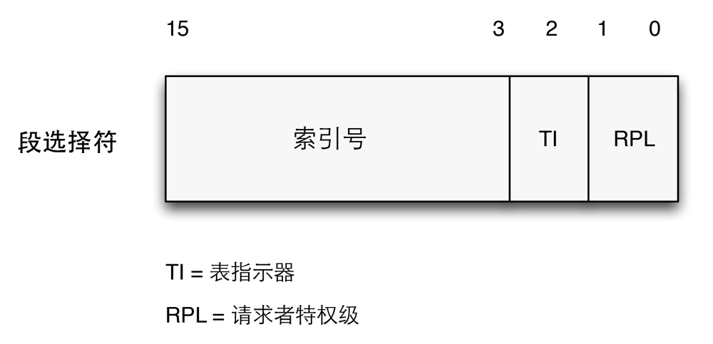

一个逻辑地址由两部分组成：一个段标识符和一个指定段内相对地址的偏移量。段标识符是一个16位长的字段，称为段选择符（*Segment Selector*），而偏移量是一个32位长的字段。

段选择符

为了快速方便地找到段选择符，处理器提供段寄存器，段寄存器地唯一目的是存放段选择符。这些段寄存器称为cs、ss、ds、es、fs和gs。尽管只有6个段寄存器，但程序可以把同一个段寄存器用于不同地目的，这6个段寄存器3个有专门的用途：

1. cs：代码段寄存器，指向包含程序指令的段。
2. ss：栈段寄存器，指向包含当前程序栈的段。
3. ds：数据段寄存器，指向包含静态数据或者全局数据段。

其他三个段寄存器用作一般用途，可以指向任意的数据段。除此之外，cs寄存器还有一个很重要的功能：它含有一个两位的字段，用以指明CPU的当前特权级（*Current Privilege Level，CPL*）。值为0代表最高优先级，而值为3代表最低优先级。Linux只用0级和3级，分别称之为内核态和用户态。

段选择符所包含的3个字段及其意义为：

字段名           | 说明
------------    | -------------
index           | 指定了放在GDT或LDT中的相应段描述符的入口
TI              | TI（*Table Indicator*）标志，指明了段描述符是在GDT中或是在LDT中[^1]。
RPL             | 请求者特权级，当相应的段选择符装入到cs寄存器中时指示出CPU当前的特权级，它还可以用于访问数据段时由选择地削弱处理器的特权级

[^1]: TI=1则在LDT中，TI=0则在GDT中。