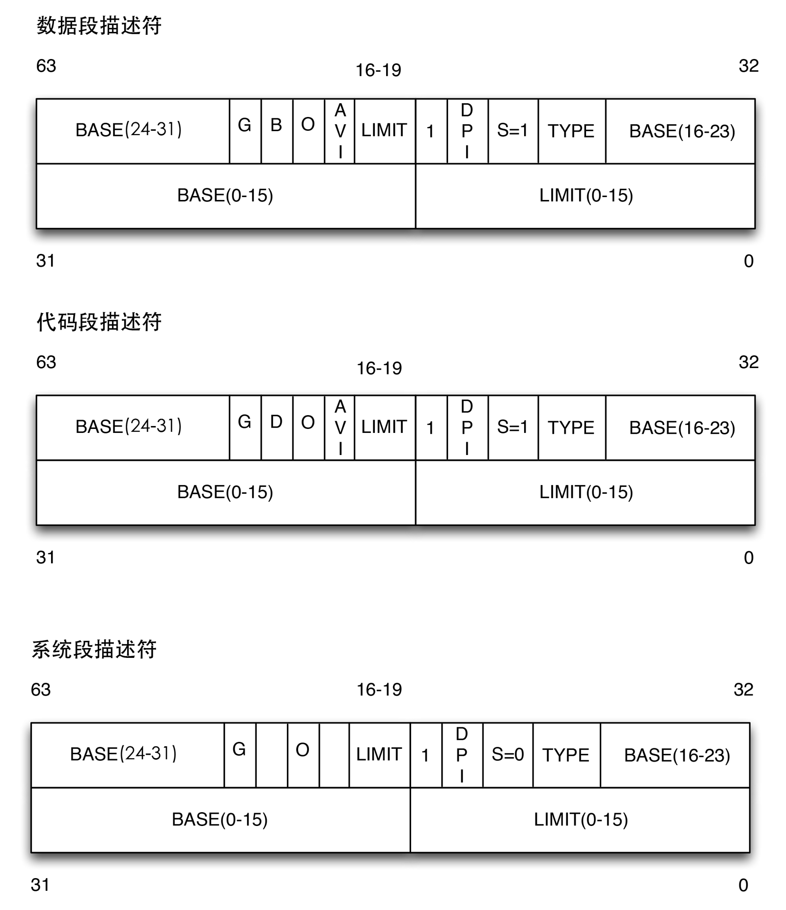

每个段由一个8字节的段描述符（*Segment Descriptor*）表示，它描述了段的特征。段描述符放在全局描述符表（*Global Descriptor Table，GDT*）或局部描述符表（*Local Descriptor Table，LDT*）中。

通常只定义一个GDT，而每个进程除了存放在GDT中的段之外如果还需要创建附加的段，可以拥有自己的LDT。GDT在主存中的地址和大小存在*gdtr*控制寄存器中，当前正被使用的LDT地址和大小放在*ldtr*控制寄存器中。

有几种不同类型的段以及它们对应的段描述符，下面列出了Linux中广泛采用的类型：

### 代码段描述符 ###

表示这个段描述符代表一个代码段，它可以放在GDT或LDT中。该描述符置S标志为1，并且为非系统段。

### 数据段描述符 ###

表示这个段描述符代表一个数据段，它可以放在GDT或LDT中。该描述符置S标志为1，栈段是通过数据段实现的。

### 任务状态段描述符（*TSSD*） ###

表示这个段描述符代表一个任务状态段（*Task State Segment，TSS*），也就是说这个段用于保存处理器寄存器的内容。它只能出现在GDT中。根据相应的进程是否正在CPU上运行，其Type字段的值分别为11或9。这个描述符的S标志被置为0。

### 局部描述符表描述符（*LDTD*） ###

这个表示段描述符代表一个包含LDT的段，他置出现在GDT中。相应的Type字段的值为2，S标志被置为0。

段描述符示意图

相应字段的意义如下：

字段名           | 说明
------------    | -------------
Base            | 包含段的首字节的线性地址
G               | 粒度标志，如果为0，则段大小以字节为单位，否则以4096字节的倍数计算
Limit           | 存放段最后一个内存单元的偏移量，从而决定段的长度。如果G被置为0，则一个段的大小在一个字节到1MB之间变化，否则，将在4KB到4GB之间变化
S               | 系统标志，如果被置为0，则这是一个系统段，否则为普通的代码段或者数据段
Type            | 描述了段的类型特征和它的存取权限
DPL             | 描述符特权等级字段，用于限制这个段的存取。它表示为访问这个段而要求的CPU最小的优先级，因此DPL设置为0的段只能当CPL为0时，也就是内核态才可以访问。DPL设为3则堆任何CPL值都是可访问的
P               | *Segment-Present标志*，等于0表示段当前不在主存中。Linux总是把此标志设为1，因为Linux从来不把整个段交换到磁盘上去
D或B            | 称为D或B标志，取决于是代码段还是数据段，D和B的含义在两种情况下有区别，如果段偏移量的地址是32位长，就基本上把它设置为1，如果偏移量是16位长，则清零
AVL             | 可以由操作系统使用，但是被Linux忽略