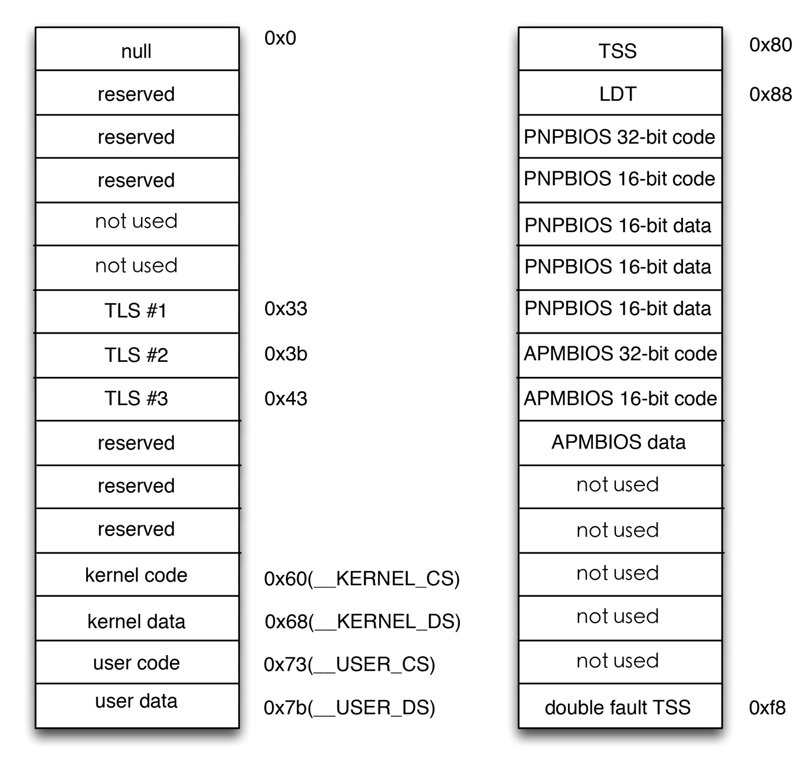

80x86处理器中的分段鼓励程序员把程序分成逻辑上相关的实体，比如子程序或者全局与局部的数据区。然而，Linux以非常有限的方式使用分段，实际上分段和分页某种程度上有点多余，因为它们都可以划分进程的物理地址空间。分段可以给每一个进程分配不同的线性地址空间，而分页可以把同一线性地址空间映射到不同的物理空间。与分段相比，Linux更喜欢分页的方式：

* 当所有进程使用相同的段寄存器时，内存管理变得简单，它们可以共享同一组线性定制。
* Linux设计目标之一时可以把它移植到绝大多数留下的处理器平台上，然而RISC[^1]体系结构对分段的支持有限。

[^1]: 精简指令集系统，大多数系统还属于CISC（*complex instruction set computer*，复杂指令集）系统。

2.6版本的Linux只有在80x86结构下才需要使用分段。

运行在用户态的所有Linux进程都使用一对相对的段来对指令和数据寻址。这两个段就是所谓的用户代码段和用户数据段，类似地，运行在内核态的所有Linux进程都使用一对相同的段对指令和数据寻址：它们分别叫做内核代码段和内核数据段。

相应的段选择符由宏\_\_USER\_CS，\_\_USER\_DS，\_\_KERNEL\_CS和\_\_KERNEL\_DS分别定义。如果为了对内核代码段寻址，内核只需要把\_\_KERNEL\_CS装进cs段寄存器就好。而对内核数据段寻址，则将\_\_KERNEL\_DS装进ds段寄存器。

所有与段相关的线性地址从0开始，到达2^32-1的寻址限长。所以用户态或内核态下的所有进程可以使用相同的逻辑地址。而所有段从0开始，可以得出，在Linux下逻辑地址与线性地址是一致的，即**逻辑地址的偏移量字段的值与相应的线性地址的值总是一致的**。

CPU当前的特权级（*CPL*）反映了进程是在用户态还是内核态，并由存放在*cs*寄存器中的段选择符的*RPL*字段指定。只要当前特权级被改变，一些段寄存器必须相应地更新。例如CPL=3时，说明在用户态，*ds*寄存器必须含有用户端的段选择符，如果进入内核态，则CPL=0，*ds*寄存器则必须含有内核数据段的段选择符。

这种情况也出现在*ss*寄存器中，当CPL为3时，它必须指向一个用户数据段中的用户栈。当CPL=0时，它必须指向内核数据段中的一个内核栈。当状态转换时，Linux总是确保*ss*寄存器中装有相应权限的数据段的段选择符。

当对指向指令或者数据结构指针进行保存时，内核根本不需要为其设置逻辑地址的段选择符。因为*cs*寄存器就含有当前的段选择符。例如，当内核调用一个函数时，它执行一条*call*汇编语言指令，该指令仅仅指定其逻辑地址的偏移量部分。而段选择符不用设置，它已经隐含在*cs*寄存器中了。因为在内核态执行的段只有一种，叫做代码段，由宏\_\_KERNEL\_CS定义。

所以只要当CPU切换到内核态时将\_\_KERNEL\_CS装载到*cs*就足够了。同样的道理也适用于指向内核数据结构的指针以及指向用户结构的指针。实际上这里只需要了解，每当CPU特权级更新，内核就应该保证相应的寄存器存放相应的段选择符。

### Linux GDT ###

在单处理器系统只有一个全局描述符表（*GDT*），在多处理器中每个CPU对应一个GDT。所有GDT都存放在*cpu_gdt_table*数组中，而所有GDT的地址和它们的大小被存放在*cpu_gdt_descr*数组中。在新的内核中更建议使用*get_cpu_gdt_table*函数，其参数为*cpu*的实例。

GDT的布局如下，每个GDT包含18个段描述符和14个空的未使用的保留项。插入未使用的项时为了使经常一起访问的描述符能够处于同一32字节的硬件高速缓存中。

GDT结构表

每一个GDT中包含的18个段描述符指向下列的段：

用户态和内核态下的代码段和数据段，如\_\_USER\_CS，\_\_USER\_DS，\_\_KERNEL\_CS和\_\_KERNEL\_DS。

任务状态段（*TSS*），每个处理器有1个，每个TSS相应的线性地址空间都是内核数据段相应线性地址空间的一个小子集。所有的任务状态段都是顺序地存放在*init_tss*数组中。

1个包括缺省局部描述符表的段，这个段通常是被所有进程共享的段。

3个局部线程存储（*Thread-Local Storage，TLS*）段：这种机制允许多线程应用程序使用最多3个局部线程的数据段。系统调用*set_thread_area*和*get_thread_area*分别为正在执行的进程创建和撤销一个TLS段

与高级电源管理（*AMP*）相关的3个段，由BIOS代码使用。

与支持即插即用（*PnP*）功能的BIOS服务程序相关的5个段，由BIOS代码使用。

被内核用来处理双重错误[^2]异常的特殊TSS段。

[^2]: 处理一个异常时可能引发另一个异常，这种情况下产生双重异常。

其实看图就已经非常好理解了。

### Linux LDT ###

大多数用户态下的Linux程序不使用局部描述符表，这样内核就定义了一个缺省的LDT供大多数进程共享。缺省的局部描述附表放在*default_ldt*数组中。它包含5个项，但内核仅仅有效地使用了其中的两个项：用于iBCS执行文件的调用门和Solaris/x86可执行文件的调用门[^3]。

[^3]: 调用门是80x86微处理器提供的一种机制，用于在调用预定义函数时改变CPU的特权级。

在某些情况下，进程仍需要创建自己的局部描述符表，这对有些应用程序很有用，比如Wine，它们执行面向段的微软Windows应用程序。*modify_ldt()*系统调用允许进程创建自己的局部描述符表。

任何被*modify_ldt()*创建的自定义局部描述符表仍然需要它自己的段。当处理器开始执行拥有自定义局部描述符表的进程时，该CPU的GDT副本中的LDT表项相应地就被修改了。

用户态下地程序同样也利用*modify_ldt()*来分配新地段，但内核从不使用这些段，它也不需要了解相应地段描述符，因为这些段描述符被包含在进程自定义的局部描述符表中了。
