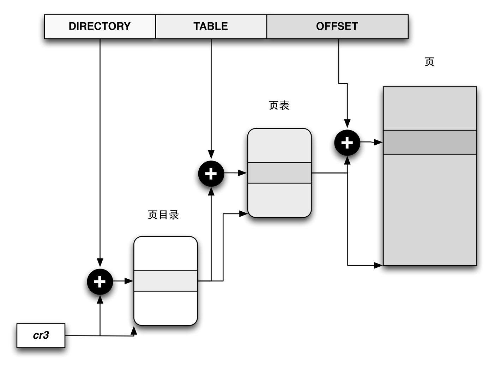
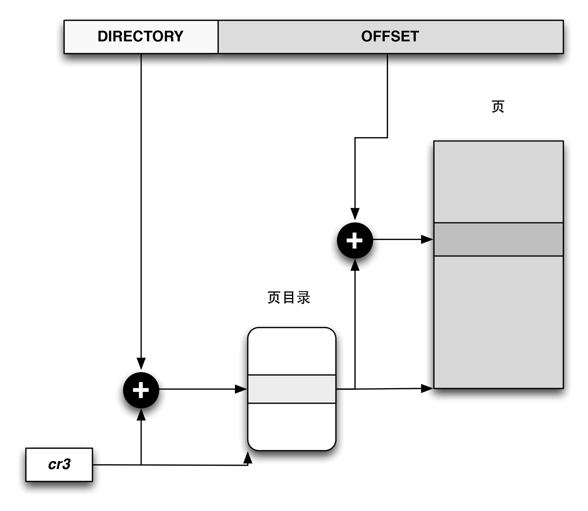

分页单元（*paging unit*）把线性地址转换成物理地址，其中一个关键任务是把所请求的访问类型与线性地址的访问权限相比较，如果这次访问是无效的，就产生一个缺页异常。

为了效率起见，线性地址被分成以固定长度为单位的组，称为页（*page*）。页内部连续的线性地址被映射到连续的物理地址中。这样，内核可以指定一个页的物理地址和其存取权限，而不用指定页所包含的全部线性地址的存取权限。

**我们使用『页』既指一组线性地址，又指包含在这组地址中的数据。**

分页单元把所有的RAM分成固定长度的页框（*page frame*），有时候页叫做物理页。每一个页框包含一个页，也就是说一个页框的长度与一个页的长度一致。页框是主存的一部分因此也是一个存储区域。

区分一个页和一个页框[^page]很重要，页只是一个数据块，可以存放在任何页框或磁盘中。

把线性地址映射到物理地址的数据结构称为页表（*page table*），页表存放在主存中，并在启动分页单元之前必须由内核对页表进行适当的初始化。从80386开始，所有的80x86处理器都支持分页，它通过设置*cr0*寄存器的*PG*标志启用。当PG=0时，线性地址就被解释成物理地址。

[^page]: 页是一组数据，页框是主存的物理地址。

### 页帧 ###

页帧代表系统内存的最小单位，对内存中的每个页都会创建*struct page*的实例。内核程序员需要保持该结构尽可能的小，因为即使在中等程度的内存配置下，系统的内存同样会分解位大量的页，只要增加少量的结构数据，就会成百上千的在系统中出现。例如系统标准页长度为4KB，主存大小为384MB的时候，会有大约100000个页，即便增加一个简单的整型指针，也会扩大上十万倍。

内存管理的许多部分都使用页，由于页的数目巨大，因此对*page*结构的小改动都会导致内存暴涨。而另一方面，由于页的广泛使用，增加了保持结构长度的南都，由于不同用图，内核一个部分可能完全依赖于*page*提供的特定信息，但该信息对内核的另一部分可能完全无用。

C语言中的联合（*union*）很适合该问题，尽管没有办法增加*page*结构体的清晰度。代码如下：

#### <include/linux/mm_types.h> ####


struct page {
    unsigned long flags;
    atomic_t _count;
    union {
        /* Count of ptes mapped in mms,
         * to show when page is mapped
         * & limit reverse map searches.
         */
        atomic_t _mapcount;
        /* SLUB */
        struct {
            u16 inuse;
            u16 objects;
        };
    };
    union {
        struct {
        unsigned long private;
        struct address_space *mapping;
        };
#if USE_SPLIT_PTLOCKS
        spinlock_t ptl;
#endif
        struct kmem_cache *slab;
        struct page *first_page;
    };
    union {
        pgoff_t index;
        void *freelist;
    };
    struct list_head lru;
#if defined(WANT_PAGE_VIRTUAL)
    void *virtual;
#endif
#ifdef CONFIG_WANT_PAGE_DEBUG_FLAGS
    unsigned long debug_flags;
#endif

#ifdef CONFIG_KMEMCHECK
    void *shadow;
#endif
};


### 页表 ###

层次化的页表用于支持对大地址空间的快速、高效的管理。

> 我们知道页表用于建立用户进程的虚拟地址空间和系统物理内存之间的关联。到目前为止的结构主要用来描述内存的结构，例如划分的节点和内存域，同时指定了其中包含的页帧的数量和状态，页表用于向每个进程提供一致的虚拟地址空间。应用程序看到的地址空间是一个连续的内存区，该表也将虚拟内存映射到物理内存，因而支持共享内存的实现，还可以在不额外增加物理内存的情况下，将页换出到设备来增加有效的可用内存。

内核内存管理总是假定使用四级页表，而不管底层是否如此，但有些情况下，有些系统只使用两级分页页表系统，因此第三和第四级页表由特定于体系结构的代码模拟。

页表管理分为两个部分，第一部分依赖于体系结构，第二部分是体系结构无关。所有的数据结构和操作数据结构的几乎所有函数都是定义在特定于体系额机构的文件中。由于特定不同的CPU的实现差别比较大，所以不深入。

### 冷热页 ###

*struct zone*的pageset成员用于实现冷热分配器（*hot-n-cold allocator*）。内核说页是热的，意味着页已经加载到CPU高速缓存，与在内存中的页相比，其数据能够尽快的访问。相反，冷页面则不在高速缓存中。

### 常规分页 ###

从80386开始，Intel处理器的分页单元处理4KB的页。32位的线性地址被氛围3个域：

1. *Directory（目录）*：最高10位。
2. *Table（页表）*：中间10位。
3. *Offset（偏移量）*：最低12位。

线性地址的转换分两步完成，每一步都基于一种转换表，第一种转换表称为页目录表（*page directory*），第二种转换表称为页表（*page table*）。

使用这种二级模式的目的在于减少每个进程页表所需RAM的数量。如果使用简单的一级页表，那将需要高达2^20个表项来表示每个进程的页表。即使一个进程并不使用那个范围内的素有地址。二级模式通过置位进程实际使用的哪些虚拟内存区请求页表来减少内存的使用量。

每个活动进程必须有一个分配给它的页目录。不过，没有必要马上位进程的所有页表都分配RAM，只有进程在实际需要一个页表是才给该页表分配RAM会更有效率。正在使用的页目录的物理地址存放在控制寄存器*cr3*中。线性地址内的*Directory*字段决定页目录中的目录项，而目录项指向适当的页表。

地址的*Table*字段依次又决定页表中的表项，而表项含有页所在页框的物理地址。*Offset*字段决定页框内的相对位置，如下图。

硬件中的分页

*Directory*字段和*Table*字段都是10位长，因此页目录和页表都可以多大1024项，那么一个页目录可以寻址到高达2^32个存储单元。

页目录和页表项有相同的结构，每项都包含如下字段：

字段名             | 说明
------------      | -------------
Present           | Present=1则说明所指的页或页表就在主存中，如果为0，则这一页不在主存中。这个表项的剩余的位可由操作系统用于自己的目的。如果执行一个地址转换所需的页表项或页目录项中的Present标志为0，那么分页单元就把该线性地址存放在寄存器cr2中，并产生缺页异常
Field             | 由于每个页框有4KB的容量，那么它的物理地址必须是4096的倍数，因此物理地址的最低12位总是为0.如果这个字段指向一个页目录，相应的页框就含有一个页表，如果它指向一个页表，相应的页框就含有一页数据
Accessed          | 每当分页单元对相应页框进行寻址时就设置这个标志。当选中的页被交换出去时，这个标志就可以由操作系统使用
Dirty             | 只应用于页表项中，每当对一个页框进行写操作时就设置这个标志，与Accessed标志一样，当选中的页被交换出去时，这个标志就可以由操作系统使用
Read/Write        | 含有页或页表的存取权限
User/Supervisor   | 含有访问页或页表所需的特权级
PCD/PWT           | 控制硬件高速缓存处理页或页表的方式
Page Size         | 值应用于页目录项，如果设置为1，则页目录指定的是2MB或4MB的页框
Global            | 只应用于页表项，这个标志是在Pentium Pro引入的，用来防止常用页从TLB告诉缓存中刷新出去。只有在cr4寄存器的页全局启用（PGE）标志置位时这个标志才起作用。

### 扩展分页 ###

从Pentinum模型开始，80x86微处理器引入了扩展分页（*extended paging*），它允许页框大小为4MB而不是4KB。扩展分页用于把大段连续的线性地址转换成相应的物理地址。在这些情况下，内核可以不用中间页表进行转换，从而节省内存并保留TLB[^1]项。

[^1]: 转换后援缓冲器。

扩展分页

如上图所述，通过设置页目录项的Page Size标志启用扩展分页乖哦能，在这种情况下，分页单元把32位线性地址分成两个字段：

1. Directory: 最高10位。
2. Offset: 其余22位。

扩展分页和正常分页的页目录基本相同，除了以下两点：

1. Page Size标志必须被设置。
2. 20位物理地址字段只有最高10位时有意义的，因为每一个物理地址都是在以4MB为辩解的地方开始，所以这个地址的低22位为0.

通过设置*cr4*处理器寄存器的PSE标志能使扩展分页与常规分页共存。

### 常规分页举例 ###

这里有一个简单的例子阐明常规分页是如何工作的，假定内核已给一个正在运行的进程分配的线性地址空间范围是0x200000000到0x2003ffff，这个空间正好由64个页组成[^2]。

[^2]: 其实我们不必关心包含这些页的页框和物理地址，实际上，其中一些页甚至可能不在主存中，只需关注表项中剩余的字段。

我们从分配给进程的线性地址的最高10位，也就是*Directory*字段开始，这两个地址都以2开头后面跟着0，所以高10位有相同的值，即0x080或十进制的128[^3]。因此，这两个地址的*Directory*字段都指向进程页目录的第129项。相应的目录项中必须包含分配给该进程的页表的物理地址。如果没有，则页目录的其余1023项都填0.

[^3]: 0x2003ffff的最高十位转换成二进制是0010000000，则为0x080，这里20和03f之间被隔断了，需要转换成二进制去理解。

中间10位的值，也就是*Table*字段，其范围从0到0x03f，十进制的从0到63，因而只有页表的前64项是有意义的，其余的960个表项都填0.

假设进程需要读线性地址0x20021406中的字节，这个地址由分页单元按下面方法处理：

1. *Directory*字段的0x80用于选择页目录的0x80目录项，此目录项指向和该进程的页相关的页表。
2. *Table*字段0x21用于选择页表的第0x21表项，指向了包含所需页的页框。
3. *Offset*字段0x406用于在目标页框中度偏移量位0x406中的字节。

如果0x21表项的*Present*标志为0，则说明此页不在主存当中，这种情况会产生一个缺页异常。当然，当进程试图访问任何超过0x200000000到0x2003ffff地址空间的范围之外的线性地址时，都会产生一个缺页异常。