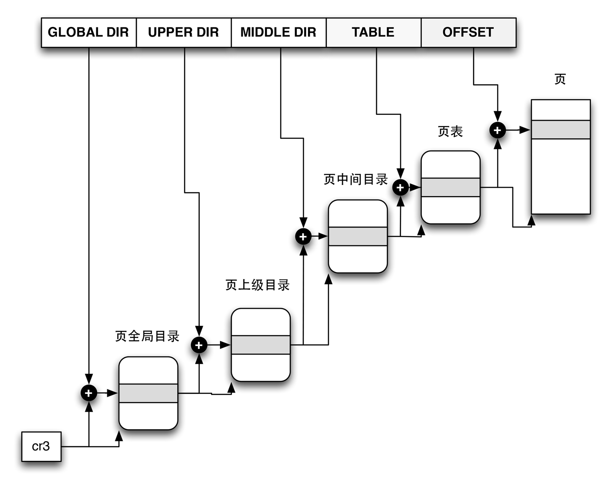

Linux采用了一种兼容32位和64位系统的普通分页模型。在32位系统模型中，两级分页已经足够了，但在64位系统中需要更多的分页级别。直到2.6.10版本，Linux采用三级分页模型，从2.6.11之后，采用了四级分页模型[^1]。这4种页表分别为：

1. 页全局目录（Page Global Directory）
2. 页上级目录（Page Upper Directory）
3. 页中间目录（Page Middle Directory）
4. 页表（Page Table）

页全局目录包含若干页上级目录的地址，页上级目录又包含页中间目录的地址，依次类推，页中间目录则包含页表的目录地址。而每个页表指向一个页框。线性地址因此被划分成五个部分。下图的线性地址并没有显示位数，因为每一部分的大小跟具体的计算机体系结构相关。

Linux中的分页

上图显示了一个Linux的四级分页中是如何通过页目录找到页表然后寻址到相应的页。实际上，和之前两级分页的概念一样。针对32位系统。Linux取消了上级页目录和中间页目录字段。不过，页上级目录和页中间目录在指针中的位置被保留，以便同样的代码在32位系统和64位系统下都能使用。

内核位页上级目录和页中间目录保留了一个位置，这是通过它们的页目录项数设置位1，并把这两个目录项映射到页全局目录的一个适当的目录项而实现的。

启用了物理地址扩展的32位系统使用了三级页表，Linux的全局页目录对应80x86的页目录指针表（*PDPT*），取消了页上级目录，页中间目录对应80x86的页目录，Linux的页表对应80x86的页表。

最后，64位系统使用三级还是四级目录取决于硬件对线性地址的划分。

Linux的进程处理依赖于分页，实际上，线性地址到物理地址的自动转换使得下面的设计目标得以实现：

1. 给每一个进程分配一块不同的物理地址空间，确保了可以有效地防止寻址错误。
2. 区别页和页框[^page]的不同，就允许存放在某个页框中的一个页，然后保存到磁盘上，以后重新装入这一页时又可以被装在不同的页框中。这是虚拟内存机制的基本要素。

[^1]: 这个变化用来全力支持x86_64平台使用的对线性地址的划分。

每一个进程有它自己的页全局目录和自己的页表集，当发生进程切换时，Linux把*cr3*寄存器的内容保存在前一个执行进程的描述符中，然后把下一个要执行进程的描述符的值装入到*cr3*寄存器中。因此当新进程重新开始在CPU上执行时，分页单元指向一组正确的页表。

[^page]: 页是一组数据，页框是主存的物理地址。

线性地址字段，页表处理的函数和宏我就不列举了，可能在以后的（如果我深入了解内存管理的话）会再补充，这里只是笔记。