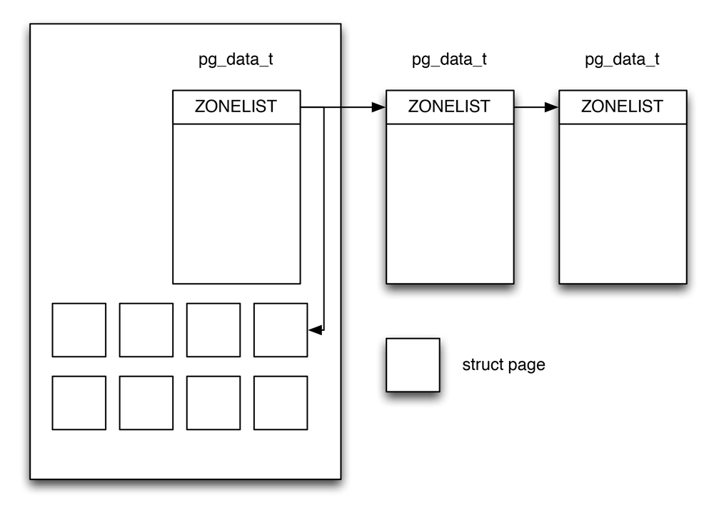

我们习惯性的认为计算机内存是一种均匀、共享的资源。在忽略硬件高速缓存作用的情况下，我们期望内存单元无论在何处，也不管CPU在何处，CPU对内存单元的访问都需要相同的时间。可惜事实并不如此。实际上，给定的CPU对不同内存单元的访问时间可能不一样。系统的物理内存被分为好几个结点。

内存划分为**结点**(*node*)，每个结点关联到系统中的一个处理器，在内核中表示为*pg_data_t*的实例。各个结点又划分为**内存域**（*Zone*），这是内存的进一步细分。大致结构如下：

内存管理区示意图

在一个理想的计算机体系结构中，一个页框就是一个内存存储单元，可以用于任何事情，例如存放内核数据和用户数据、缓冲磁盘数据等等。但实际上计算机体系结构有硬件的制约，这限制了页框可以使用的方式，尤其是Linux内核必须处理80x86体系结构的两种硬件约束：

1. ISA总线的直接内存存取（*DMA*）处理有一个严格的限制，它们只能对RAM的前16MB寻址。
2. 在具有大容量RAM的现代32位计算机中，CPU不能直接访问所有的物理内存，因为线性地址空间太小。

Linux把每个内存结点的物理内存划分为3个管理区，ZONE\_DMA、ZONE\_NORMAL、ZONE_HIGHMEM。其范围分别为：

字段名             | 说明
------------      | -------------
ZONE\_DMA         | 低于16MB的内存页框
ZONE\_NORMAL      | 高于16MB但地狱896MB的内存页框
ZONE\_HIGHMEM     | 高于896MB的内存页框

内核引入了下内存域描述符（*zone_type*）列常量枚举系统中的所有内存域，去掉注释代码如下：

#### <include/linux/mmzone.h> ####


enum zone_type {
#ifdef CONFIG_ZONE_DMA
    ZONE_DMA,
#endif
#ifdef CONFIG_ZONE_DMA32
    ZONE_DMA32,
#endif
    ZONE_NORMAL,
#ifdef CONFIG_HIGHMEM
    ZONE_HIGHMEM,
#endif
    ZONE_MOVABLE,
    __MAX_NR_ZONES
};


其中字段名和说明如下：

字段名             | 说明
------------      | -------------
ZONE_DMA          | 标记和式DMA的内存域，该区域的长度依赖于处理器的类型
ZONE_DMA32        | 标记了使用32位地址字可寻之、适合DMA的内存域。32位机器上此标志为空
ZONE_NORMAL       | 标记了可直接映射到内核段的普通内存域，这是所有体系结构上都会保证存在的唯一内存域，但无法保证该地址范围对应了实际的物理内存。
ZONE_HIGHMEM      | 标记了超出内核段的物理内存。在编译的时候可以配置，例如64位计算机并不需要高端地址内存域
ZONE_MOVABLE      | 伪内存域，防止物理内存碎片的机制中需要使用该内存域
MAX\_NR\_ZONES    | 充当结束标记，在内核想要迭代系统中的所有内存域时会使用这个变量

各个内存域都关联了一个数组，用来组织属于该内存域的物理内存页，内核中称为页帧。对每个页帧，都分配一个*struct page*实例以及所需的管理数据。各个内存结点保存在一个单链表中，供内核遍历。

### 结点 ###

pglist\_data\_t时用于表示结点的基本元素，定义如下：

#### <include/linux/mmzone.h> ####


typedef struct pglist_data {
    struct zone node_zones[MAX_NR_ZONES];
    struct zonelist node_zonelists[MAX_ZONELISTS];
    int nr_zones;
#ifdef CONFIG_FLAT_NODE_MEM_MAP /* means !SPARSEMEM */
    struct page *node_mem_map;
#ifdef CONFIG_CGROUP_MEM_RES_CTLR
    struct page_cgroup *node_page_cgroup;
#endif
#endif
    struct bootmem_data *bdata;
#ifdef CONFIG_MEMORY_HOTPLUG
    spinlock_t node_size_lock;
#endif
    unsigned long node_start_pfn;
    unsigned long node_present_pages; /* 物理页的总数 * /
    unsigned long node_spanned_pages; /* 物理页总长度，包含洞 */
    int node_id;
    wait_queue_head_t kswapd_wait;
    struct task_struct *kswapd;
    int kswapd_max_order;
} pg_data_t;


其字段说明如下：

字段名             | 说明
------------      | -------------
node_zone         | 是一个数组，包含了结点中各内存域的数据结构
node_zonelists    | 指定了备用结点及其内存域的列表
nr_zones          | 结点中不同的内存域的数目
node\_mem\_map    | 指向page实例数组的指针
bdata             | 指向自举内存分配器数据结构的实例
node\_start\_pfn  | 是该NUMA结点的第一个页帧的逻辑变好，每个页帧的变好都是全局统一的
node_id           | 全局结点ID，系统中的NUMA结点都从0开始编号
kswapd_wait       | 交换守护进程（*swap daemon*）的等待队列，在将页帧换出结点是会用到

在《深入Linux内核架构中》，pglist\_data结构体的代码里有pgdata_next字段，用于指向下一个pglist\_data结构的指针，但是在某个版本中去掉了。使用*node\_online\_map*也可以找到下一个pgdata的信息。

#### <include/linux/nodemask.h> ####


#define node_online_map     node_states[N_ONLINE]


[具体提交在此](http://www.gelato.unsw.edu.au/archives/linux-ia64/0509/15528.html)，邮件里的说明摘录如下：

> This patch is to remove pgdat link list from pgdat structure,
because I think it is redundant. 
In the current implementation, pgdat structure has this link list.  
struct pglist_data{struct pglist_data *pgdat_next;}  
This is used for searching other zones and nodes by for_each_pgdat and for_each_zone macros.  
So, if a node is hot added, the system has to not only set bit of node_online_map, but also connect this for new node. 
However, all of pgdat linklist user would like to know just
next (online) node. So, I think node_online_map is enough information 
for them to find other nodes. And hot add/remove code will be simpler. 

### 结点状态管理 ###

如果系统中结点多于一个，内核会维护一个位图，用以提供各个结点的状态信息，状态是用位掩码指定的，可使用下列的值：

#### <include/linux/nodemask.h> ####


enum node_states {
    N_POSSIBLE,
    N_ONLINE,
    N_NORMAL_MEMORY,
#ifdef CONFIG_HIGHMEM
    N_HIGH_MEMORY,
#else
    N_HIGH_MEMORY = N_NORMAL_MEMORY,
#endif
    N_CPU,
    NR_NODE_STATES
};


其中一些字段的意义为：

字段名             | 说明
------------      | -------------
N_POSSIBLE        | 结点在某个时候可能变为联机/在线
N_ONLINE          | 结点是联机/在线的
N\_NORMAL\_MEMORY | 结点有普通内存域
N\_HIGH\_MEMORY   | 结点有普通内存域或高端内存域
N\_CPU            | 结点有一个或多个CPU

### 内存管理区 ###

内存管理区也可以称为内存域。内核使用`zone`结构表示一个内存管理区（或内存域），去掉一些注释之后定义如下：

#### <include/linux/mmzone.h> ####


struct zone {
    unsigned long watermark[NR_WMARK];
    unsigned long percpu_drift_mark;
    unsigned long       lowmem_reserve[MAX_NR_ZONES];

#ifdef CONFIG_NUMA
    int node;
    unsigned long       min_unmapped_pages;
    unsigned long       min_slab_pages;
    struct per_cpu_pageset  *pageset[NR_CPUS];
#else
    struct per_cpu_pageset  pageset[NR_CPUS];
#endif
    spinlock_t      lock;
#ifdef CONFIG_MEMORY_HOTPLUG
    seqlock_t       span_seqlock;
#endif
    struct free_area    free_area[MAX_ORDER];

#ifndef CONFIG_SPARSEMEM
    unsigned long       *pageblock_flags;
#endif /* CONFIG_SPARSEMEM */

    ZONE_PADDING(_pad1_)

    spinlock_t      lru_lock;
    struct zone_lru {
        struct list_head list;
    } lru[NR_LRU_LISTS];

    struct zone_reclaim_stat reclaim_stat;

    unsigned long       pages_scanned;
    unsigned long       flags;

    atomic_long_t       vm_stat[NR_VM_ZONE_STAT_ITEMS];

    int prev_priority;
    unsigned int inactive_ratio;

    ZONE_PADDING(_pad2_)
    wait_queue_head_t   * wait_table;
    unsigned long       wait_table_hash_nr_entries;
    unsigned long       wait_table_bits;

    struct pglist_data  *zone_pgdat;
    unsigned long       zone_start_pfn;

    unsigned long       spanned_pages;
    unsigned long       present_pages;
    const char      *name;
} ____cacheline_internodealigned_in_smp;


其中一个重要的部分是ZONE\_PADDING。ZONE\_PADDING将一个内存域氛围几个部分，这是因为对zone结构体的访问非常频繁，在多处理系统上，通常会有不同的CPU试图同时访问结构成员。因此使用锁防止它们彼此干扰。而由于内核会经常对内存域访问，所以经常获取该结构的自旋锁[^1]。

*\_\_\_\_cacheline\_internodealigned\_in\_smp*是编译器关键字，用以实现最优的高速缓存对齐方式。另外，我们可以看到per\_cpu\_pageset结构体中的pageset[NR_CPUS]这个关键，在编译时，如果是NUMA计算机，则值是大于1，可能在2-32之间。如果是UMA系统的话，其值只等于1[^2]。

### 冷热页 ###

内存域（*zone*）结构体中的成员per\_cpu\_pageset和冷热页有关，我们可以看per\_cpu\_pageset结构体，代码如下：


struct per_cpu_pageset {
    struct per_cpu_pages pcp;
#ifdef CONFIG_NUMA
    s8 expire;
#endif
#ifdef CONFIG_SMP
    s8 stat_threshold;
    s8 vm_stat_diff[NR_VM_ZONE_STAT_ITEMS];
#endif
} ____cacheline_aligned_in_smp;


在内核书籍里代码里per\_cpu\_pages pcp[2]中的pcp是一个数组，索引0对应热页，索引1对应冷页。在后续的Linux内核中被改动，被合并成一个单独的链表。具体改动的[原因在此](http://marc.info/?t=119492914200001&r=1&w=2)。原因摘抄如下：

> We have repeatedly discussed if the cold pages still have a point.  
There is one way to join the two lists: Use a single list and put the cold pages at the end and the hot pages at the beginning. That way a single list can serve for both types of allocations.

我们可以看这个结构体包含per\_cpu\_pages结构体，其内容如下：


struct per_cpu_pages {
    int count;
    int high;
    int batch;

    struct list_head lists[MIGRATE_PCPTYPES];
};


其中字段意义如下：

字段名             | 说明
------------      | -------------
count             | 列表中的页
high              | 页数上限水印，需要的时候清空
batch             | 添加/删除多页块的时候，块的大小
list_head         | 页的链表

我们可以总结一下，pglist_data表示结点，zone表示一个内存域或者内存管理区。

每个页描述符都有到内存结点和到结点内管理区（包含相应页框）的链接。为节省空间，这些链接的存放方式与典型的指针不同，而是被编码或索引存放在*flags*字段的高位。实际上，刻画页框的标志的数目是有限的，因此保留*flags*字段的最高位来编码特定内存结点和管理区号总是可能的。

内核调用一个内存分配函数时，必须指明请求页框所在的管理区。内核通常指明它愿意使用哪个管理区。例如，如果一个页框必须直接映射再线性地址的第4个GB，但它又不用于ISA DMA的传输，那么内核不是再ZONE\_NORMAL区就是在ZONE\_DMA区请求一个页框。

[^1]: zone->lock和zone->lru_lock。

[^2]: 这个值不代表实际的CPU数，而是内核支持的最大CPU数。