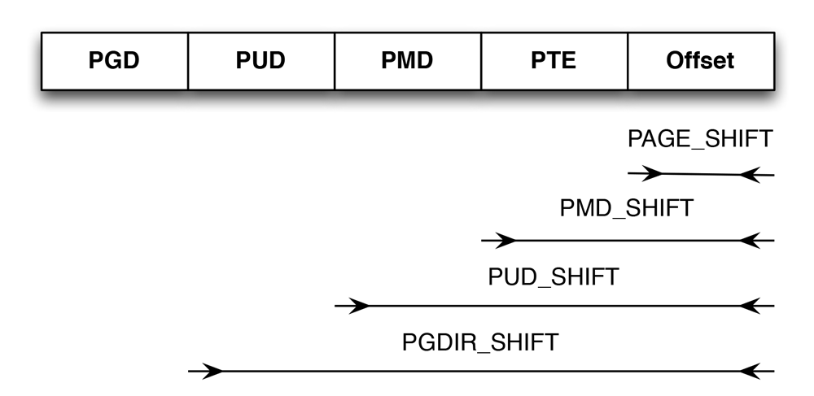

在[硬件中的分页](/linux-kernel-architecture/posts/system-paging-unit/)中记录了什么是页、页帧和页表，页帧的数据结构已经在[内存管理](/linux-kernel-architecture/posts/system-paging-unit/)中详细记录了，这里主要记录一下页表的数据结构。

从内存寻址的笔记可以知道，页表用于支持对大地址空间的快速、高效的管理。内核内存管理总是假定使用四级页表，而不管底层处理器是否这样，有的系统只使用两级分页系统，只要把高位的UPPER DIRECTORY和MIDDLE DIRECTORY指定为1即可。但内核还是保留指针，以便使用相同的代码。

根据内核代码，我们把全局页表，上层页表，中间页表和页表分别定义为PGD、PUD、PMD和PTE。所以页表结构可以简单归纳如下。

页表的简单结构

图中说明了如何用比特位移来定义各字段分量的位置，这些分量根据不同的体系结构有所不同，比特位的具体数由*PAGE_SHIFT*指定。

*PMD_SHIFT*指定了页内偏移量和最后一级页表所需比特位的总数。这个值减去*PAGE_SHIFT*就可以得到PTE，也就是最后一级页表索引所需比特位的数目，这个值表名了一个中间层页表项管理的部分地址空间大小。各级页目录/页表中所能存储的指针数目，页可以通过宏定义确定*PTRS_PER_PGD*指定了全局页目录中项的数目，同理*PTRS_PER_PMD*指定了中间页的数目。

两级页表的体系结构也会将*PTRS_PER_PMD*和*PTRS_PER_PUD*指定为1，使得内核的剩余部分感觉体系结构页提供了四级页表的转换，尽管实际上只有两级页表。中间层页目录和上层页目录实际上被消除掉了。因为其中只有一项。

*PTRS_PER_PMD*定义的代码如下：

#### <include/asm-generic/pgtable-nopmd.h> ###


#define PMD_SHIFT   PUD_SHIFT
#define PTRS_PER_PMD    1
#define PMD_SIZE    (1UL << PMD_SHIFT)
#define PMD_MASK    (~(PMD_SIZE-1))


*PTRS_PUD_PMD*定义的代码如下：

#### <include/asm-generic/pgtable-nopud.h> ###


#define PUD_SHIFT   PGDIR_SHIFT
#define PTRS_PER_PUD    1
#define PUD_SIZE    (1UL << PUD_SHIFT)
#define PUD_MASK    (~(PUD_SIZE-1))


可以看到默认情况下，上级和中间页表指定为1，内核提供了4个数据结构来表示页表项的结构：

1. pgd_t用于全局页表项。
2. pud_t用于上层页表项。
3. pmd_t用于中间页表项。
4. pte_t用于直接页表项。

代码如下，有时候根据体系结构代码不一样：

#### <include/asm-generic/page.h> ###


unsigned long pte;
} pte_t;
typedef struct {
    unsigned long pmd[16];
} pmd_t;
typedef struct {
    unsigned long pgd;
} pgd_t;
typedef struct {
    unsigned long pgprot;
} pgprot_t;
typedef struct page *pgtable_t;


### 页表（*PTE*）的信息

最后一级页表中的项不仅包含了指向页的内存指针位置，还在上述的多余比特位包含了与页有关的附加信息，尽管这些数据是特定于CPU的，但至少提供了有关访问控制的一些信息。下面列举一些信息。

字段名             | 说明
------------      | -------------
\_PAGE_PRESENT    | 指定了虚拟内存页是否存在于内存中，因为页不一定总在内存中
\_PAGE_ACCESSED   | CPU每次访问页时，会自动设置该值，内核会定期检查比特位，以确认页使用的活跃度，不经常使用的页会被换出，在读写或访问之后会设置该比特位
\_PAGE_DIRTY      | 表示该页是否为脏页，即页的内容是否已经修改过
\_PAGE_FILE       | 这个值与\_PAGE\_DIRTY相同，但用于不同的上下文，即页不在内存中的时候，不存在的页肯定不可能是脏的，因此可以重新解释该比特位，如果没有设置，则指向一个换出的页的位置
\_PAGE_USER       | 如果设置了这个值，则允许用户空间代码访问该页
\_PAGE_READ       | 指定了普通用户进程是否可读
\_PAGE_WRITE      | 指定了普通用户进程是否可写
\_PAGE_EXECUTE    | 指定了普通用户进程是否允许执行机器代码

创建页表项可以通过使用特定页表的创建函数，例如*pud_alloc*初始化一个完整的页表的内存，也可以使用如*pud_free*释放一个页表项的内存。可以通过*pte_page*获得一个页表。
