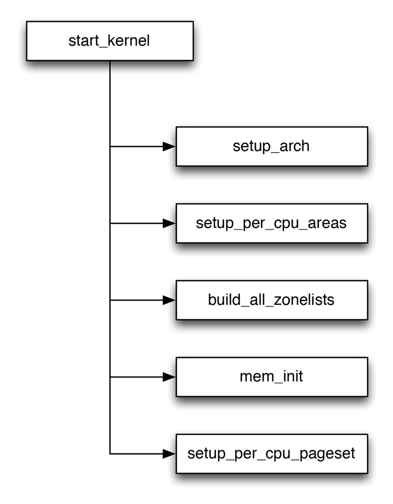

在内存管理上下文中，初始化（*iniitialization*）可以有多种含义，在许多CPU上，必须显式设置适用于Linux内核的内存模型，例如在IA-32系统上需要切换到保护模式，然后内核才能检测可用内存和寄存器。在初始化过程中，还必须建立内存管理的数据结构，以及其他很多事物，因为内核在内存管理完全初始化之前就需要使用内存，在系统启动过程期间，使用了一个额外的简化形式的内存管理模块，然后又丢弃掉。

因为内存管理初始化中特定于CPU的部分使用了底层体系结构中许多次要的细节，这些与内核结构没有什么关系。我们只要关心*pg_data_t*数据结构初始化即可。

### NODE_DATA ###
对相关数据结构的初始化是从全局启动例程*start_kernel*中开始的，该例程在加载内核并激活各个子系统后执行。由于内存管理是内核的一个非常重要的部分，因此在特定于体系结构的设置步骤中监测内存并确定系统中内存的分配情况后，会立即执行初始化。

所以，已经对各种系统内存模式生成了一个*pgdata_t*实例，用于保存诸如结点中内存数量以及内存在各个内存域之间的分配情况信息。所有陪你过台上都实现了特定于体系结构的NODE\_DATA宏，用来查询与一个NUMA结点相关的*pgdata_t*实例。

#### <include/linux/mmzone.h> ####


#define NODE_DATA(nid) (&contig_page_data)


尽管这个宏有一个形式参数用于选择NUMA结点，但在UMA系统只有一个伪结点。所以总是使用相同的数据。

### 系统启动 ###

系统启动如下图所示：

初始化内存管理流程图

这些函数及其意义分别如下：

函数名                    | 说明
------------             | -------------
setup_arch               | 这是一个特定于体系结构的函数，其中一项任务是负责初始化自举分配器
setup\_per\_cpu_areas    | 在SMP系统上，setup\_per\_cpu\_areas初始化源代码中定的静态per-cpu变量，这个变量对系统中的每个CPU都有一个独立的副本，此类变量保存在内核二进制映象的一个独立的段中。这个函数目的是为系统的各个CPU分别创建一份这些数据的副本，在非SMP系统上这个函数是一个空操作
build\_all\_zonelists    | 建立结点和内存域的数据结构
mem_init                 | 也是一个独立于体系结构的函数，用于停用bootmem分配器并迁移到实际的内存管理函数
setup\_per\_cpu\_pageset | 为pageset数组的第一个数组元素分配内存

由于大部分函数实现都是体系结构相关的，所以不再详细的介绍。