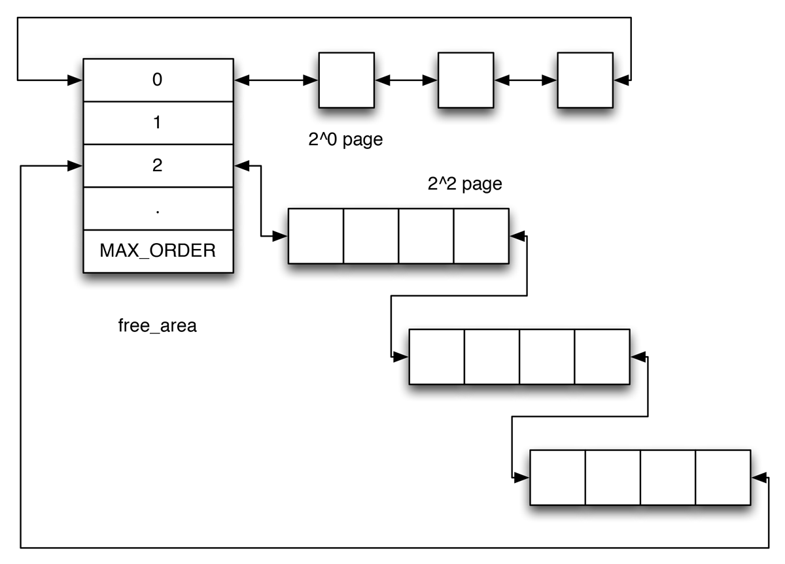

在内核初始化完成后，内存管理的责任交由给伙伴系统（*buddy system*）承担，伙伴系统基于一个异常简单却令人吃惊的强大算法，伙伴系统结合了分配器的两大特征，速度和效率，正是因为如此，伙伴系统已经持续了许多年，一直到现在也在使用。

### 伙伴系统 ###

系统中的空闲内存块总是两两分组的，每组中的两个内存块被称作伙伴，伙伴的分配可以是彼此独立的，但如果两个伙伴都是空闲的，那么内核将会将其合并成一个更大的内存块，作为下一层次上某个内存块的伙伴。

举个例子，当有128KB个内存大小的时候，我们申请一个24KB的内存，这128KB的内存首先分开为两个64KB的大小，其中一个64KB的内存块保留，另一个64KB大小的内存会继续分裂成两个伙伴，变为两个32KB的内存大小，给我们申请使用。反之，当我们24KB的内存已经不再使用，那么这一个32KB的内存块就会返回，和之前保留的一个32KB的内存块合并成64KB内存块，再进行逆运算合并。

现在系统实现以上情况时，使用多个内存块链表来实现，例如128KB的内存块会有一个链表，64KB的内存块会有一个链表，当64KB的相邻的内存块已经不再使用，那么就合并成123KB的内存块，并且从64KB内存块链表中移除，返回给128KB内存块链表。

而链表的索引通常用阶来表示，例如2^1、2^2分别表示2和4单位的内存块的链表。

### 伙伴系统的结构 ###

系统内存中的每个物理内存页，也就是页帧，都对应一个*struct page*，每个内存管理区都关联了一个*struct zone*的实例，其中保存了用于管理伙伴数据的主要数组。

在[内存管理区](/linux-kernel-architecture/posts/pglist-data-and-zone/)里面有详细的代码，这里只抽出部分代码：

#### <include/linux/mmzone.h> ####


struct zone {
    //...
    struct free_area    free_area[MAX_ORDER];
    //...
} ____cacheline_internodealigned_in_smp;


其中*free_area*是一个非常重要的辅助数据结构，我们可以看如下代码：

#### <include/linux/mmzone.h> ####


struct free_area {
    struct list_head    free_list[MIGRATE_TYPES];
    unsigned long       nr_free;
};


其中*nr_free*指定了当前内存区中空闲页块的数目。*free_list*是用于链接空闲页的链表，页链表包含大小相同的连续内存区。**阶**是伙伴系统里非常重要的概念，它描述了内存分配的数量单位，例如2^order，order就是阶，并且其范围从0到MAX_ORDER。order通常设置为11，这意味着一次分配可以请求的页的最大数是2^11=2048。

*free_area[]*数组中的各个元素索引也可以理解为索引，第0个链表代表内存管理区里的单页，第1个链表代表内存管理区里的两页。从下图可以看出，*free_area[0]*每个元素代表单个页帧，*free_area[2]*的每个元素代表4个页帧。

{:style="max-width:600px"}
伙伴系统分配

伙伴系统不必是彼此链接的，如果一个内存区在分配期间被分解成两块，内核会自动将另外一块加入到对应的链表中，如果在未来的某个时刻，由于内存释放的缘故，两个内存区域都处于空闲状态，可通过其他地址判断是否为伙伴。管理工作较少也是伙伴系统的一个主要优点。

基于伙伴系统的内存管理专注于某个节点的某个内存域，例如DMA或高端内存域。但所有内存管理区和节点的伙伴系统都通过备用分配列表链接起来。在首选内存管理区或节点无法满足分配请求时，首先尝试用同一节点的另一个内存管理区分配，反复尝试下一个结点直到满足请求。
