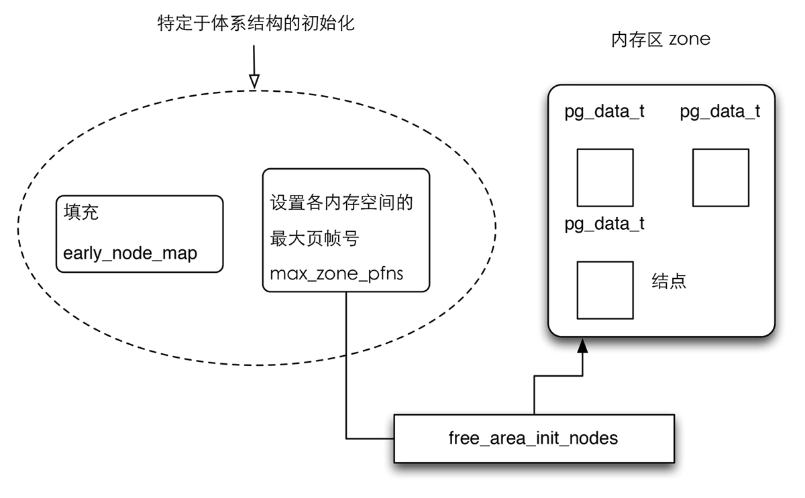
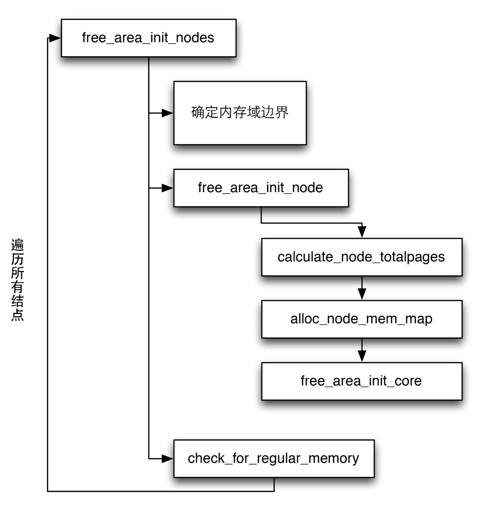

由于内存结构的分配和体系结构相关，早期每个体系结构都要自己准备相关的数据，体系结构相关代码需要在启动期间建立以下数据信息：

1. 系统中各个内存域的页帧边界，保存在*max_zone_pfn*数组。
2. 各个结点页帧的分配情况，保存在全局变量*early_node_map*中。

### 管理数据结构的创建 ###

从内核版本2.6.10开始提供了一个通用的框架，用于将上述信息转换为伙伴系统预期的结点和内存空间的数据结构，在这之前，各个体系结构必须自行建立相关结构。现在，体系结构相关代码只需要建立前述的简单结构，然后将复杂的工作留给*free_area_init_nodes*即可。

特定体系代码和内核代码之间的作用

上图简单的描述了在建立结点和内存管理区数据结构时，特定于体系结构的代码和通用内核代码之间的相关作用，回到*free_area_init_nodes*函数本身，流程图如下：

初始化内存域和结点流程图

*free_area_init_nodes*函数代码如下：

#### <mm/page_alloc.c> ####


void __init free_area_init_nodes(unsigned long *max_zone_pfn)
{
    unsigned long nid;
    int i;

    /* 使用堆排序对结构进行简单的排序 */
    sort_node_map();

    /* 记录内存域边界 */
    memset(arch_zone_lowest_possible_pfn, 0,
                sizeof(arch_zone_lowest_possible_pfn));
    memset(arch_zone_highest_possible_pfn, 0,
                sizeof(arch_zone_highest_possible_pfn));
    /* 通过max_zone_pfn传递给free_area_init_nodes
       信息记录了各个内存域包含的最大页帧号 */
    /* find_min_pfn_with_active_regions
       用于找到注册的最低内存空间中可用的编号最小的页帧*/
    arch_zone_lowest_possible_pfn[0] =
    find_min_pfn_with_active_regions();
    /* max_zone_pfn用于找到最低内存域的最大页帧号*/
    arch_zone_highest_possible_pfn[0] = max_zone_pfn[0];
    /* 直接构建内存空间的页帧区间 */
    for (i = 1; i < MAX_NR_ZONES; i++) {
        if (i == ZONE_MOVABLE)
            continue;
        arch_zone_lowest_possible_pfn[i] =
            arch_zone_highest_possible_pfn[i-1];
        arch_zone_highest_possible_pfn[i] =
            max(max_zone_pfn[i], arch_zone_lowest_possible_pfn[i]);
    }
    arch_zone_lowest_possible_pfn[ZONE_MOVABLE] = 0;
    arch_zone_highest_possible_pfn[ZONE_MOVABLE] = 0;

    /* 找到ZONE_MOVABLE在各个结点的起始编号 */
    memset(zone_movable_pfn, 0, sizeof(zone_movable_pfn));
    find_zone_movable_pfns_for_nodes(zone_movable_pfn);

    /* 输出结点信息 */
    printk("Zone PFN ranges:\n");
    for (i = 0; i < MAX_NR_ZONES; i++) {
        if (i == ZONE_MOVABLE)
            continue;
        printk("  %-8s %0#10lx -> %0#10lx\n",
                zone_names[i],
                arch_zone_lowest_possible_pfn[i],
                arch_zone_highest_possible_pfn[i]);
    }

    /* 输出结点信息 */
    printk("Movable zone start PFN for each node\n");
    for (i = 0; i < MAX_NUMNODES; i++) {
        if (zone_movable_pfn[i])
            printk("  Node %d: %lu\n", i, zone_movable_pfn[i]);
    }

    /* 输出early_node_map[] */
    printk("early_node_map[%d] active PFN ranges\n",
           nr_nodemap_entries);
    for (i = 0; i < nr_nodemap_entries; i++)
        printk("  %3d: %0#10lx -> %0#10lx\n", early_node_map[i].nid,
                        early_node_map[i].start_pfn,
                        early_node_map[i].end_pfn);

    /* 初始化各个结点 */
    mminit_verify_pageflags_layout();
    setup_nr_node_ids();
    for_each_online_node(nid) {
        pg_data_t *pgdat = NODE_DATA(nid);
        free_area_init_node(nid, NULL,
                find_min_pfn_for_node(nid), NULL);

        /* 检查结点上是否有内存 */
        if (pgdat->node_present_pages)
            node_set_state(nid, N_HIGH_MEMORY);
        check_for_regular_memory(pgdat);
    }
}


在进行大体的初始化之后，开始针对单个结点检查并初始化。

#### <mm/page_alloc.c> ####


void __paginginit free_area_init_node(
        int nid, unsigned long *zones_size,
        unsigned long node_start_pfn, unsigned long *zholes_size)
{
    /* 创建数据结点的数据结构 */
    pg_data_t *pgdat = NODE_DATA(nid);

    /* 设置结点的基本信息 */
    pgdat->node_id = nid;
    pgdat->node_start_pfn = node_start_pfn;
    /* 该函数累计各个内存空间的页数，计算结点中页的总数，对连续内存
       模型而言，可以通过zone_size_init完成，但这个函数还考虑了内
       存空洞，在启动时，会输出一段简短的消息，如：
       On node 0 totalpages: 131056
     */
    calculate_node_totalpages(pgdat, zones_size, zholes_size);
    /* 负责初始化一个简单但非常重要的数据结构 */
    alloc_node_mem_map(pgdat);
#ifdef CONFIG_FLAT_NODE_MEM_MAP
    printk(KERN_DEBUG "free_area_init_node:
           node %d, pgdat %08lx, node_mem_map %08lx\n",
        nid, (unsigned long)pgdat,
        (unsigned long)pgdat->node_mem_map);
#endif

    free_area_init_core(pgdat, zones_size, zholes_size);
}


其中详细看一下*alloc_node_mem_map*这个函数：

#### <mm/page_alloc.c> ####


static void __init_refok alloc_node_mem_map(
        struct pglist_data *pgdat)
{
    /* 排除掉空结点 */
    if (!pgdat->node_spanned_pages)
        return;

#ifdef CONFIG_FLAT_NODE_MEM_MAP
    /* ia64 体系结构有自己的node_mem_map，需要进行处理 */
    if (!pgdat->node_mem_map) {
        unsigned long size, start, end;
        struct page *map;

        /* 内存分配 */
        start = pgdat->node_start_pfn & ~(MAX_ORDER_NR_PAGES - 1);
        end = pgdat->node_start_pfn + pgdat->node_spanned_pages;
        end = ALIGN(end, MAX_ORDER_NR_PAGES);
        size =  (end - start) * sizeof(struct page);
        map = alloc_remap(pgdat->node_id, size);
        if (!map)
            map = alloc_bootmem_node(pgdat, size);
        pgdat->node_mem_map = map + (pgdat->node_start_pfn - start);
    }
#ifndef CONFIG_NEED_MULTIPLE_NODES
    /*
       当pgdata是系统第0个结点
       则mem_map保存指向这个结点的指针
       mem_map是一个全局数组
     */
    if (pgdat == NODE_DATA(0)) {
        mem_map = NODE_DATA(0)->node_mem_map;
#ifdef CONFIG_ARCH_POPULATES_NODE_MAP
        if (page_to_pfn(mem_map) != pgdat->node_start_pfn)
            mem_map -= (pgdat->node_start_pfn - ARCH_PFN_OFFSET);
#endif /* CONFIG_ARCH_POPULATES_NODE_MAP */
    }
#endif
#endif /* CONFIG_FLAT_NODE_MEM_MAP */
}


当完成上面的初始化之后，初始化内存域数据结构的工作就交给了*free_area_init_core*，它会依次遍历结点的所有内存空间。

代码如下：

#### <mm/page_alloc.c> ####


static void __paginginit free_area_init_core(struct pglist_data *pgdat,
        unsigned long *zones_size, unsigned long *zholes_size)
{
    enum zone_type j;
    int nid = pgdat->node_id;
    unsigned long zone_start_pfn = pgdat->node_start_pfn;
    int ret;

    pgdat_resize_init(pgdat);
    pgdat->nr_zones = 0;
    init_waitqueue_head(&pgdat->kswapd_wait);
    pgdat->kswapd_max_order = 0;
    pgdat_page_cgroup_init(pgdat);

    /* 遍历所有的内存空间 */

    for (j = 0; j < MAX_NR_ZONES; j++) {
        struct zone *zone = pgdat->node_zones + j;
        unsigned long size, realsize, memmap_pages;
        enum lru_list l;

        size = zone_spanned_pages_in_node(nid, j, zones_size);
        realsize = size - zone_absent_pages_in_node(nid, j,
                                zholes_size);

        memmap_pages =
            PAGE_ALIGN(size * sizeof(struct page)) >> PAGE_SHIFT;
        if (realsize >= memmap_pages) {
            realsize -= memmap_pages;
            if (memmap_pages)
                printk(KERN_DEBUG
                       "  %s zone: %lu pages used for memmap\n",
                       zone_names[j], memmap_pages);
        } else
            printk(KERN_WARNING
                "  %s zone: %lu pages exceeds realsize %lu\n",
                zone_names[j], memmap_pages, realsize);

        /* Account for reserved pages */
        if (j == 0 && realsize > dma_reserve) {
            realsize -= dma_reserve;
            printk(KERN_DEBUG "  %s zone: %lu pages reserved\n",
                    zone_names[0], dma_reserve);
        }
        /* 内核使用nr_kernel_pages统计所有一致映射的页
           而nr_all_pages包括高端内存页在内
         */
        if (!is_highmem_idx(j))
            nr_kernel_pages += realsize;
        nr_all_pages += realsize;

        /* 初始化各个结点的信息 */
        zone->spanned_pages = size;
        zone->present_pages = realsize;
#ifdef CONFIG_NUMA
        zone->node = nid;
        zone->min_unmapped_pages =
            (realsize*sysctl_min_unmapped_ratio) / 100;
        zone->min_slab_pages =
            (realsize * sysctl_min_slab_ratio) / 100;
#endif
        zone->name = zone_names[j];
        spin_lock_init(&zone->lock);
        spin_lock_init(&zone->lru_lock);
        zone_seqlock_init(zone);
        zone->zone_pgdat = pgdat;

        zone->prev_priority = DEF_PRIORITY;

        /* 初始化该内存域的per-CPU缓存 */
        zone_pcp_init(zone);
        for_each_lru(l) {
            INIT_LIST_HEAD(&zone->lru[l].list);
            zone->reclaim_stat.nr_saved_scan[l] = 0;
        }
        zone->reclaim_stat.recent_rotated[0] = 0;
        zone->reclaim_stat.recent_rotated[1] = 0;
        zone->reclaim_stat.recent_scanned[0] = 0;
        zone->reclaim_stat.recent_scanned[1] = 0;
        zap_zone_vm_stats(zone);
        zone->flags = 0;
        if (!size)
            continue;

        set_pageblock_order(pageblock_default_order());
        setup_usemap(pgdat, zone, size);

        /* 初始化free_area列表
           并将属于该内存域的所有page实例都设置为默认值 */
        ret = init_currently_empty_zone(zone, zone_start_pfn,
                        size, MEMMAP_EARLY);
        BUG_ON(ret);
        memmap_init(size, nid, j, zone_start_pfn);
        zone_start_pfn += size;
    }
}
