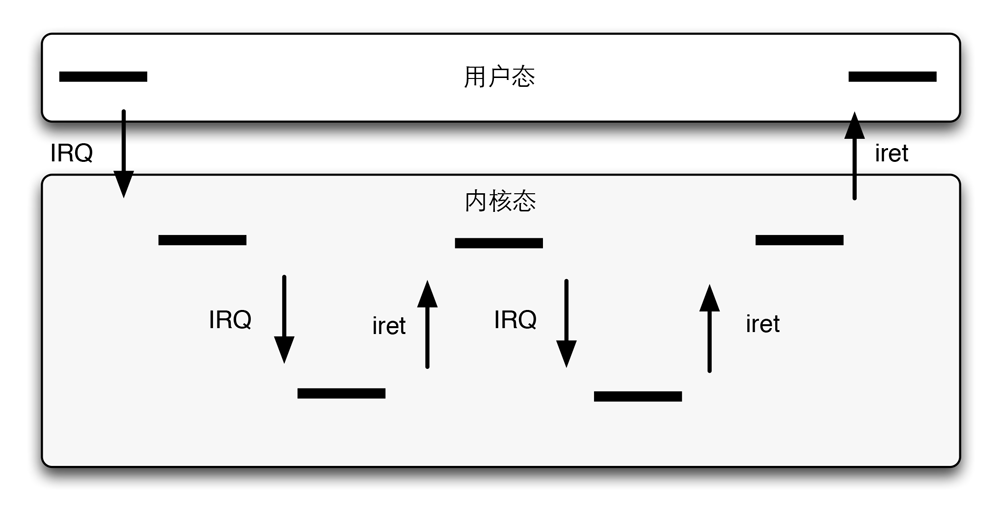

每个中断或异常都会引起一个内核控制路径，或者说代表当前进程在内核态执行单独的指令序列。我们再来回顾一下什么是内核控制路径。内核控制路径（kernel control path）表示内核处理系统调用、异常或中断所执行的指令序列。所以，我们只要知道内核控制路径是一些指令序列即可。

当I/O设备发出一个中断时，相应的内核控制路径的第一部分指令就是那些把寄存器的内容保存在内核堆栈的指令，而最后一部分指令就是恢复寄存器内容并让CPU返回到用户态的哪些指令。

内核控制路径可以任意嵌套，一个中断处理程序可以被另一个中断处理程序『中断』，所以就会产生中断处理程序的嵌套执行，如下图：

嵌套中断处理

如上图所示，当产生一个中断之后，进入内核态的一个中断处理程序。中断处理程序被另外一个中断给『中断』，于是进入第二个中断处理程序。当第二个中断处理程序处理完毕后，返回第一个中断处理程序，第一个中断处理程序处理完毕后，返回用户态进程。

允许内核控制路径嵌套必须有特定的规定，那就是中断处理程序必须永不阻塞，事实上，异常要么是由编程错误引起的，要么是由调试程序触发的，然而缺页异常发生在内核态。这发生在当进程试图对属于其他地址空间的页进行寻址，而这个页现在不在RAM中时。

当处理这样一个异常时，内核可以挂起当前进程，并用另一个进程替代它，知道请求的页可以使用位置，只要被挂起的进程又获得处理器，处理缺页异常的内核控制路径就恢复执行。因为缺页异常从不引起另一个异常，所以与异常相关的至多两个内核控制路径会堆叠在一起。

与异常形成对照的时，尽管中断的内核控制路径代表当前进程运行，但由I/O设备产生的中断并不引用当前进程的数据结构，实际上，当一个给定的中断发生时，要预测哪个进程即将运行是不可能的。

一个中断处理程序既可以抢占其他的中断处理程序，页可以抢占异常处理程序，相反，异常处理程序从不抢占中断处理程序，在内核态能触发的唯一异常就是缺页异常，但中断处理程序从不知心可以导致缺页的操作。

基于下面两个原因，Linux交错执行内核控制路径：

1. 为了提高可编程中断控制器和设备控制器的吞吐量。假定设备控制器在一条IRQ线上产生了一个信号，PIC把这个信号转换成一个外部中断，然后PIC和设备控制器保持阻塞，一直到PIC从CPU处接受到一个条应答信息。由内核控制路径的交错执行，内核即使在处理前一个中断，也能发送应答。
2. 为了实现一个没有优先级的中断模型。因为每个中断处理程序都可以被另一个中断处理程序延缓，因此，硬件设备之间没必要建立预定义优先级，这就简化了代码，提高了内核的可移植性。

在多处理器系统上，几个内核控制路径可以并发执行，此外，与异常相关的内核控制路径可以开始在一个CPU上执行，并且由于进程切换而迁移到另一个CPU上执行。
