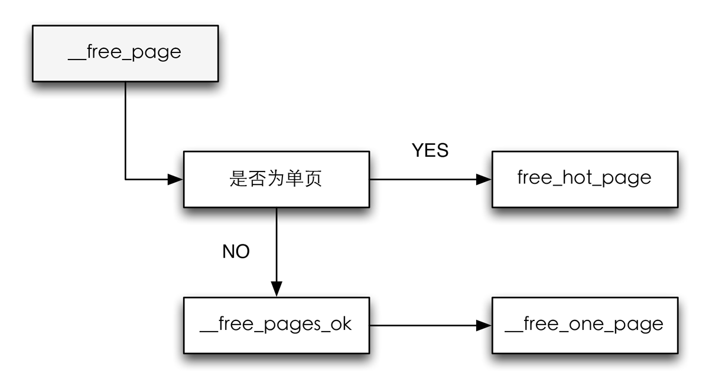
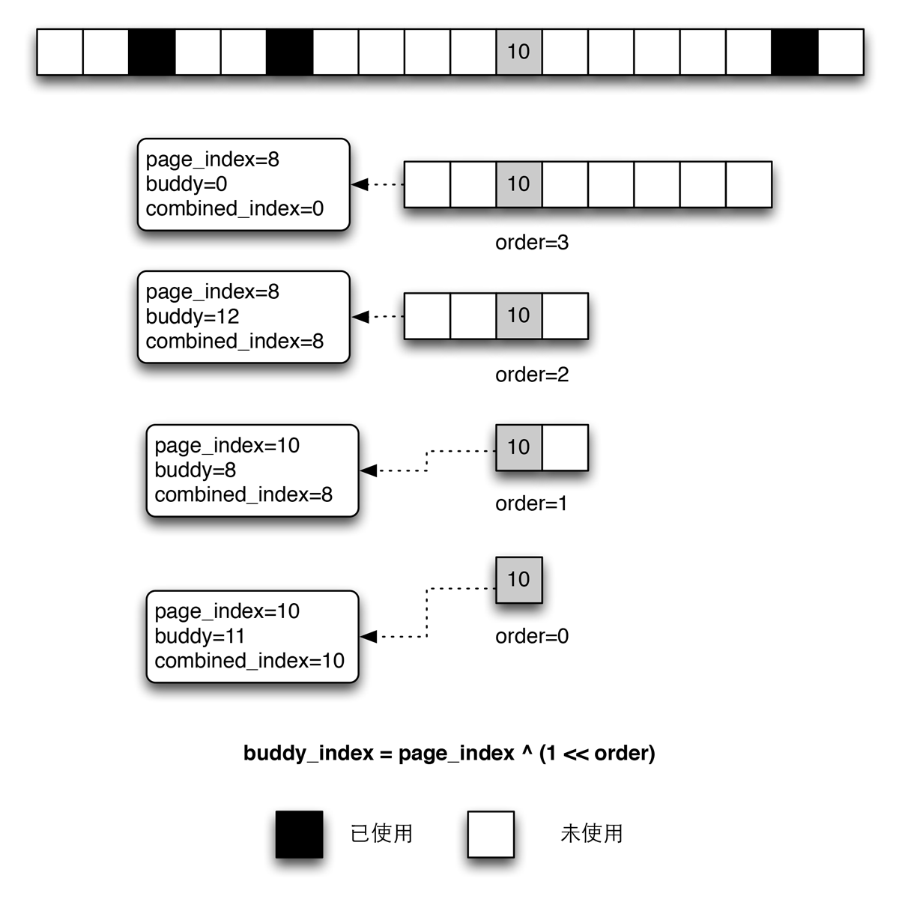

\_\_free\_page是一个基础函数，用于实现内核API中所有涉及内存释放的函数，其代码流程图如下所示：

释放页流程图

\_\_free\_page首先判断所需释放的内存是单页还是较大的内存块，如果是释放单页，那么就不必给交换给伙伴系统，而是置于per-CPU缓存中，对很可能出现在CPU高速缓存的页，则置放到热页的列表中。出于这个目的，内核提供了*free_hot_page*辅助函数，代码如下：

#### <mm/page_alloc.c> ####


void free_hot_page(struct page *page)
{
    trace_mm_page_free_direct(page, 0);
    free_hot_cold_page(page, 0);
}


可以看出，*free_hot_page*只不过是做了一个参数转换，实际上调用的是*free_hot_cold_page*，代码如下。

#### <mm/page_alloc.c> ####


static void free_hot_cold_page(struct page *page, int cold)
{
    /* 获取页的内存域 */
    struct zone *zone = page_zone(page);
    /* 获取per cpu的页的列表 */
    struct per_cpu_pages *pcp;
    unsigned long flags;
    int migratetype;
    int wasMlocked = __TestClearPageMlocked(page);

    kmemcheck_free_shadow(page, 0);

    if (PageAnon(page))
        page->mapping = NULL;
    /* 检查是否能够释放页，也在这个文件中
     * 判断条件例如page->mapping不为空
     * 并且page的引用不为0之类
     * 就不释放这个页
    */
    if (free_pages_check(page))
        return;

    if (!PageHighMem(page)) {
        debug_check_no_locks_freed(page_address(page), PAGE_SIZE);
        debug_check_no_obj_freed(page_address(page), PAGE_SIZE);
    }
    arch_free_page(page, 0);
    kernel_map_pages(page, 1, 0);

    /* 获得per-CPU缓存中的页 */
    pcp = &zone_pcp(zone, get_cpu())->pcp;
    migratetype = get_pageblock_migratetype(page);
    set_page_private(page, migratetype);
    /* 置本地IRQ标志位 */
    local_irq_save(flags);
    if (unlikely(wasMlocked))
        free_page_mlock(page);
    __count_vm_event(PGFREE);

    /*
     * 只针对unmovable、reclaimable和movable的pcp列表中的页进行处理
     * 而ISOLATE的页作为movable的页返回或者释放给分配器
     */
    if (migratetype >= MIGRATE_PCPTYPES) {
        if (unlikely(migratetype == MIGRATE_ISOLATE)) {
            free_one_page(zone, page, 0, migratetype);
            goto out;
        }
        migratetype = MIGRATE_MOVABLE;
    }

    /* 我们可以看到上面穿过来的参数cold为0，则不是冷页 */
    if (cold)
        list_add_tail(&page->lru, &pcp->lists[migratetype]);
    else
        list_add(&page->lru, &pcp->lists[migratetype]);
    pcp->count++;
    /* 如果per-CPU缓存中页的数目超过了pcp-count
     * 则将数量为pcp->batch的一批内存还给伙伴系统
     */
    if (pcp->count >= pcp->high) {
        /* 用于还回给伙伴系统 */
        free_pcppages_bulk(zone, pcp->batch, pcp);
        pcp->count -= pcp->batch;
    }

out:
    local_irq_restore(flags);
    put_cpu();
}


如果释放多个页，那么*\_\_free\_pages*最终还是会到*\_\_free\_one\_page*函数，这个函数不仅仅处理单页的释放，页处理复合页的释放。

这个函数是释放内存的最重要的函数，相关内存区被添加到伙伴系统中适当的*free\_area*列表，在释放伙伴时，该函数将其合并为一个连续的内存区，放置到高一阶的*free\_area*列表中，如果还能合并一个进一步的伙伴的话，那么就继续重复进行合并。这个过程会一直重复下去直到没有任何伙伴可以合并。

如何知道一个伙伴对的两个部分都位于空闲页的列表中，还需要更近一步的判断，使用*\_\_page\_find\_buddy*函数，代码如下。

#### <mm/page_alloc.c> ####


static inline struct page *
__page_find_buddy(struct page *page,
unsigned long page_idx,
unsigned int order)
{
    unsigned long buddy_idx = page_idx ^ (1 << order);

    return page + (buddy_idx - page_idx);
}


其中伙伴页索引的计算方法为页的index^(1左移order)。^运算符表示按位异或操作。*__find_combined_index*函数用于找到合并之后的页索引。

#### <mm/page_alloc.c> ####


static inline unsigned long
__find_combined_index(unsigned long page_idx,
unsigned int order)
{
    return (page_idx & ~(1 << order));
}


根据伙伴系统页索引信息，并不一定能够判断两个页属伙伴，内核还必须确保伙伴的页都是空闲的，使用*page_is_buddy*函数：

#### <mm/page_alloc.c> ####


static inline int page_is_buddy(struct page *page,
    struct page *buddy,
    int order)
{
    /* buddy是否合法 */
    if (!pfn_valid_within(page_to_pfn(buddy)))
        return 0;

    /* 页的内存域是否相同 */
    if (page_zone_id(page) != page_zone_id(buddy))
        return 0;

    /* 页的order是否相同 */
    if (PageBuddy(buddy) && page_order(buddy) == order) {
        VM_BUG_ON(page_count(buddy) != 0);
        return 1;
    }
    return 0;
}


扯了这么多终于可以看*__free_one_page*这个函数了。

#### <mm/page_alloc.c> ####


static inline void __free_one_page(struct page *page,
        struct zone *zone, unsigned int order,
        int migratetype)
{
    unsigned long page_idx;

    if (unlikely(PageCompound(page)))
        if (unlikely(destroy_compound_page(page, order)))
            return;

    VM_BUG_ON(migratetype == -1);
    /* 找到页的索引 */
    page_idx = page_to_pfn(page) & ((1 << MAX_ORDER) - 1);

    VM_BUG_ON(page_idx & ((1 << order) - 1));
    VM_BUG_ON(bad_range(zone, page));
    /* 从页的阶开始遍历，直到最高阶-1 */
    while (order < MAX_ORDER-1) {
        unsigned long combined_idx;
        struct page *buddy;
        /* 通过索引找到伙伴 */
        buddy = __page_find_buddy(page, page_idx, order);
        /* 再一次检查是否可以合并伙伴 */
        if (!page_is_buddy(page, buddy, order))
            break;

        /* 伙伴是空闲的，合并并且向上一个order移动 */
        list_del(&buddy->lru);
        zone->free_area[order].nr_free--;
        rmv_page_order(buddy);
        /* 找到合并的页索引 */
        combined_idx = __find_combined_index(page_idx, order);
        page = page + (combined_idx - page_idx);
        /* 合并并且order递增 */
        page_idx = combined_idx;
        order++;
    }
    set_page_order(page, order);
    /* page->lru队列增加到free_area相应的列表中 */
    list_add(&page->lru,
        &zone->free_area[order].free_list[migratetype]);
    zone->free_area[order].nr_free++;
}


举个例子，假设回收一个页，这个页的索引为10，那么实例图如下：

将一个页归还给伙伴系统示意图

释放页会一直还循环到更高的阶，直到最高阶或者找不到伙伴可以合并为止。