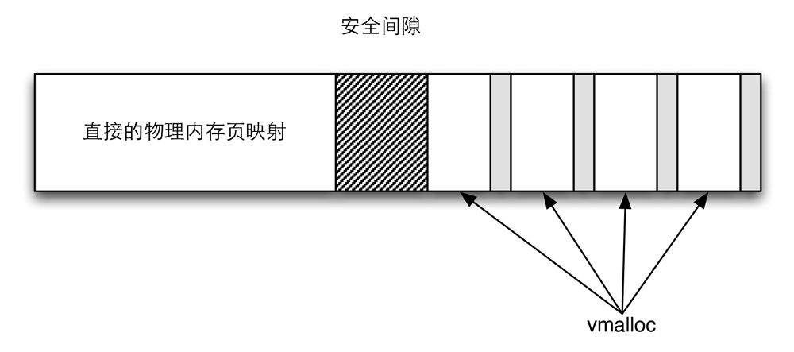
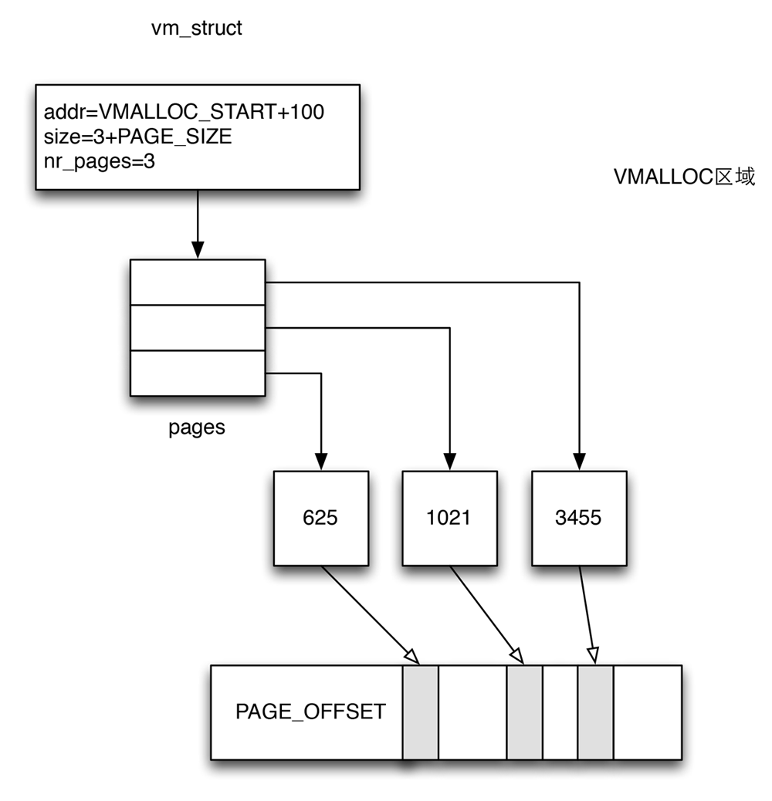

如果内核能够找到连续的页，那是最好的，这样分配和释放都会比较简单，但是真实的系统里情况往往不是那么简单。在分配一大块内存时，可能竭尽全力也无法找到连续的内存块，在用户空间中这不是问题，因为普通进程设计为使用处理器的分页机制，当然这也会降低速度并占用TLB。

在内核中页可以使用相同的技术，内核分配了其虚拟地址空间的一部分用于建立连续映射。

vmalloc区域

每个vmalloc分配的子区域都是自包含的，与其他vmalloc子区域通过一个内存页分隔，类似于直接映射和vmalloc区域之间的边界，不同vmalloc子区域之间的分隔也是为防止不正确的内存访问操作。这种情况只会因为内核故障出现，应该通过系统错误信息报告，而不是允许内核其他部分的数据被暗中修改，因为分隔是在虚拟地址空间中建立的，不会浪费物理内存页。

vmalloc是一个接口函数，内核代码使用它来分配在虚拟内存中连续但在物理内存中不一定连续的内存。

#### <include/linux/vmalloc.h> ####


void *vmalloc(unsigned long size);


这个函数只需要一个参数，用于指定所需内存区的长度，不过其长度单位不是页而是字节，这在用户空间程序的设计中是很普遍的。

使用vmalloc的最著名的实例是内核对模块的实现，因为模块可以在任何时候加载，如果模块数据比较多，那么无法保证有足够的连续内存可用，特别是在系统已经运行了比较长时间的情况下。如果能够用小块内存拼接出足够的内存，那么就可以使用vmalloc。

因为用于vmalloc的内存页总是必须映射在内核地址空间中，因此使用ZONE_HIGHMEM内存域的页要优于其他内存域，这使得内核可以节省更宝贵的较地段内存域又不会带来额外的坏处。所以，vmalloc是内核出于自身的目的使用高端内存页的少数情况之一。

内核在管理虚拟内存中的vmalloc区域时，必须跟踪哪些子区域被使用，哪些是空闲的，所以定义了一个*vm_struct*的数据结构，并将所有使用的部分保存在一个链表中。

#### <include/linux/vmalloc.h> ####


struct vm_struct {
    struct vm_struct    *next;
    void                *addr;
    unsigned long       size;
    unsigned long       flags;
    struct page         **pages;
    unsigned int        nr_pages;
    unsigned long       phys_addr;
    void                *caller;
};


其中字段的意义如下：

字段                  | 说明
------------          | -------------
next                  | 链表的下一个元素
addr                  | 定义了分配的子区域在虚拟地址空间的起始地址
size                  | 表示了该区域的长度
flags                 | 存储了与该内存区关联的标志集合，用于指定内存区的类型
pages                 | 是一个指针，指向page指针的数组，每个数组成员都表示一个映射到虚拟地址空间中的物理内存页的page的实例
nr_pages              | 指定pages中数组的项目数
phys_addr             | 映射了由物理地址描述的物理内存区
caller                | 调用的对象

其中flags的常用字段及其意义如下：

字段                  | 说明
------------          | -------------
VM_IOREMAP            | 表示几乎随机的物理内存区映射到vmalloc去雨中，这是一个特定于体系结构的操作
VM_ALLOC              | 指定由vmalloc产生的子区域
VM_MAP                | 用于表示将现存的pages集合映射到连续的虚拟地址空间中

使用vmalloc的话，那么我们可以看到的结构如下：

vmalloc内存页映射物理内存

内核提供了辅助函数*get_vm_area*充当*\_\_get_vm_area*的前端，负责参数的准备工作。而*\_\_get_vm_area*函数实际上是*\_\_get_vm_area_node*函数的前端，这个函数负责在vmalloc空间中找到一个合适的位置，代码如下：

#### <include/linux/vmalloc.h> ####


static struct vm_struct *__get_vm_area_node(
    unsigned long size,
    unsigned long align,
    unsigned long flags,
    unsigned long start,
    unsigned long end,
    int node, gfp_t gfp_mask,
    void *caller)
{
    static struct vmap_area *va;
    struct vm_struct *area;

    BUG_ON(in_interrupt());
    if (flags & VM_IOREMAP) {
        int bit = fls(size);

        if (bit > IOREMAP_MAX_ORDER)
            bit = IOREMAP_MAX_ORDER;
        else if (bit < PAGE_SHIFT)
            bit = PAGE_SHIFT;

        align = 1ul << bit;
    }

    size = PAGE_ALIGN(size);
    if (unlikely(!size))
        return NULL;

    area = kzalloc_node(sizeof(*area),
        gfp_mask & GFP_RECLAIM_MASK, node);
    if (unlikely(!area))
        return NULL;

    /*
     * 在这里总是分配一个警戒页作为安全间隙用来保护
     */
    size += PAGE_SIZE;

    //start代表VMALLOC_START
    //end代表VMALLOC_END
    va = alloc_vmap_area(size, align,
            start, end, node, gfp_mask);
    if (IS_ERR(va)) {
        kfree(area);
        return NULL;
    }

    if (flags & VM_UNLIST)
        setup_vmalloc_vm(area, va, flags, caller);
    else
        insert_vmalloc_vm(area, va, flags, caller);

    return area;
}


如果找到了合适的区域就返回，如果没有就返回NULL指针，*remove_vm_area*函数将区域从vmalloc地址空间中删除，代码如下：

#### <include/linux/vmalloc.h> ####


struct vm_struct *remove_vm_area(const void *addr)
{
    struct vmap_area *va;

    va = find_vmap_area((unsigned long)addr);
    if (va && va->flags & VM_VM_AREA) {
        struct vm_struct *vm = va->private;

        if (!(vm->flags & VM_UNLIST)) {
            struct vm_struct *tmp, **p;
            /*
             * 在unmap之前从列表中移除这个内存区并且禁止访问
             */
            write_lock(&vmlist_lock);
            for (p = &vmlist; (tmp = *p) != vm; p = &tmp->next)
                ;
            *p = tmp->next;
            write_unlock(&vmlist_lock);
        }

        vmap_debug_free_range(va->va_start, va->va_end);
        free_unmap_vmap_area(va);
        vm->size -= PAGE_SIZE;
        // 返回内存区域
        return vm;
    }
    return NULL;
}


在了解了查找vmalloc内存区和移除内存区之后，就可以开始分配内存区。*vmalloc*函数发起对不连续内存区的分配操作，不过这个函数只是调用了*_\_vmalloc*并且提供了一些初始化的参数，然后就走到了*_\_vmalloc_node*。代码如下：

#### <include/linux/vmalloc.h> ####


static void *__vmalloc_node(
    unsigned long size, unsigned long align,
    gfp_t gfp_mask, pgprot_t prot,
    int node, void *caller)
{
    struct vm_struct *area;
    void *addr;
    unsigned long real_size = size;

    size = PAGE_ALIGN(size);
    if (!size || (size >> PAGE_SHIFT) > totalram_pages)
        return NULL;

    /* 查找是否能找到一个空闲的页 */
    area = __get_vm_area_node(size, align, VM_ALLOC | VM_UNLIST,
                  VMALLOC_START, VMALLOC_END, node,
                  gfp_mask, caller);

    if (!area)
        return NULL;

    /* 物理内存区的分配 */
    addr = __vmalloc_area_node(area, gfp_mask, prot, node, caller);

    /*
     * 插入最新分配的内存页到链表中
     */
    insert_vmalloc_vmlist(area);

    /*
     * 3是需要的，因为__get_vm_area_node函数创建的
     * vm_struct和vmap_area对象包含
     * 虚拟分配的虚拟地址
     */
    kmemleak_alloc(addr, real_size, 3, gfp_mask);

    return addr;
}


可以看到通过*__get_vm_area_node*函数查找是否有空闲的内存区域，如果存在，那么就从物理内存中分配各个页，然后将这些页连续地映射到vmalloc区域中，分配虚拟内存的工作就完成了。

其中最为重要的就是*__vmalloc_area_node*函数，这个函数的作用是进行物理内存区的分配，代码如下：

#### <include/linux/vmalloc.h> ####


static void *__vmalloc_area_node(
    struct vm_struct *area, gfp_t gfp_mask,
    pgprot_t prot, int node, void *caller)
{
    /* 进行安全性检查 */
    struct page **pages;
    unsigned int nr_pages, array_size, i;

    nr_pages = (area->size - PAGE_SIZE) >> PAGE_SHIFT;
    array_size = (nr_pages * sizeof(struct page *));

    area->nr_pages = nr_pages;
    if (array_size > PAGE_SIZE) {
        pages = __vmalloc_node(array_size, 1,
                gfp_mask | __GFP_ZERO,
                PAGE_KERNEL, node, caller);
        area->flags |= VM_VPAGES;
    } else {
        pages = kmalloc_node(array_size,
                (gfp_mask & GFP_RECLAIM_MASK) | __GFP_ZERO,
                node);
    }
    area->pages = pages;
    area->caller = caller;
    if (!area->pages) {
        remove_vm_area(area->addr);
        kfree(area);
        return NULL;
    }
    /* 循环遍历整个区域的所有页 */
    for (i = 0; i < area->nr_pages; i++) {
        struct page *page;

        /*
         * node<0表示没有显式地分配页帧的结点
         */
        if (node < 0)
            //从当前结点分配
            page = alloc_page(gfp_mask);
        else
            //从指定的结点分配
            page = alloc_pages_node(node, gfp_mask, 0);

        if (unlikely(!page)) {
            /* 成功分配了i个页，在__vunmap()中释放它们 */
            area->nr_pages = i;
            goto fail;
        }
        area->pages[i] = page;
    }

    if (map_vm_area(area, prot, &pages))
        goto fail;
    return area->addr;

fail:
    vfree(area->addr);
    return NULL;
}


分配的页从相关结点的伙伴系统中移除，在调用时，vmalloc将*gfp_mask*设置为*GFP_KERNEL \| __GFP_HIGHMEM*，内核通过该才输指示内存管理子系统尽可能的从*ZONE_HIGHMEM*内存域分配页帧。理由时地段内存域的页帧更为宝贵，不应该浪费到vmalloc的分配中。

从伙伴系统分配内存时，是逐页分配，而不是一次分配一大块，是因为在vmalloc中，如果缺陷可以分配连续的内存区域，那就没有必要使用vmalloc，毕竟这个函数的所有目的就在于分配大的内存块，因为尽管因为内存碎片的缘故，内存块中的页帧可能不是连续的。将分配单位拆的越小，即便在严重的内存碎片的物理内存的情况下，也是可以正常分配的。

有两个函数用于向内核释放内存，*vfree*用于释放*vmalloc*和*vmalloc_32*分配的区域，而*vunmap*用于释放由*vmap*和*ioremap*创建的映射，不过这两个函数都会调用到*__vunmap*。

#### <include/linux/vmalloc.h> ####


static void __vunmap(const void *addr, int deallocate_pages)
{
    struct vm_struct *area;

    if (!addr)
        return;

    if ((PAGE_SIZE-1) & (unsigned long)addr) {
        WARN(1, KERN_ERR "Trying to vfree() bad address (%p)\n",
            addr);
        return;
    }
    // 获得内存域
    area = remove_vm_area(addr);
    if (unlikely(!area)) {
        WARN(1, KERN_ERR "Trying to vfree() "\
            "nonexistent vm area (%p)\n",
            addr);
        return;
    }

    debug_check_no_locks_freed(addr, area->size);
    debug_check_no_obj_freed(addr, area->size);

    if (deallocate_pages) {
        int i;
        // 遍历所有内存区的页，并且归还给伙伴系统
        for (i = 0; i < area->nr_pages; i++) {
            struct page *page = area->pages[i];

            BUG_ON(!page);
            __free_page(page);
        }

        if (area->flags & VM_VPAGES)
            vfree(area->pages);
        else
            kfree(area->pages);
    }
    // 删除内核的用来管理内存域的数据结构
    kfree(area);
    return;
}


这个函数的*addr*表示要释放区域的起始地址，*deallocate_pages*指定了是否将与该区域相关的物理内存返回给伙伴系统。*vfree*将*deallocate_pages*参数的值设置为1，而*vunmap*设置为0。

释放内存不需要给出释放区域的长度，因为长度可以从*vmlist*中的信息中了解到，*unmap_vm_area*使用找到的*vm_area*实例，从页表中删除不再需要的项，这个函数需要操作各级页表，但删除一个项，该函数还会更新CPU高速缓存。

如果*deallocate_pages*设置为1，那么内核会遍历*area->pages*的所有元素，然后对每一项调用*__free_page*，将内存释放到伙伴系统。

在释放完内存区域的页之后，最后还必须释放用于管理内存区的内核数据结构。