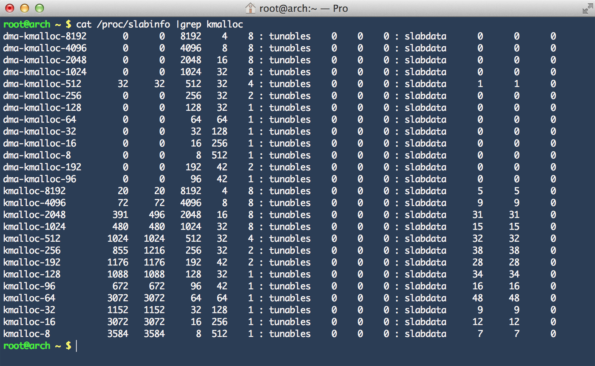

内核中的一般的内存分配和释放函数与C标准库中等价函数的名称类似，用法也几乎相同，如：

**kmalloc(size, flags)**

分配长度为*size*字节的一个内存区，并返回指向改内存区起始处的一个*void*指针，如果没有足够的内存，则为NULL指针。其中*flags*参数使用*GFP_*常数，来指定分配内存的具体内存域。

**kfree(*ptr)**

用于释放*ptr*指向的内存区。

与用户空间程序设计相比，内核还包括*percpu_alloc*和*percpu_free*函数，用于为各个系统CPU分配和释放所需内存区。*kmalloc*在内核源代码中的使用数以千记，但模式都是相同的。用*kmalloc*分配内存区，首先通过类型转换变为正确的类型，然后赋值到指针变量。


info = (struct cdrom_info *)kmalloc(
    sizeof(struct cdrom_info),
    GFP_KERNEL)


从程序员的角度来看，建立和使用缓存的任务不是特别困难，必须首先用*kmem_cache_create*建立一个适当的缓存，接下来即可使用*kmem_cache_alloc*和*kmem_cache_free*分配和释放其中包含的对象。slab分配器负责完成与伙伴系统交互来分配所需的页。

所有活动缓存的列表保留在*/proc/slabinfo*中。

slabinfo示例

输出的各列除了包含用于标识各个缓存的字符串名称之外，还包含下列信息：

1. 缓存中活动对象的数量。
2. 缓存中对象的总数，包括已用和未知。
3. 所管理对象的长度，按字节计算。
4. 一个slab中对象的数量。
5. 每个slab中页的数量。
6. 活动slab的数量。
7. 在内核决定向缓存分配更多内存时，所分配的对象的数量[^1]。

[^1]: 每次会分配一个较大的内存块，以减少与伙伴系统的交互，在缩小缓存时，也使用该值作为释放内存块的大小。

除了容易识别的缓存名称如用于UNIX域套接字的*unix_sock*，还有其他字段名称如*kmalloc-size*。这些字段提供DMA内存域的计算机还包括用于DMA分配的缓存。这些是*kmalloc*函数的基础，是内核为不同长度提供的slab缓存，除极少例外，其长度都是2的幂次方，长度范围从32B或64B到2^25B。上界也可以更小，由*KMALLOC_MAX_SIZE*设置。

每次调用*kmalloc*时，内核找到最合适的缓存，从中分配一个对象满足请求，如果没有刚刚好和式的缓存，则分配稍大一点的对象，但不会分配小的对象。在实际实现中，slab分配器和缓存之间的差异几乎没有，所以有些时候我们可以将这两个名词看作同义词。