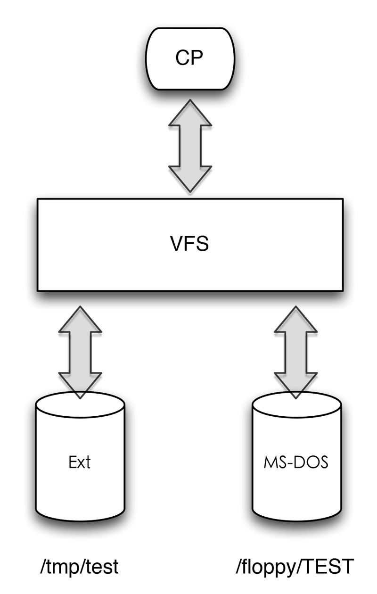

Linux是具有与其他操作系统和谐共存的能力，可以透明地安装具有其他操作系统文件格式的磁盘或分区，这些操作系统如Windows或者其他Unix。通过所谓的虚拟文件系统的概念，Linux使用与其他Unix变体相同的方式设法支持多重文件系统类型。

虚拟文件系统所隐含的思想是把表示很多不同种类的文件系统的共同信息放入内核，其中有一个字段或函数来支持Linux所支持的所有实际文件系统所提供的任何操作。读所调用的每个读、写或其他函数，内核都能把它们替换成支持本地Linux文件系统，NTFS文件系统，或者文件所在的任何其他文件系统的实际函数。

虚拟文件系统（*Virtual Filesystem*）也可以称之为虚拟文件系统换换（*Virtual Filesystem Switch，VFS*），是一个内核软件层，用来处理与Unix标准文件系统相关的所有系统调用，其表现为能为各种文件系统提供一个通用的接口。

假设一个用户拷贝一个文件，例如：

    cp /floopy/TEST /tmp/test

其中*/floopy*是MS-DOS磁盘的一个安装点，而*/tmp*是一个标准的Ext文件系统的目录。如下图所示：

一个简单的VFS架构

VFS支持的文件系统可以划分为三类。

**磁盘文件系统**

这些文件系统管理在本地磁盘分区中可用的存储空间或其他可以起到磁盘作用的设备[^1]，VFS支持的基于磁盘的某些文件系统还有：

1. Linux使用的文件系统，例如Ext2，现在最新使用的文件系统是Ext4。
2. Unix家族的文件系统，如sysv、MINIX文件系统以及VERITAS VxFS文件系统。
3. Miscrosoft文件系统。
4. ISO9660 CD-ROM文件系统和通用磁盘格式DVD文件系统。
5. 其他有专利权的文件系统哦女孩，如HPFS、HFS、AFFS以及ADFS文件系统。
6. 起源于非Linux系统的其他日志文件系统，如IBM的JFS和SGI的XFS文件系统。

**网络文件系统**

这些文件系统允许轻易地访问属于其他网络计算机的文件系统所包含的文件，虚拟文件系统所支持的一些著名的网络文件系统有：NFS、Coda、AFS、CIFS等文件系统。

**特殊文件系统**

这些文件系统不管理本地或者远程磁盘空间，/proc文件系统是特殊文件系统的一个典型范例。

由于我看的书的原因，记录的更多的是Ext2和Ext3文件系统，但依旧会看Ext4文件系统并记录一些笔记。所以今后笔记中的Linux文件系统就不指明是第几代Ext文件系统，统称为Ext文件系统。

Unix的目录建立了一颗根目录为『/』的树，根目录包含在根文件系统（*root filesystem*）中，在Linux中这个根文件系统通常是Ext类型，其他所有的文件系统都可以被安装在根文件系统的子目录里。

当一个文件系统被安装在某一个目录上时，在父文件系统中的目录内容不再是可访问的，因为任何路径，甚至包括安装点，都将引用已安装的文件系统。但是，当被安装文件系统卸载之后，原目录的内容又可以再现。这种Unix文件系统的特点可以由系统管理员用来隐藏文件，因为只需要把一个文件系统安装在要隐藏文件的目录中即可。

基于磁盘的文件系统通常存放在硬件块设备中，如磁盘、软盘或者CD-ROM。Linux VFS的一个有用的特点是能够处理*/dev/loop0*这样的虚拟块设备，这种设备可以用来安装普通文件所在的文件系统。作为一种可能的应用，用户可以保护自己的私有文件系统，这可以通过把自己文件系统的加密版本存放在一个普通文件中来实现。

[^1]: 比如说一个USB闪存。