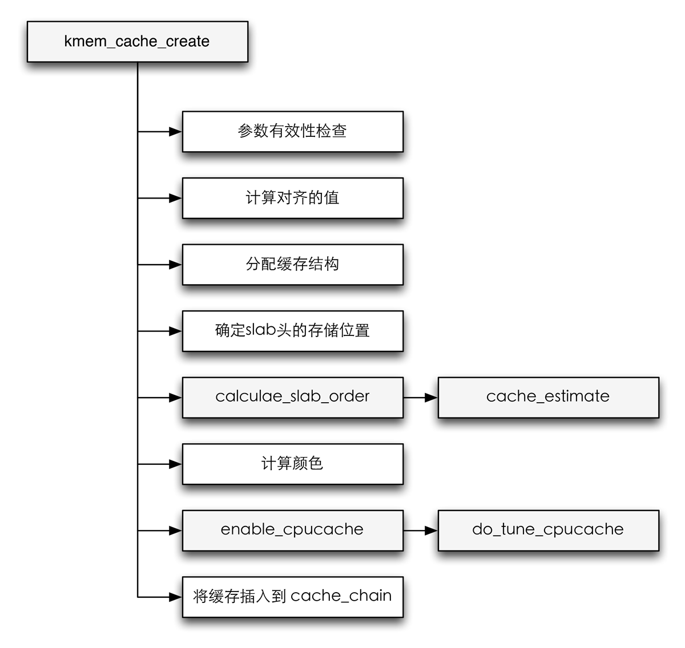

创建新的slab缓存必须使用*kmem_cache_create*函数，这个函数很长，在分析代码之前我们可以看看这个函数的流程图。

创建slab流程图

除了可读的*name*随后会出现在*/proc/slabinfo*，这个函数的参数需要进行一些检查，以确保没有指定一些无效的值。去掉一些调试的代码，其函数的代码如下。

#### <mm/slab.c> ####


struct kmem_cache *
kmem_cache_create (const char *name, size_t size, size_t align,
    unsigned long flags, void (*ctor)(void *))
{
    size_t left_over, slab_size, ralign;
    struct kmem_cache *cachep = NULL, *pc;
    gfp_t gfp;

    /*
     * 正常的检查
     */
    if (!name || in_interrupt() || (size < BYTES_PER_WORD) ||
        size > KMALLOC_MAX_SIZE) {
        printk(KERN_ERR "%s: Early error in slab %s\n", __func__,
                name);
        BUG();
    }

    if (slab_is_available()) {
        get_online_cpus();
        mutex_lock(&cache_chain_mutex);
    }

    list_for_each_entry(pc, &cache_chain, next) {
        char tmp;
        int res;

        /*
         * area of the module.  Print a warning.
         * 只有module没有卸载并且没有销毁它的slab缓存
         * 并且没有其他地方重用了vmalloc才会出现这种情况
         */
        res = probe_kernel_address(pc->name, tmp);
        if (res) {
            printk(KERN_ERR
                   "SLAB: cache with size %d has lost its name\n",
                   pc->buffer_size);
            continue;
        }

        if (!strcmp(pc->name, name)) {
            printk(KERN_ERR
                   "kmem_cache_create: duplicate cache %s\n", name);
            dump_stack();
            goto oops;
        }
    }

    /* DEBUG CODE IGNORED */

    /*
     * 计算对齐所需要的填充字节
     * 对象长度向上舍入到处理器字长的倍数
     */
    if (size & (BYTES_PER_WORD - 1)) {
        size += (BYTES_PER_WORD - 1);
        size &= ~(BYTES_PER_WORD - 1);
    }

    /* 计算最终需要对齐的填充字节 */

    /* 1) 体系结构推荐 */
    if (flags & SLAB_HWCACHE_ALIGN) {
        /*
         * 默认对齐值，由特定于体系结构的代码指定
         * 如果一个对象比较小，则会将多个对象挤到
         * 一个缓存行中
         */
        ralign = cache_line_size();
        while (size <= ralign / 2)
            ralign /= 2;
    } else {
        ralign = BYTES_PER_WORD;
    }

    /*
     * 字对齐或者更大
     * 这个可能会被体系结构相关覆盖
     */
    if (flags & SLAB_STORE_USER)
        ralign = BYTES_PER_WORD;

    if (flags & SLAB_RED_ZONE) {
        ralign = REDZONE_ALIGN;
        size += REDZONE_ALIGN - 1;
        size &= ~(REDZONE_ALIGN - 1);
    }

    /* 2)体系结构强制的最小对齐值 */
    if (ralign < ARCH_SLAB_MINALIGN) {
        ralign = ARCH_SLAB_MINALIGN;
    }
    /* 3) 调用者强制的对齐值 */
    if (ralign < align) {
        ralign = align;
    }
    /* 去掉调试 */
    if (ralign > __alignof__(unsigned long long))
        flags &= ~(SLAB_RED_ZONE | SLAB_STORE_USER);
    /*
     * 4) 存储最后计算出的对齐值
     */
    align = ralign;

    if (slab_is_available())
        gfp = GFP_KERNEL;
    else
        gfp = GFP_NOWAIT;

    /* 获取缓存的描述符对象 */
    cachep = kmem_cache_zalloc(&cache_cache, gfp);
    if (!cachep)
        goto oops;

    /* DEBUG CODE IGNORED */

    /*
     * 对象长度比较大，那么最好将slab管理数据
     * 放置在slab之外
     */
    if ((size >= (PAGE_SIZE >> 3)) && !slab_early_init)
        flags |= CFLGS_OFF_SLAB;

    size = ALIGN(size, align);

    /*
     * 到目前位置，只定义了对象的长度，没有定义
     * slab的长度，因此系统需要找到适当的页数来
     * 定义slab的长度，即不能太大，也不能太小
     * 内核通过calculate_slab_order函数实现迭代
     * 过程，找到理想的slab长度
     */

    left_over = calculate_slab_order(cachep, size, align, flags);

    if (!cachep->num) {
        printk(KERN_ERR
               "kmem_cache_create: couldn't create cache %s.\n"
               , name);
        kmem_cache_free(&cache_cache, cachep);
        cachep = NULL;
        goto oops;
    }
    slab_size = ALIGN(cachep->num * sizeof(kmem_bufctl_t)
              + sizeof(struct slab), align);

    if (flags & CFLGS_OFF_SLAB && left_over >= slab_size) {
        flags &= ~CFLGS_OFF_SLAB;
        left_over -= slab_size;
    }

    if (flags & CFLGS_OFF_SLAB) {
        /* 如果设置了该值，那么较小的对象
         * 也可以将slab头放在slab之外
         */
        slab_size =
            cachep->num * sizeof(kmem_bufctl_t)
                + sizeof(struct slab);

#ifdef CONFIG_PAGE_POISONING
        if (size % PAGE_SIZE == 0 && flags & SLAB_POISON)
            flags &= ~(SLAB_RED_ZONE | SLAB_STORE_USER);
#endif
    }
    /* 特定于体系结构的函数，获得L1缓存行的长度 */
    cachep->colour_off = cache_line_size();
    /* 偏移量必须是对齐值的倍数 */
    if (cachep->colour_off < align)
        cachep->colour_off = align;
    cachep->colour = left_over / cachep->colour_off;
    cachep->slab_size = slab_size;
    cachep->flags = flags;
    cachep->gfpflags = 0;
    if (CONFIG_ZONE_DMA_FLAG && (flags & SLAB_CACHE_DMA))
        cachep->gfpflags |= GFP_DMA;
    cachep->buffer_size = size;
    cachep->reciprocal_buffer_size = reciprocal_value(size);

    if (flags & CFLGS_OFF_SLAB) {
        cachep->slabp_cache = kmem_find_general_cachep(
            slab_size, 0u);
        BUG_ON(ZERO_OR_NULL_PTR(cachep->slabp_cache));
    }
    cachep->ctor = ctor;
    cachep->name = name;

    if (setup_cpu_cache(cachep, gfp)) {
        __kmem_cache_destroy(cachep);
        cachep = NULL;
        goto oops;
    }

    /* 缓存初始化完成，加入到链表中 */
    list_add(&cachep->next, &cache_chain);
oops:
    if (!cachep && (flags & SLAB_PANIC))
        panic("kmem_cache_create(): failed to create slab `%s'\n",
              name);
    if (slab_is_available()) {
        mutex_unlock(&cache_chain_mutex);
        put_online_cpus();
    }
    return cachep;
}
EXPORT_SYMBOL(kmem_cache_create);


其中一个重要的方法是*calculate_slab_order*，该方法用于查找slab的长度，slab长度即不能太长也不能太短，太长，则可能会浪费内存，太小，则增加管理的开销，降低使用的效率。内核会通过该函数实现迭代，找到理想的slab长度。

#### <mm/slab.c> ####


static size_t calculate_slab_order(struct kmem_cache *cachep,
            size_t size, size_t align, unsigned long flags)
{
    unsigned long offslab_limit;
    size_t left_over = 0;
    int gfporder;

    for (gfporder = 0; gfporder <= KMALLOC_MAX_ORDER; gfporder++) {
        unsigned int num;
        size_t remainder;
        /*
         * 通过该函数找到一个slab布局
         */
        cache_estimate(gfporder, size,
            align, flags, &remainder, &num);
        if (!num)
            continue;

        if (flags & CFLGS_OFF_SLAB) {
            offslab_limit = size - sizeof(struct slab);
            offslab_limit /= sizeof(kmem_bufctl_t);

            if (num > offslab_limit)
                break;
        }

        cachep->num = num;
        cachep->gfporder = gfporder;
        left_over = remainder;

        if (flags & SLAB_RECLAIM_ACCOUNT)
            break;

        if (gfporder >= slab_break_gfp_order)
            break;

        if (left_over * 8 <= (PAGE_SIZE << gfporder))
            break;
    }
    return left_over;
}


如果slab上有足够的空闲空间可存储slab头，那么即使实际应该存储在slab之外，内核也会利用这个机会，将其存储在slab外。

在执行了查找slab长度的操作之后，内核对slab进行着色。

内核使用L1缓存行的长度作为偏移量，这个值可以通过特定于体系结构的函数*cache_line_size*。还必须保证偏移量是所用对齐值的倍数，否则就无法进行数据对齐。例如在一些系统上，对于管理长度为256字节的对象，内核会产生如下结果[^1]：

1. 一个slab管理15个对象。
2. 使用一个页。
3. 有五种可能的颜色，每种颜色使用32字节的偏移量。
4. slab头存储在slab上。

虽然处理了slab的布局，但在创建新的slab缓存时，还需要创建per-CPU缓存，为各个处理器分配所需的内存：一个array_cache的实例和一个指针数组，数组项数目由内核计算给出[^2]。

[^1]: 按照SLAB\_HWCACHE\_ALLGN的要求对齐到硬件缓存行的缓存。

[^2]: 另外值得注意的是*batchcount*字段总是设置为缓存中对象数目的一半。

最后，在完成初始化之后，将初始化的*kmem_cache*实例添加到全局连表。