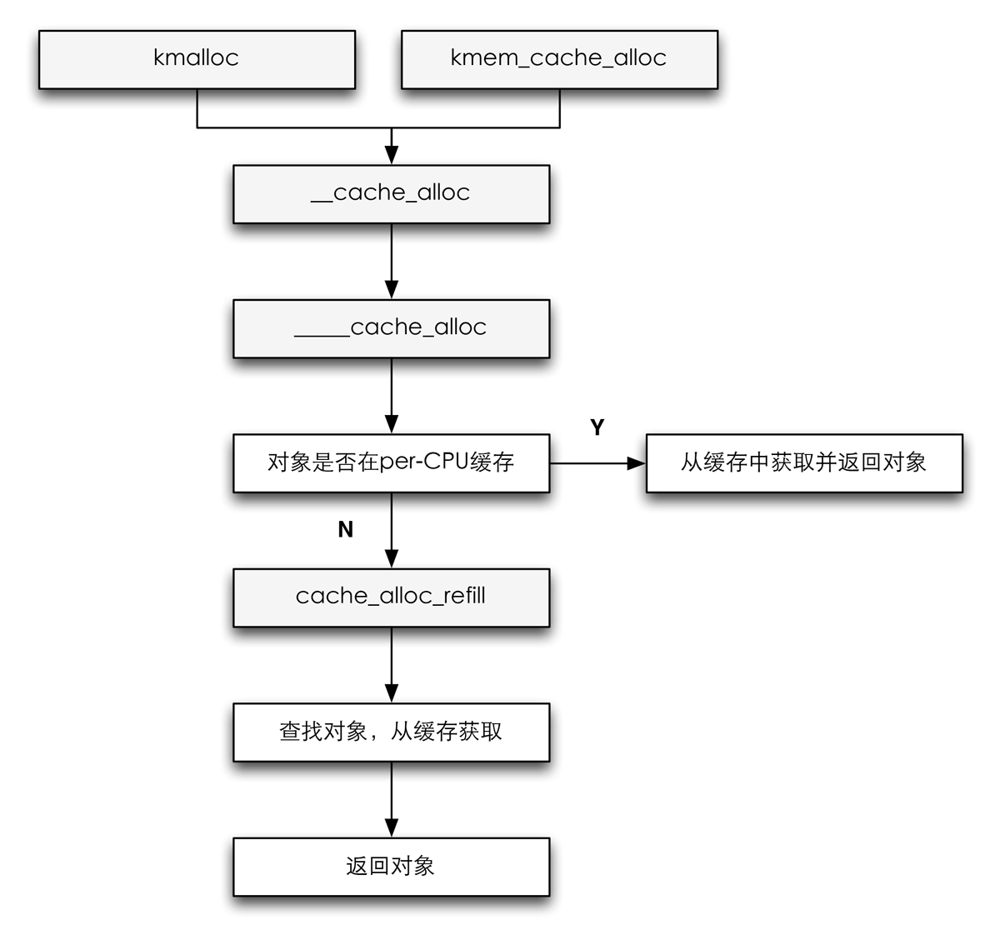

slab的分配使用*kmem_cache_alloc*函数，这个函数的流程图如下：

#### <mm/slab.c> ####


void *kmem_cache_alloc(struct kmem_cache *cachep, gfp_t flags)
{
    void *ret = __cache_alloc(cachep, flags, __builtin_return_address(0));

    trace_kmem_cache_alloc(_RET_IP_, ret,
                   obj_size(cachep), cachep->buffer_size, flags);

    return ret;
}
EXPORT_SYMBOL(kmem_cache_alloc);


可以看到无论是*kmalloc*或者*kmem_cache_alloc*最后都会调用到*\_\_cache_alloc*函数，而*\_\_cache_alloc*最后都会调用到*____cache_alloc*函数[^1]。

[^1]: 四个下划线。

#### <mm/slab.c> ####


static inline void *____cache_alloc(
    struct kmem_cache *cachep, gfp_t flags)
{
    void *objp;
    struct array_cache *ac;

    check_irq_off();

    ac = cpu_cache_get(cachep);
    if (likely(ac->avail)) {
        STATS_INC_ALLOCHIT(cachep);
        ac->touched = 1;
        objp = ac->entry[--ac->avail];
    } else {
        STATS_INC_ALLOCMISS(cachep);
        objp = cache_alloc_refill(cachep, flags);
    }

    kmemleak_erase(&ac->entry[ac->avail]);
    return objp;
}


从上面的代码来看，*cachep*是一个指针，指向缓存使用的*kmem_cache_t*实例，*ac_data*宏通过返回*cachep->array[smp_processor_id()]*，从而获得当前活动CPU相关的*array_cache*实例。

因为内存中的对象紧跟*array_cache*实例之后，内核可以借助该结构末尾的伪数组访问对象而不需要使用指针，通过将*ac->avail*减去1，就可以将对象从缓存中移除。

如果在per-CPU中没有对象的话，就需要调用*cache_alloc_refill*方法来重新填充。

#### <mm/slab.c> ####


static void *cache_alloc_refill(
struct kmem_cache *cachep, gfp_t flags)
{
    int batchcount;
    struct kmem_list3 *l3;
    struct array_cache *ac;
    int node;

retry:
    check_irq_off();
    node = numa_node_id();
    ac = cpu_cache_get(cachep);
    batchcount = ac->batchcount;
    if (!ac->touched && batchcount > BATCHREFILL_LIMIT) {
        /* 检查batchcount的值 */
        batchcount = BATCHREFILL_LIMIT;
    }
    l3 = cachep->nodelists[node];

    BUG_ON(ac->avail > 0 || !l3);
    spin_lock(&l3->list_lock);

    /* 检查是否可以从共享数组中重新填充 */
    if (l3->shared && transfer_objects(
        ac, l3->shared, batchcount))
        goto alloc_done;

    while (batchcount > 0) {
        struct list_head *entry;
        struct slab *slabp;
        /* 获取对象的slab链表 */
        entry = l3->slabs_partial.next;
        /* 首先是slabs_partial，然后是slabs_free */
        if (entry == &l3->slabs_partial) {
            l3->free_touched = 1;
            entry = l3->slabs_free.next;
            if (entry == &l3->slabs_free)
                goto must_grow;
        }

        slabp = list_entry(entry, struct slab, list);
        check_slabp(cachep, slabp);
        check_spinlock_acquired(cachep);

        /*
         * 如果slab不在partial或者free连表中
         * 那么至少有一个对象可以被分配
         */
        BUG_ON(slabp->inuse >= cachep->num);

        while (slabp->inuse < cachep->num && batchcount--) {
            STATS_INC_ALLOCED(cachep);
            STATS_INC_ACTIVE(cachep);
            STATS_SET_HIGH(cachep);

            ac->entry[ac->avail++] = slab_get_obj(cachep, slabp,
                                node);
        }
        check_slabp(cachep, slabp);

        /* 将slab移动到正确的slab连表中 */
        list_del(&slabp->list);
        if (slabp->free == BUFCTL_END)
            list_add(&slabp->list, &l3->slabs_full);
        else
            list_add(&slabp->list, &l3->slabs_partial);
    }

must_grow:
    l3->free_objects -= ac->avail;
alloc_done:
    spin_unlock(&l3->list_lock);

    if (unlikely(!ac->avail)) {
        int x;
        x = cache_grow(
            cachep, flags | GFP_THISNODE,
            node, NULL);

        ac = cpu_cache_get(cachep);
        if (!x && ac->avail == 0)
            return NULL;

        if (!ac->avail)
            goto retry;
    }
    ac->touched = 1;
    return ac->entry[--ac->avail];
}
