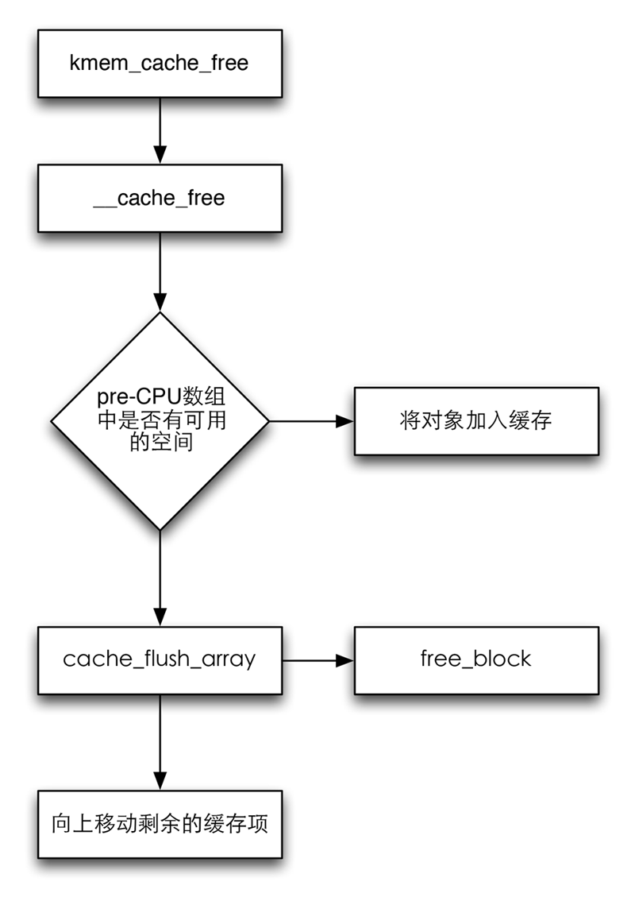

如果一个已经分配的对象已经不再需要，那么必须使用*kmem_cache_free*函数将已经分配的slab返回给slab分配器。

slab释放的流程图

*kmem_cache_free*实际上是一个*__cache_free*的接口，直接调用了该函数，参数直接传递过去，其原因也是防止*kfree*实现中的代码复制。

类似于分配，根据per-CPU缓存状态的不同，可以有两种操作流程，如果per-CPU缓存中的对象数目低于允许的限制，则在其中存储一个指向缓存中对象的指针。

#### <mm/slab.c> ####



static inline void __cache_free(
    struct kmem_cache *cachep, void *objp)
{
    struct array_cache *ac = cpu_cache_get(cachep);

    check_irq_off();
    kmemleak_free_recursive(objp, cachep->flags);
    objp = cache_free_debugcheck(cachep, objp, __builtin_return_address(0));

    kmemcheck_slab_free(cachep, objp, obj_size(cachep));

    if (nr_online_nodes > 1 && cache_free_alien(cachep, objp))
        return;

    if (likely(ac->avail < ac->limit)) {
        STATS_INC_FREEHIT(cachep);
        ac->entry[ac->avail++] = objp;
        return;
    } else {
        STATS_INC_FREEMISS(cachep);
        cache_flusharray(cachep, ac);
        ac->entry[ac->avail++] = objp;
    }
}


从上面的代码可以看出，这样的操作是很必要的，否则，必须将一些对象从缓存移回slab，从编号最低的数组元素开始：缓存的实现一句先进先处的原理，这些对象在数组中已经很长时间，因此不太可能依然驻留在CPU高速缓存中。

具体的实现交给函数*cache_flusharray*，这个函数又调用了*free_block*，将对象从缓存移动到原来的slab，并将剩余的对象向数组起始处移动。例如，如果缓存中有30个对象的空间，而*batchcoucnt*为15，则位置0到14的对象将会移回slab，剩余编号15～29的对象则在缓存中向上移动，现在占据位置0～14.

将对象从缓存移回到slab是非常有用的，我们看*free_block*代码如下：

#### <mm/slab.c> ####


static void free_block(struct kmem_cache *cachep, void **objpp, int nr_objects,
               int node)
{
    int i;
    struct kmem_list3 *l3;

    for (i = 0; i < nr_objects; i++) {
        void *objp = objpp[i];
        struct slab *slabp;

        slabp = virt_to_slab(objp);
        l3 = cachep->nodelists[node];
        list_del(&slabp->list);
        check_spinlock_acquired_node(cachep, node);
        check_slabp(cachep, slabp);
        slab_put_obj(cachep, slabp, objp, node);
        STATS_DEC_ACTIVE(cachep);
        l3->free_objects++;
        check_slabp(cachep, slabp);

        /* 临时的slab重新插入缓存链表 */
        if (slabp->inuse == 0) {
            if (l3->free_objects > l3->free_limit) {
                l3->free_objects -= cachep->num;
                slab_destroy(cachep, slabp);
            } else {
                list_add(&slabp->list, &l3->slabs_free);
            }
        } else {
            list_add_tail(&slabp->list, &l3->slabs_partial);
        }
    }
}


这个函数在更新缓存数据结构中没有使用对象的数目之后，遍历*objpp*中的所有对象。并对每个对象执行*virt_to_slab*函数。

在确定对象所属的slab之前，首先必须调用*virt_to_slab*函数找到对象所在的页，与slab之间的关联使用*page_get_slab*来确定。

临时的slab从缓存的链表中移除，*slab_put_obj*反应了在空闲链表中的这种操作，用于分配的第一个对象是刚刚删除的，而列表中的下一个对象则是此前的第一个对象，此后，该slab重新插入到缓存的链表中。

释放缓存和销毁缓存还有所不同，销毁缓存使用*kmem_cache_destory*函数，这个函数主要在删除模块的时候调用，这个时候需要将分配的内存全部释放。该函数进行一下三步来释放一个模块内的所有内存：

1. 依次扫描slabs_free链表上的slab，将slab返回给伙伴系统。
2. 释放用于pre-CPU缓存的内存空间。
3. 从cache_cache链表移除相关数据。
